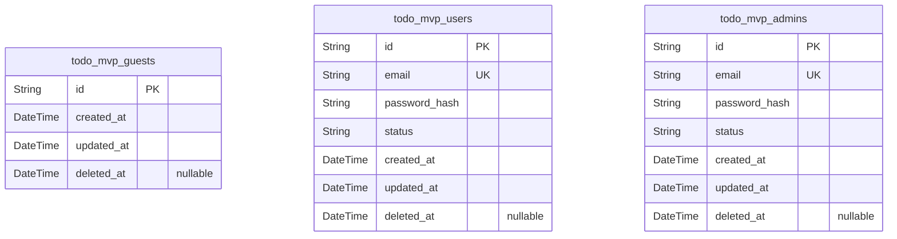
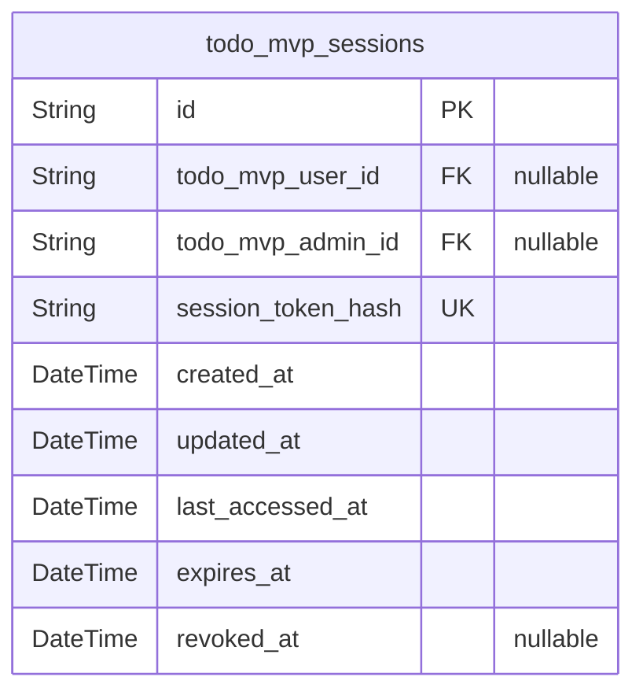
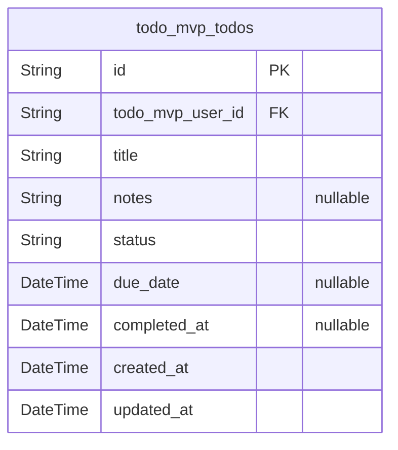
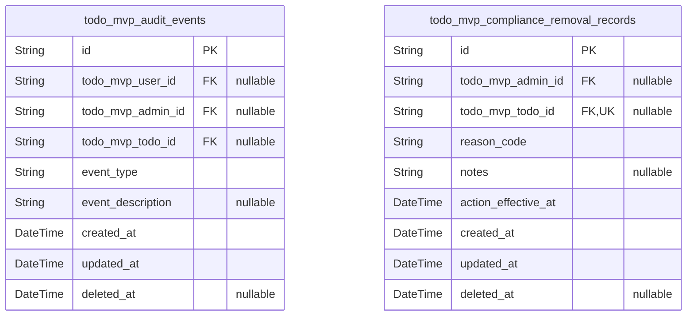

# Prisma Markdown

> Generated by [`prisma-markdown`](https://github.com/samchon/prisma-markdown)

- [Actors](#actors)
- [Auth](#auth)
- [Todos](#todos)
- [Audits](#audits)

## Actors

### `todo_mvp_guests`

Guest identities representing unauthenticated visitors. Used to
optionally associate anonymous activity or apply policy limits without
conflating with authenticated [todo_mvp_users](#todo_mvp_users) or {@link
todo_mvp_admins}. Typically managed indirectly via session flows in
[todo_mvp_sessions](#todo_mvp_sessions) (reference-only). Minimal data by design to
honor privacy and MVP scope.

Properties as follows:

- `id`: Primary Key.
- `created_at`
  > Creation timestamp for this guest identity. Enables temporal ordering and
  > minimal auditability.
- `updated_at`: Last update timestamp for this guest identity record.
- `deleted_at`
  > Soft delete timestamp for compliance or cleanup workflows. When set, the
  > record is considered removed from active use.

### `todo_mvp_users`

Authenticated user accounts for the Todo MVP. Each user owns personal
Todos and operates within strict owner-only boundaries. Includes login
credentials and lifecycle state to support deactivation/reactivation.
Related operational records (sessions, audits) live in {@link
todo_mvp_sessions} and [todo_mvp_audit_events](#todo_mvp_audit_events) (reference-only).

Properties as follows:

- `id`: Primary Key.
- `email`
  > User’s unique email used for authentication and communication in the MVP.
  > Business-unique within users.
- `password_hash`: Argon2/bcrypt or similar password hash. Never store plain passwords.
- `status`
  > Account lifecycle status. Suggested values: "active" or "deactivated" to
  > support admin account management.
- `created_at`: Timestamp when the user account was created.
- `updated_at`: Timestamp when the user account was last updated.
- `deleted_at`
  > Soft delete timestamp to support user-initiated account
  > deletion/anonymization workflows before permanent purge.

### `todo_mvp_admins`

Administrative identities with limited oversight capabilities in MVP
(aggregate metrics, account lifecycle). Admins do not browse or edit
member Todo content per requirements. Managed independently from {@link
todo_mvp_users} for clear authorization boundaries.

Properties as follows:

- `id`: Primary Key.
- `email`: Admin’s unique email used for authentication. Unique within admins.
- `password_hash`
  > Hashed password credential for admin authentication. Never store plain
  > passwords.
- `status`
  > Admin lifecycle status. Suggested values: "active" or "deactivated" for
  > operational control.
- `created_at`: Timestamp when the admin account was created.
- `updated_at`: Timestamp when the admin account was last updated.
- `deleted_at`
  > Soft delete timestamp supporting account closure or compliance workflows
  > prior to permanent removal.

## Auth

### `todo_mvp_sessions`

Authentication session records for todoMvp. Each session represents a
signed-in state for an authenticated actor (user or admin). A session
links to either a [todo_mvp_users](#todo_mvp_users) or a [todo_mvp_admins](#todo_mvp_admins)
record (exactly one typically populated by application rules). Lifecycle
is governed by timestamps: created_at/updated_at for audit,
last_accessed_at for idle timeout handling, expires_at for absolute TTL,
and revoked_at when a user signs out. Sessions are system-managed
artifacts supporting authentication and authorization; not a
user-authored content entity.

Properties as follows:

- `id`: Primary Key.
- `todo_mvp_user_id`
  > Authenticated user owner of this session. Target model's {@link
  > todo_mvp_users.id}.
- `todo_mvp_admin_id`
  > Authenticated admin owner of this session. Target model's {@link
  > todo_mvp_admins.id}.
- `session_token_hash`
  > Hashed representation of the session bearer token for lookup and
  > validation (plaintext tokens are never stored). Uniquely identifies a
  > session.
- `created_at`: Session creation timestamp (when sign-in succeeded).
- `updated_at`
  > Last time this session record itself was modified (e.g., token rotation
  > or administrative change).
- `last_accessed_at`
  > Most recent time the session was actively used. Supports inactivity
  > timeouts and security analytics.
- `expires_at`
  > Absolute expiration time after which this session is no longer valid,
  > regardless of activity.
- `revoked_at`
  > Timestamp when the session was explicitly revoked (e.g., sign-out). Null
  > means not revoked.

## Todos

### `todo_mvp_todos`

Core Todo items owned by a single authenticated user. Each record
represents one actionable item with a required title, optional notes and
a day-level due date, and a simple lifecycle ("open" or "completed").
Ownership is enforced via a required relation to [todo_mvp_users](#todo_mvp_users).
Timestamps support list ordering and audit-friendly visibility
(created/updated, plus completed_at only when status is "completed").
This table intentionally excludes denormalized aggregates and
soft-deletion to match MVP scope and privacy constraints. For due_date,
prefer storing as DATE (no time-of-day) to avoid timezone ambiguity; if
not feasible, normalize consistently (e.g., UTC midnight).

Properties as follows:

- `id`: Primary Key.
- `todo_mvp_user_id`: Owner user's [todo_mvp_users.id](#todo_mvp_users).
- `title`
  > Short human-readable label of the task. Required; trimmed by application
  > logic; typical length 1–120 characters. Duplicate titles are allowed per
  > user.
- `notes`
  > Optional free-form details for the task. Preserves line breaks; up to
  > about 1,000 characters by business rules.
- `status`
  > Current lifecycle state of the task. Allowed values by business rules:
  > "open" or "completed". Defaults to "open" on creation.
- `due_date`
  > Optional day-level target completion date interpreted in the user's local
  > time context. Prefer storing as DATE (no time) to avoid timezone
  > ambiguity.
- `completed_at`
  > Timestamp recorded only when status transitions to "completed". Cleared
  > when toggled back to "open".
- `created_at`: Creation timestamp recorded when the Todo is created.
- `updated_at`
  > Last updated timestamp recorded whenever the Todo is successfully edited
  > or its status changes.

## Audits

### `todo_mvp_audit_events`

Append-only audit trail capturing user- or admin-initiated Todo lifecycle
actions (create, update, complete, uncomplete, delete) for
privacy-preserving accountability. References to actors and targets are
nullable with onDelete: SetNull to preserve audit history after user or
Todo deletion during the retention window. No Todo content (title/notes)
is stored. Typical queries filter by actor or target resource over time.

Properties as follows:

- `id`: Primary Key.
- `todo_mvp_user_id`
  > Acting user's [todo_mvp_users.id](#todo_mvp_users). Nullable to preserve records
  > after user deletion.
- `todo_mvp_admin_id`
  > Optional acting admin's [todo_mvp_admins.id](#todo_mvp_admins). Nullable and
  > preserved via onDelete: SetNull.
- `todo_mvp_todo_id`
  > Target Todo's [todo_mvp_todos.id](#todo_mvp_todos). Nullable to preserve records
  > after Todo deletion.
- `event_type`
  > Business event type. Allowed values (examples): "todo_created",
  > "todo_updated", "todo_completed", "todo_uncompleted", "todo_deleted".
  > Application validates allowed set.
- `event_description`
  > Optional short, content-free description for operational context. Must
  > not include Todo content (title/notes).
- `created_at`: Event creation time (audit record creation).
- `updated_at`
  > Timestamp of the last administrative correction to this audit record, if
  > any.
- `deleted_at`
  > Soft deletion timestamp for retention management. When set, the record is
  > logically removed from standard reads.

### `todo_mvp_compliance_removal_records`

Minimal, privacy-preserving records of administrative compliance
removals. References to the acting admin and removed Todo are nullable
with onDelete: SetNull to preserve the record after entity deletion. One
record per removed Todo (unique when not null). No Todo content is
stored.

Properties as follows:

- `id`: Primary Key.
- `todo_mvp_admin_id`
  > Acting administrator's [todo_mvp_admins.id](#todo_mvp_admins). Nullable to maintain
  > record integrity if the admin account is deleted later.
- `todo_mvp_todo_id`
  > Removed Todo's [todo_mvp_todos.id](#todo_mvp_todos). Nullable to allow the record to
  > persist after the Todo is deleted.
- `reason_code`
  > High-level reason code for compliance removal (examples:
  > "policy_violation", "legal_request", "user_request_via_admin"). No Todo
  > content allowed.
- `notes`: Optional administrative notes that must not include user Todo content.
- `action_effective_at`: Timestamp when the removal took effect from the user's perspective.
- `created_at`: Record creation time.
- `updated_at`: Timestamp of the last administrative correction to this record, if any.
- `deleted_at`: Soft deletion timestamp for retention and lifecycle control.
