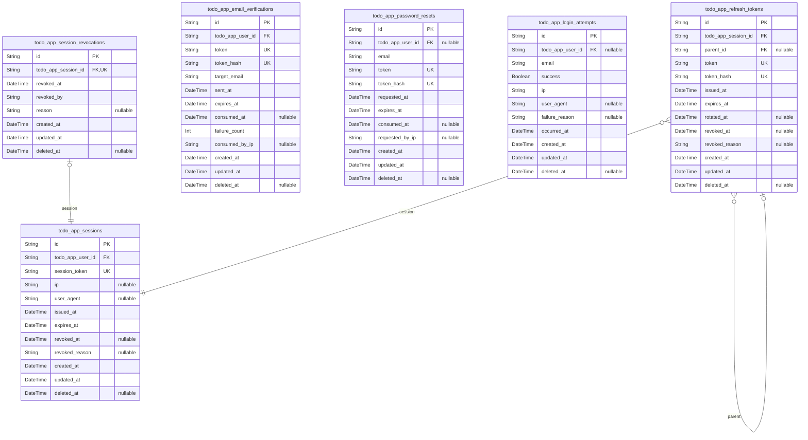

# Prisma Markdown

> Generated by [`prisma-markdown`](https://github.com/samchon/prisma-markdown)

- [Systematic](#systematic)
- [Actors](#actors)
- [Auth](#auth)
- [Todos](#todos)
- [Events](#events)
- [Audit](#audit)
- [Privacy](#privacy)
- [RateLimits](#ratelimits)
- [Metrics](#metrics)
- [default](#default)

## Systematic

### `todo_app_service_configurations`

System-wide configuration items keyed by namespace and key with optional
environment scoping. Holds raw string values with an explicit value_type
for interpretation at runtime. Managed by administrators and referenced
by application services for behavior switches. Optionally linked to a
governing policy [todo_app_service_policies](#todo_app_service_policies) and created by a user
[todo_app_users](#todo_app_users). Records support lifecycle via active flag and
effective window.

Properties as follows:

- `id`: Primary Key.
- `todo_app_user_id`
  > Administrative actor who last created/updated this configuration. Target
  > model's [todo_app_users.id](#todo_app_users).
- `todo_app_service_policy_id`
  > Optional governing policy for this configuration. Target model's {@link
  > todo_app_service_policies.id}.
- `namespace`
  > Logical grouping for configuration keys (e.g., "core", "auth",
  > "billing"). Used to segment settings by domain.
- `environment`
  > Optional environment discriminator (e.g., "prod", "staging", "dev"). Null
  > indicates environment-agnostic.
- `key`
  > Business key name unique within (namespace, environment).
  > Case-insensitive comparisons are handled at application level if needed.
- `value`
  > Stored configuration value in raw string form. Consumers interpret
  > according to value_type.
- `value_type`
  > Type hint for interpreting the stored value (e.g., "string", "int",
  > "double", "boolean", "datetime", "uri").
- `is_secret`
  > Whether this value is sensitive and should be redacted in logs and
  > listings.
- `description`
  > Human-readable description and operational notes for this configuration
  > key.
- `active`: Whether this configuration is currently enabled for evaluation.
- `effective_from`: Optional activation start time for the configuration in business terms.
- `effective_to`: Optional deactivation time after which the configuration is not applied.
- `created_at`: Creation timestamp for this configuration record.
- `updated_at`: Last update timestamp for this configuration record.
- `deleted_at`: Soft delete timestamp. Null indicates the record is active/not deleted.

### `todo_app_service_policies`

Business policies governing application behavior, rate limits, retention,
and other constraints. Each policy has a globally unique code and stores
a raw value as string with value_type indicating how to interpret it.
Managed independently by administrators; referenced by other entities
including [todo_app_service_configurations](#todo_app_service_configurations) and {@link
todo_app_feature_flags}. Created-by user reference links to {@link
todo_app_users}.

Properties as follows:

- `id`: Primary Key.
- `todo_app_user_id`
  > Administrative owner/creator of this policy. Target model's {@link
  > todo_app_users.id}.
- `namespace`: Logical grouping for the policy (e.g., "auth", "security", "privacy").
- `code`: Globally unique policy code used by services to look up the policy.
- `name`: Human-readable name of the policy.
- `description`: Detailed business description and operational guidance for this policy.
- `value`
  > Policy value stored as raw string; interpreted by services using
  > value_type.
- `value_type`
  > Type hint for interpreting the policy value (e.g., "string", "int",
  > "double", "boolean", "datetime", "uri").
- `active`: Whether this policy is currently in effect.
- `effective_from`: Optional activation start time for the policy in business terms.
- `effective_to`: Optional end time after which the policy is no longer in effect.
- `created_at`: Creation timestamp for this policy record.
- `updated_at`: Last update timestamp for this policy record.
- `deleted_at`: Soft delete timestamp. Null indicates the record is active/not deleted.

### `todo_app_feature_flags`

Feature flag definitions for conditional enablement and staged rollouts.
Supports environment and namespace scoping, percentage rollouts, and
optional targeting notes. Administrators manage flags independently;
flags may optionally be associated with a governing policy {@link
todo_app_service_policies} and are created by [todo_app_users](#todo_app_users).

Properties as follows:

- `id`: Primary Key.
- `todo_app_service_policy_id`
  > Optional governing policy reference. Target model's {@link
  > todo_app_service_policies.id}.
- `todo_app_user_id`
  > Administrative owner/creator of the feature flag. Target model's {@link
  > todo_app_users.id}.
- `namespace`: Logical grouping for the feature flag (e.g., "ui", "payments", "sync").
- `environment`
  > Deployment environment for the flag (e.g., "prod", "staging", "dev").
  > Null indicates environment-agnostic.
- `code`
  > Unique flag code within (namespace, environment). Used by services to
  > evaluate features.
- `name`: Human-readable name of the feature flag.
- `description`: Business description, rollout plan, and guardrail notes for this flag.
- `active`: Whether the flag is enabled for evaluation.
- `rollout_percentage`
  > Percentage-based rollout for progressive exposure (0–100). Applied only
  > when active.
- `target_audience`
  > Optional description of intended audience or segmentation rules in
  > business terms.
- `start_at`: Optional start time when the flag begins evaluation.
- `end_at`: Optional end time after which the flag is no longer evaluated.
- `created_at`: Creation timestamp for this feature flag record.
- `updated_at`: Last update timestamp for this feature flag record.
- `deleted_at`: Soft delete timestamp. Null indicates the record is active/not deleted.

## Actors

### `todo_app_users`

Core user accounts for the todoApp. Stores authentication credentials,
account lifecycle status, and verification state. Serves as the parent
entity for user profile, preferences, sessions, and role assignments.
Other actor-related models reference this model via 1:1 relationships.
This table is central to access control and privacy boundaries.

Properties as follows:

- `id`: Primary Key.
- `email`
  > User's unique email address for authentication and notifications. Acts as
  > the login identifier. Must be unique across the system.
- `password_hash`: Argon2/bcrypt or similar password hash. Never store plaintext passwords.
- `status`
  > Account lifecycle state (e.g., pending_verification, active, suspended,
  > deactivated). Controls whether the user can authenticate.
- `email_verified`: Whether the user's email has been verified according to policy.
- `verified_at`: Timestamp when email was verified. Null until verification completes.
- `last_login_at`
  > Timestamp of the last successful login for user activity tracking and
  > security reviews.
- `created_at`: Creation timestamp for the user record.
- `updated_at`: Last update timestamp for the user record.
- `deleted_at`
  > Soft deletion timestamp. When set, the record is considered deleted and
  > excluded from normal flows.

### `todo_app_user_profiles`

Supplemental user profile information attached to a single {@link
todo_app_users} account. Contains human-facing attributes for display and
search. Managed through the owning user; not independently meaningful for
access control.

Properties as follows:

- `id`: Primary Key.
- `todo_app_user_id`
  > Owning user's [todo_app_users.id](#todo_app_users). Enforces 1:1 relationship
  > between a user and a profile.
- `full_name`
  > User's full name for display purposes. Purely presentational; not used
  > for authentication.
- `nickname`: Optional nickname or handle for casual display contexts.
- `avatar_uri`: Optional URI to the user's avatar image resource.
- `created_at`: Creation timestamp for the profile.
- `updated_at`: Last update timestamp for the profile.
- `deleted_at`: Soft deletion timestamp of the profile record.

### `todo_app_user_preferences`

Per-user preference settings that affect behavior and presentation (e.g.,
timezone, locale, pagination). Managed via the user context and used to
interpret due dates and UI text. One-to-one with [todo_app_users](#todo_app_users).

Properties as follows:

- `id`: Primary Key.
- `todo_app_user_id`: Owner user's [todo_app_users.id](#todo_app_users). One-to-one preference record.
- `timezone`
  > IANA timezone identifier (e.g., "Asia/Seoul") interpreting due dates and
  > times for this user.
- `locale`: BCP 47 language tag for UI text conventions (e.g., "en-US").
- `page_size`
  > Default pagination size for lists. Business rule: 1–100; common default
  > is 20.
- `created_at`: Creation timestamp for the preferences record.
- `updated_at`: Last update timestamp for the preferences record.
- `deleted_at`: Soft deletion timestamp of the preferences record.

### `todo_app_guestvisitors`

Role assignment history for when a [todo_app_users](#todo_app_users) account holds
the guestVisitor role. Stores multiple grant/revoke events over time to
preserve audit history. Managed by governance logic; not user-editable.
Queries typically order by granted_at and filter by current (revoked_at
IS NULL) membership.

Properties as follows:

- `id`: Primary Key.
- `todo_app_user_id`
  > Assigned user's [todo_app_users.id](#todo_app_users). Allows multiple historical
  > assignments for the same user.
- `granted_at`: Timestamp when the guestVisitor role was granted.
- `revoked_at`: Timestamp when the role was revoked. Null when currently active.
- `created_at`: Creation timestamp for the role assignment record.
- `updated_at`: Last update timestamp for the role assignment record.
- `deleted_at`: Soft deletion timestamp for retention without hard delete.

### `todo_app_todousers`

Role assignment history for when a [todo_app_users](#todo_app_users) account holds
the todoUser role. Supports multiple grant/revoke cycles for
auditability. Not user-editable; maintained by system governance
workflows.

Properties as follows:

- `id`: Primary Key.
- `todo_app_user_id`
  > Assigned user's [todo_app_users.id](#todo_app_users). Allows multiple historical
  > assignments for the same user.
- `granted_at`: Timestamp when the todoUser role was granted.
- `revoked_at`: Timestamp when the role was revoked. Null when currently active.
- `created_at`: Creation timestamp for the role assignment record.
- `updated_at`: Last update timestamp for the role assignment record.
- `deleted_at`: Soft deletion timestamp for retention without hard delete.

### `todo_app_systemadmins`

Role assignment history for when a [todo_app_users](#todo_app_users) account holds
the systemAdmin role. Preserves multiple grant/revoke events over time
for governance audits. Not user-editable; managed by administrators.

Properties as follows:

- `id`: Primary Key.
- `todo_app_user_id`
  > Assigned user's [todo_app_users.id](#todo_app_users). Allows multiple historical
  > assignments for the same user.
- `granted_at`: Timestamp when the systemAdmin role was granted.
- `revoked_at`: Timestamp when the role was revoked. Null when currently active.
- `created_at`: Creation timestamp for the role assignment record.
- `updated_at`: Last update timestamp for the role assignment record.
- `deleted_at`: Soft deletion timestamp for retention without hard delete.

## Auth

### `todo_app_sessions`

Authentication session records for signed-in users. Each session belongs
to a single user ([todo_app_users](#todo_app_users)) and tracks issuance,
expiration, client metadata, and optional revocation details. Used to
authorize access tokens and to support session revocation workflows.
Sessions are security-sensitive and typically short-lived.

Properties as follows:

- `id`: Primary Key.
- `todo_app_user_id`: Owning user's [todo_app_users.id](#todo_app_users).
- `session_token`
  > Opaque, randomly generated session token used to authenticate requests
  > for this session. Must be unique and non-guessable.
- `ip`
  > Client IP address (IPv4/IPv6) observed when the session was established
  > or last used.
- `user_agent`
  > Client user agent string captured at session creation for security
  > analytics and device recognition.
- `issued_at`: Timestamp when the session was issued.
- `expires_at`: Timestamp when the session expires and is no longer valid.
- `revoked_at`: Timestamp when the session was revoked, if applicable.
- `revoked_reason`
  > Human-readable reason for revocation, if known (e.g., user logout,
  > password change, admin action).
- `created_at`: Record creation time.
- `updated_at`: Record last update time.
- `deleted_at`: Soft deletion time if the record is logically removed.

### `todo_app_refresh_tokens`

Refresh token chain for sessions. Each token belongs to one session
([todo_app_sessions](#todo_app_sessions)) and can optionally reference its parent token
for rotation chains. Supports rotation, revocation, and expiry management
for long-lived authentication. For security, store only a one-way hash of
the raw token in token_hash and avoid persisting plaintext tokens.

Properties as follows:

- `id`: Primary Key.
- `todo_app_session_id`: Associated session's [todo_app_sessions.id](#todo_app_sessions).
- `parent_id`
  > Previous refresh token in the rotation chain. Self-reference {@link
  > todo_app_refresh_tokens.id}.
- `token`
  > Opaque refresh token value. Deprecated for security; prefer storing only
  > token_hash.
- `token_hash`
  > One-way hash (e.g., SHA-256) of the refresh token. Used for lookup and
  > uniqueness to avoid storing plaintext tokens.
- `issued_at`: Timestamp when this refresh token was issued.
- `expires_at`: Timestamp when this refresh token expires.
- `rotated_at`
  > Timestamp when this token was rotated (replaced) by a child token, if
  > applicable.
- `revoked_at`: Timestamp when this token was revoked, if applicable.
- `revoked_reason`
  > Reason for token revocation, if known (e.g., password change, security
  > event).
- `created_at`: Record creation time.
- `updated_at`: Record last update time.
- `deleted_at`: Soft deletion time if the record is logically removed.

### `todo_app_email_verifications`

Email verification tokens for account activation or email change flows.
Each record targets a specific user ([todo_app_users](#todo_app_users)) and email
address and tracks delivery, expiry, and consumption for auditability.
For security, store a one-way token_hash instead of plaintext.

Properties as follows:

- `id`: Primary Key.
- `todo_app_user_id`: Target user's [todo_app_users.id](#todo_app_users).
- `token`
  > Opaque email verification token. Deprecated for security; prefer storing
  > only token_hash.
- `token_hash`
  > One-way hash (e.g., SHA-256) of the verification token for lookup and
  > uniqueness.
- `target_email`
  > Email address being verified (may be the current or new email for the
  > account).
- `sent_at`: Timestamp when the verification message was sent.
- `expires_at`: Timestamp when the verification token expires.
- `consumed_at`: Timestamp when the token was successfully consumed, if applicable.
- `failure_count`
  > Number of failed verification attempts associated with this token for
  > rate-limiting and auditing.
- `consumed_by_ip`: Client IP address from which the token was consumed, if available.
- `created_at`: Record creation time.
- `updated_at`: Record last update time.
- `deleted_at`: Soft deletion time if the record is logically removed.

### `todo_app_password_resets`

Password reset requests and tokens. May reference the user ({@link
todo_app_users}) when identifiable, while still allowing
privacy-preserving requests by email only. Tracks expiry and consumption
for security and audit. For security, store a one-way token_hash instead
of plaintext.

Properties as follows:

- `id`: Primary Key.
- `todo_app_user_id`
  > Related user's [todo_app_users.id](#todo_app_users) when the email maps to an
  > existing account. Nullable for privacy-preserving requests.
- `email`
  > Email address provided for the reset request. Stored for processing and
  > messaging even if no user exists.
- `token`
  > Opaque password reset token. Deprecated for security; prefer storing only
  > token_hash.
- `token_hash`: One-way hash (e.g., SHA-256) of the reset token for lookup and uniqueness.
- `requested_at`: Timestamp when the reset was requested.
- `expires_at`: Timestamp when the reset token expires.
- `consumed_at`: Timestamp when the reset token was used, if applicable.
- `requested_by_ip`: Client IP address that initiated the reset request, if available.
- `created_at`: Record creation time.
- `updated_at`: Record last update time.
- `deleted_at`: Soft deletion time if the record is logically removed.

### `todo_app_login_attempts`

Per-attempt authentication outcomes for brute-force protection, abuse
detection, and security analytics. Attempts may or may not map to an
existing user; both are recorded for rate-limiting and forensics.

Properties as follows:

- `id`: Primary Key.
- `todo_app_user_id`
  > Resolved user's [todo_app_users.id](#todo_app_users) when the attempted email maps
  > to an account; null otherwise.
- `email`: Email address used for the login attempt (as entered).
- `success`: Whether the login attempt succeeded (true) or failed (false).
- `ip`: Client IP address for the attempt.
- `user_agent`: User agent string of the client, if available.
- `failure_reason`: Optional reason for failure (e.g., invalid_credentials, suspended).
- `occurred_at`: Timestamp when the attempt occurred.
- `created_at`: Record creation time.
- `updated_at`: Record last update time.
- `deleted_at`: Soft deletion time if the record is logically removed.

### `todo_app_session_revocations`

Explicit revocation records for sessions. Enforces one revocation record
per session to capture who revoked the session and why. Used to audit
logout, security actions, or administrative revocations.

Properties as follows:

- `id`: Primary Key.
- `todo_app_session_id`: Target session's [todo_app_sessions.id](#todo_app_sessions).
- `revoked_at`: Timestamp when the session was revoked.
- `revoked_by`: Actor category performing the revocation (e.g., user, system, admin).
- `reason`: Human-readable reason for revocation, if available.
- `created_at`: Record creation time.
- `updated_at`: Record last update time.
- `deleted_at`: Soft deletion time if the record is logically removed.

## Todos

### `todo_app_todos`

Primary Todo entity managed by end users. Stores owner reference, core
textual fields, due date, lifecycle status (open/completed), and temporal
fields. Activity and deletion audit data are captured in {@link
todo_app_todo_activities} and [todo_app_todo_deletion_events](#todo_app_todo_deletion_events).
Ownership is enforced via FK to [todo_app_users](#todo_app_users).

Properties as follows:

- `id`: Primary Key.
- `todo_app_user_id`
  > Owner user's [todo_app_users.id](#todo_app_users). Establishes ownership and access
  > isolation.
- `title`
  > Required short text title of the todo. Business rule: 1–120 characters
  > after trimming; must include at least one non-whitespace character.
- `description`
  > Optional longer text description of the todo, up to 1000–2000 characters
  > by policy. Not used for derived values.
- `due_at`
  > Optional due date/time interpreted in the owner’s timezone. Used for
  > overdue/today/future filters; not restricted to future-only unless policy
  > dictates.
- `status`
  > Lifecycle status of the todo. Expected values: 'open' or 'completed'
  > (business-level).
- `completed_at`
  > Timestamp recorded when the todo is marked completed; cleared when
  > reopened.
- `created_at`: Creation timestamp for the todo (system-managed).
- `updated_at`: Last modification timestamp for the todo (system-managed).
- `deleted_at`
  > Soft deletion timestamp. When set, the todo is excluded from normal
  > listings. Enables recovery windows per policy.

### `todo_app_todo_activities`

Historical activity records (audit trail) for todos. Captures
append-mostly events such as create, update, complete, reopen, and delete
requests with actor and occurred_at time. References {@link
todo_app_todos} and [todo_app_users](#todo_app_users). To preserve audit history
beyond parent deletion, the foreign keys are nullable and configured for
onDelete: SetNull.

Properties as follows:

- `id`: Primary Key.
- `todo_app_todo_id`
  > Target todo’s [todo_app_todos.id](#todo_app_todos). Nullable to preserve audit
  > records if the todo is purged; onDelete: SetNull.
- `todo_app_user_id`
  > Actor user’s [todo_app_users.id](#todo_app_users). Nullable to preserve audit
  > records if the user account is purged; onDelete: SetNull.
- `activity_type`
  > Type of activity event. Expected values include: 'create', 'update',
  > 'complete', 'reopen', 'delete'.
- `details`: Optional human-readable details for the activity (no sensitive secrets).
- `changed_fields`
  > Optional list of changed field names for update events (comma-separated
  > or structured text).
- `previous_status`: Optional prior status value when applicable (e.g., 'open' or 'completed').
- `next_status`: Optional next status value when applicable (e.g., 'open' or 'completed').
- `occurred_at`: Business-event timestamp when the activity occurred.
- `created_at`: Record creation timestamp.
- `updated_at`
  > Record update timestamp (rarely used; audit records are typically
  > append-only).
- `deleted_at`
  > Soft deletion timestamp for erroneous or redacted records under
  > exceptional policies.

### `todo_app_todo_deletion_events`

Point-in-time deletion audit entries for todos. Records who deleted the
todo and when, with optional human-readable reason. Complements
soft-delete policy and supports privacy/audit requirements. References
[todo_app_todos](#todo_app_todos) and [todo_app_users](#todo_app_users). To preserve audit
history beyond parent deletion, the foreign keys are nullable and
configured for onDelete: SetNull.

Properties as follows:

- `id`: Primary Key.
- `todo_app_todo_id`
  > Deleted todo’s [todo_app_todos.id](#todo_app_todos). Nullable to preserve audit
  > records if the todo is purged; onDelete: SetNull.
- `todo_app_user_id`
  > Deleting actor’s [todo_app_users.id](#todo_app_users). Nullable to preserve audit
  > records if the user account is purged; onDelete: SetNull.
- `reason`: Optional human-readable reason or context for deletion (no secrets).
- `occurred_at`: Business-event timestamp when deletion occurred.
- `created_at`: Record creation timestamp.
- `updated_at`: Record update timestamp (normally static after insert).
- `deleted_at`
  > Soft deletion timestamp used only for administrative redaction under
  > policy.

## Events

### `todo_app_event_types`

Business event taxonomy for todoApp. Each record defines a stable code
and human-readable name for a class of events (e.g., "todo.created",
"todo.completed"). Referenced by [todo_app_business_events](#todo_app_business_events) to
classify occurrences. Enables governance (enable/disable types) and
consistent analytics grouping across the system.

Properties as follows:

- `id`: Primary Key.
- `code`
  > Stable machine-readable identifier of the event type (e.g.,
  > "todo.created"). Used in integrations and analytics and must remain
  > stable.
- `name`: Human-readable title of the event type for administration and reporting.
- `description`: Optional longer description of when and why this event type is emitted.
- `active`
  > Whether this event type is currently enabled for emission within the
  > system.
- `created_at`: Record creation timestamp.
- `updated_at`: Record last update timestamp.

### `todo_app_business_events`

Append-only business event log capturing user-facing domain events across
todoApp. Each event references an [todo_app_event_types](#todo_app_event_types)
classification and may optionally reference the actor's {@link
todo_app_users} and a target [todo_app_todos](#todo_app_todos). Session context via
[todo_app_sessions](#todo_app_sessions) is optional. Stores raw, non-derived attributes
only (timestamps, message, source metadata) for auditability and
analytics ingestion. Referential actions are configured to preserve
history (Restrict on types; SetNull on optional links).

Properties as follows:

- `id`: Primary Key.
- `todo_app_event_type_id`
  > Event classification reference. Target model's {@link
  > todo_app_event_types.id}
- `todo_app_user_id`
  > Optional actor reference when the event is associated with a signed-in
  > user. Target model's [todo_app_users.id](#todo_app_users)
- `todo_app_todo_id`
  > Optional target Todo reference when the event pertains to a specific
  > Todo. Target model's [todo_app_todos.id](#todo_app_todos)
- `todo_app_session_id`: Optional session context. Target model's [todo_app_sessions.id](#todo_app_sessions)
- `occurred_at`: Timestamp when the business event actually occurred (domain time).
- `message`
  > Optional human-readable message or summary describing the event in
  > business terms (used for search and diagnostics).
- `source`
  > Optional emitter or subsystem identifier providing origin context (e.g.,
  > "web", "api", "job").
- `external_id`
  > Optional external or upstream event identifier to enable idempotency and
  > deduplication across ingestion pipelines.
- `ip`
  > Optional best-effort client IP captured at event time for security and
  > analytics use-cases in accordance with policy.
- `user_agent`
  > Optional user agent string captured at event time for diagnostics and
  > product analytics.
- `created_at`: Record creation timestamp (ingestion time).
- `updated_at`: Record last update timestamp (system-managed).

### `todo_app_event_counters_daily`

Daily counters for business events to support KPI queries. Each row
summarizes the count of occurrences for an [todo_app_event_types](#todo_app_event_types)
on a given calendar day bucket. Optionally scoped by actor {@link
todo_app_users} and/or target [todo_app_todos](#todo_app_todos). Maintained by
application processes; contains only raw counts and timestamps (no
derived rollups beyond the defined bucket). Referential actions preserve
history (Restrict on types; SetNull on optional links).

Properties as follows:

- `id`: Primary Key.
- `todo_app_event_type_id`
  > Classified event type being counted. Target model's {@link
  > todo_app_event_types.id}
- `todo_app_user_id`
  > Optional actor user scope for the daily count. Target model's {@link
  > todo_app_users.id}
- `todo_app_todo_id`
  > Optional target Todo scope for the daily count. Target model's {@link
  > todo_app_todos.id}
- `bucket_date`
  > Start of the calendar day (00:00:00) in the chosen reference timezone
  > representing the counting bucket.
- `count`
  > Total number of events observed for the specified dimensions within the
  > bucket day.
- `created_at`: Record creation timestamp.
- `updated_at`: Record last update timestamp.

## Audit

### `todo_app_audit_logs`

Append-only audit trail capturing sensitive operations across the system.
Records the acting user (required), optional target user, business
action, related resource classification, outcome, and client context.
Private todo text values are never stored here. References actors and
targets via [todo_app_users](#todo_app_users) to support cross-user isolation and
governance reviews. Uses restrictive/set-null deletes to preserve audit
history.

Properties as follows:

- `id`: Primary Key.
- `actor_user_id`
  > Acting user's [todo_app_users.id](#todo_app_users). Required for attribution and
  > accountability.
- `target_user_id`
  > Target user's [todo_app_users.id](#todo_app_users). Optional when no specific user
  > is targeted.
- `action`
  > Business action identifier (e.g., "login", "logout", "suspend_account",
  > "data_export_request"). Used for audit classification and search.
- `resource_type`
  > Domain resource category or model name associated with the action (e.g.,
  > "todo_app_todos", "todo_app_sessions").
- `resource_id`
  > Identifier of the resource related to this event when applicable. String
  > typed to accommodate non-UUID external identifiers.
- `success`: Whether the attempted action succeeded (true) or failed (false).
- `ip`
  > Origin IP address captured at the time of the event for security
  > investigation. Stored as text.
- `user_agent`
  > Client user-agent string to aid in security investigations. Text only; no
  > parsing or PII extraction here.
- `created_at`: Record creation timestamp (event capture time).
- `updated_at`
  > Record last update timestamp (operational correction/audit enrichment
  > time).
- `deleted_at`
  > Soft deletion timestamp for retention workflows. Null means
  > active/retained.

### `todo_app_admin_actions`

Historical records of privileged administrative operations performed by
system administrators. Captures who acted, optional target user, the
administrative action, stated reason, and operational notes. Does not
store private todo content. Supports governance reviews and incident
response. Uses restrictive/set-null deletes on FKs to preserve history.

Properties as follows:

- `id`: Primary Key.
- `admin_user_id`
  > Administrator actor's [todo_app_users.id](#todo_app_users). Required for privileged
  > actions.
- `target_user_id`
  > Target user's [todo_app_users.id](#todo_app_users). Optional for service-wide
  > actions with no specific target.
- `action`
  > Administrative action key (e.g., "suspend_account", "reactivate_account",
  > "revoke_sessions", "update_service_config").
- `reason`
  > Business reason provided by the administrator for this action. Human
  > readable; avoid private todo text.
- `notes`
  > Operational notes relevant to the action. Human readable; avoid private
  > todo text.
- `success`: Whether the administrative action completed successfully.
- `idempotency_key`
  > Optional idempotency token to prevent accidental duplicate execution of
  > the same admin action request.
- `created_at`: Record creation timestamp (action capture time).
- `updated_at`
  > Record last update timestamp (operational correction/audit enrichment
  > time).
- `deleted_at`
  > Soft deletion timestamp for retention workflows. Null means
  > active/retained.

### `todo_app_account_status_changes`

Point-in-time records of account lifecycle changes for users (e.g.,
pending_verification → active, active → suspended, suspended → active).
Provides a complete historical trail for governance and incident
investigation. The admin attribution is optional for system-triggered
transitions. No private todo text is stored here. Uses
restrictive/set-null deletes to preserve history.

Properties as follows:

- `id`: Primary Key.
- `target_user_id`
  > Subject account's [todo_app_users.id](#todo_app_users). Required for the status
  > transition record.
- `admin_user_id`
  > Administrator actor's [todo_app_users.id](#todo_app_users) when manually changed.
  > Null for automated/system transitions.
- `previous_status`
  > Previous account status value (e.g., "pending_verification", "active",
  > "suspended", "deactivated").
- `new_status`: New account status value (e.g., "active", "suspended", "deactivated").
- `business_reason`
  > Business rationale for the transition. Human readable; avoid private todo
  > text.
- `has_effect`
  > Indicates whether this transition actually changed the stored status
  > (false for a no-op attempt).
- `created_at`: Record creation timestamp (transition capture time).
- `updated_at`
  > Record last update timestamp (operational correction/audit enrichment
  > time).
- `deleted_at`
  > Soft deletion timestamp for retention workflows. Null means
  > active/retained.

## Privacy

### `todo_app_data_exports`

Records of user-initiated personal data export requests for compliance
and portability. Each row represents one export job for a specific user
with lifecycle timestamps and outcome details. The record references the
owner user via [todo_app_users](#todo_app_users). Typical queries filter by user,
status, and creation time; administrators may audit exports across users.
No private todo content is stored here, only metadata and the download
link when available.

Properties as follows:

- `id`: Primary Key.
- `todo_app_user_id`: Owner user's [todo_app_users.id](#todo_app_users).
- `status`
  > Export job status (e.g., requested, processing, completed, failed,
  > expired). Used for workflow and monitoring.
- `export_format`: Requested data export format (e.g., json, csv).
- `download_uri`
  > Secure download URI for the prepared export archive when available. Null
  > until export is ready or if failed.
- `file_size_bytes`: Size of the generated export archive in bytes, if completed.
- `checksum`
  > Checksum (e.g., SHA-256) of the exported archive to allow integrity
  > verification. Stored as plain hex string.
- `status_message`
  > Optional human-readable status or failure reason captured during
  > processing. Useful for support and audit.
- `completed_at`
  > Timestamp when the export finished successfully (or when processing
  > concluded).
- `expires_at`: Timestamp after which the download link is no longer valid.
- `request_ip`
  > IP address (string form) captured at the time of export request for
  > traceability.
- `request_user_agent`: User agent string captured at the time of export request for traceability.
- `created_at`: Creation timestamp (request time).
- `updated_at`: Last update timestamp for the export job record.
- `deleted_at`
  > Soft deletion timestamp. Allows operational recovery or retention
  > handling per policy.

### `todo_app_account_deletion_requests`

User-initiated account deletion workflow records. Each row captures a
single deletion request lifecycle including confirmations, scheduling,
finalization, or cancellation. References the account {@link
todo_app_users} and stores only administrative metadata and reasons (no
private content). Used by governance teams to track and enforce data
lifecycle policies.

Properties as follows:

- `id`: Primary Key.
- `todo_app_user_id`: Target account's [todo_app_users.id](#todo_app_users).
- `status`
  > Deletion request status (e.g., pending_confirmation, scheduled, canceled,
  > completed).
- `reason`
  > Optional user-provided reason or administrative note for the deletion
  > request.
- `confirmed_at`: Timestamp when the user confirmed the deletion request (e.g., via email).
- `scheduled_purge_at`: Scheduled date/time for purge operations to begin, per policy.
- `processed_at`: Timestamp when deletion processing completed for the account.
- `canceled_at`: Timestamp when the request was canceled or withdrawn by the user.
- `request_ip`
  > IP address (string form) captured at the time the deletion request was
  > created.
- `request_user_agent`: User agent string captured at request time.
- `created_at`: Creation timestamp for the deletion request.
- `updated_at`: Last update timestamp for the deletion request.
- `deleted_at`: Soft deletion timestamp for operational needs and retention controls.

### `todo_app_privacy_consents`

Consent records per user and purpose for non-essential processing. Each
row represents a specific consent action (granted or revoked) tied to a
policy version and timestamps. Historical trail is preserved by new rows
rather than updates in place. References the owner via {@link
todo_app_users}. Enables compliance queries by user, purpose, and status.

Properties as follows:

- `id`: Primary Key.
- `todo_app_user_id`: Owner user's [todo_app_users.id](#todo_app_users).
- `purpose_code`
  > System code for the consent purpose (e.g., analytics, marketing_email).
  > Used for programmatic filtering.
- `purpose_name`: Human-readable purpose name for search and reporting.
- `granted`
  > Whether consent was granted (true) or denied/withdrawn (false) at the
  > event time.
- `granted_at`: Timestamp when the consent action occurred (grant or deny).
- `revoked_at`
  > Timestamp when the previously granted consent was revoked. Null if still
  > active or if never granted.
- `expires_at`: Optional expiry for the consent if governed by policy.
- `policy_version`
  > Policy or notice version identifier that was in effect at the time of
  > consent.
- `source`: Where/how the consent was captured (e.g., web, mobile, settings_page).
- `ip`: IP address (string form) at the time of the consent action.
- `user_agent`: User agent string at the time of the consent action.
- `created_at`: Record creation timestamp.
- `updated_at`: Last update timestamp for the record.
- `deleted_at`: Soft deletion timestamp for operational recovery/retention.

## RateLimits

### `todo_app_rate_limits`

System-wide throttling policy definitions. Administrators define and
manage these limits for different action categories and scopes.
Referenced by [todo_app_user_rate_counters](#todo_app_user_rate_counters) and {@link
todo_app_ip_rate_counters} to enforce fair-use and cooldown behavior.
Contains only configuration attributes (no counters) to maintain strict
3NF. Typical queries search by category/scope and free-text over
name/description.

Properties as follows:

- `id`: Primary Key.
- `code`
  > Unique business code identifying the rate limit policy (e.g.,
  > "write_per_minute"). Used for configuration management and safe
  > references in code or admin tools.
- `name`: Human-readable name of the policy for admin consoles and documentation.
- `description`
  > Detailed admin-facing description of the policy intention, scope, and
  > operational notes.
- `scope`
  > Scope of application such as "user", "ip", or "global". Determines the
  > subject dimension to which counters apply.
- `category`
  > Functional category of actions affected by this policy, e.g., "read",
  > "write", or "auth".
- `window_seconds`
  > Fixed window duration in seconds used to aggregate requests for
  > throttling calculations.
- `max_requests`: Maximum allowed requests within the window before throttling is applied.
- `burst_size`
  > Optional token bucket burst size allowing temporary spikes within the
  > same window. When null, burst is not applied.
- `sliding_window`
  > Whether the policy uses a sliding window approximation (true) or fixed
  > window (false).
- `enabled`: Administrative toggle to enable or disable enforcement of this policy.
- `created_at`: Creation timestamp of the policy record.
- `updated_at`: Last update timestamp of the policy record.
- `deleted_at`
  > Soft deletion timestamp. When set, the policy is considered archived and
  > excluded from normal operations.

### `todo_app_user_rate_counters`

Operational counters for applying rate limits per user. Each record
aggregates requests in a specific window for a specific policy.
References [todo_app_rate_limits](#todo_app_rate_limits) for configuration and {@link
todo_app_users} for the subject. Used to determine throttling and
cooldowns; not directly managed by end users.

Properties as follows:

- `id`: Primary Key.
- `todo_app_rate_limit_id`: Associated rate limit policy's [todo_app_rate_limits.id](#todo_app_rate_limits).
- `todo_app_user_id`: Subject user's [todo_app_users.id](#todo_app_users).
- `window_started_at`: Start timestamp of the counting window for this user and policy.
- `window_ends_at`: End timestamp of the counting window for this user and policy.
- `count`
  > Number of actions recorded within this window for the user under the
  > given policy.
- `last_action_at`: Timestamp of the most recent action contributing to this window's counter.
- `blocked_until`
  > If throttled, the time until which actions should be blocked for this
  > user under this policy. Null when not blocked.
- `created_at`: Creation timestamp of this counter record.
- `updated_at`: Last update timestamp of this counter record.
- `deleted_at`: Soft deletion timestamp used for archival/cleanup without hard delete.

### `todo_app_ip_rate_counters`

Operational counters for applying rate limits per IP address. Each record
aggregates requests in a specific window for a specific policy.
References [todo_app_rate_limits](#todo_app_rate_limits) for configuration. Intended for
abuse mitigation where user identity is absent or unreliable.

Properties as follows:

- `id`: Primary Key.
- `todo_app_rate_limit_id`: Associated rate limit policy's [todo_app_rate_limits.id](#todo_app_rate_limits).
- `ip`
  > Client IP address (IPv4 or IPv6 in text form) used as the subject key for
  > this counter.
- `window_started_at`: Start timestamp of the counting window for this IP and policy.
- `window_ends_at`: End timestamp of the counting window for this IP and policy.
- `count`
  > Number of actions recorded within this window for the IP under the given
  > policy.
- `last_action_at`: Timestamp of the most recent action contributing to this window's counter.
- `blocked_until`
  > If throttled, the time until which actions should be blocked for this IP
  > under this policy. Null when not blocked.
- `created_at`: Creation timestamp of this counter record.
- `updated_at`: Last update timestamp of this counter record.
- `deleted_at`: Soft deletion timestamp used for archival/cleanup without hard delete.

## Metrics

### `todo_app_aggregated_metrics`

Historical aggregated metrics snapshots for the todo application. Each
row captures a metric value over a defined time window and optional
dimensions (e.g., by user or event type). This table preserves
time-series history for auditability and trend analysis. It references
existing domain entities for dimensional filtering but does not duplicate
their attributes. Related materialized views like {@link
mv_todo_app_daily_stats} and [mv_todo_app_kpi_counters](#mv_todo_app_kpi_counters) provide
read-optimized rollups.

Properties as follows:

- `id`: Primary Key.
- `todo_app_user_id`
  > Optional owner dimension for the metric snapshot. Target model's {@link
  > todo_app_users.id}.
- `todo_app_event_type_id`
  > Optional event type dimension for the metric snapshot. Target model's
  > [todo_app_event_types.id](#todo_app_event_types).
- `metric_key`
  > Business metric identifier (e.g., 'todos.created', 'todos.completed',
  > 'latency.p95'). Used to group and query snapshots.
- `granularity`
  > Time bucket level of aggregation such as 'hour', 'day', 'week', or
  > 'month'.
- `period_start`: Inclusive start timestamp of the snapshot's aggregation window in UTC.
- `period_end`: Exclusive end timestamp of the snapshot's aggregation window in UTC.
- `value`: Aggregated numeric value for the metric within the period window.
- `unit`: Measurement unit of the value (e.g., 'count', 'ms', 'hours').
- `created_at`: Record creation timestamp.
- `updated_at`: Record last update timestamp.
- `deleted_at`: Soft deletion timestamp. Null when active.

## default

### `mv_todo_app_daily_stats`

Materialized daily statistics for the todo application. Provides
read-optimized, denormalized counts and ratios per calendar day to power
dashboards and reports without scanning raw events. Derived from snapshot
tables and event/audit sources. Related base snapshots: {@link
todo_app_aggregated_metrics}.

Properties as follows:

- `id`: Primary Key.
- `stats_date`
  > Calendar date represented at start-of-day (00:00:00) in UTC for which the
  > stats apply.
- `todos_created`: Number of todos created on stats_date.
- `todos_completed`: Number of todos completed on stats_date.
- `active_users`
  > Distinct count of active users performing at least one tracked action on
  > stats_date.
- `completion_ratio`
  > Ratio of completed todos to created todos for stats_date.
  > Computed/derived in MV.
- `refreshed_at`: Timestamp when this MV row was last refreshed from source data.
- `created_at`: MV row creation timestamp in the materialized cache.
- `updated_at`: MV row last refresh timestamp in the materialized cache.
- `deleted_at`: Soft deletion timestamp for MV row if removed from active view logic.

### `mv_todo_app_kpi_counters`

Materialized KPI counters over sliding or fixed windows for dashboards
and SLO monitoring. Captures high-level indicators such as counts and
latency/throughput KPIs without scanning raw data. Derived and read-only.
Related base: [todo_app_aggregated_metrics](#todo_app_aggregated_metrics).

Properties as follows:

- `id`: Primary Key.
- `window_start`: Inclusive start of the KPI window in UTC.
- `window_end`: Exclusive end of the KPI window in UTC.
- `todos_created`: Total number of todos created within the KPI window.
- `todos_completed`: Total number of todos completed within the KPI window.
- `active_users`: Distinct count of active users within the KPI window.
- `avg_time_to_complete_hours`
  > Average time to complete a todo within the window (hours). May be null
  > when insufficient data.
- `p95_completion_time_hours`
  > 95th percentile time to complete a todo within the window (hours). May be
  > null when insufficient data.
- `refreshed_at`: Timestamp when this MV row was last refreshed from source data.
- `created_at`: MV row creation timestamp in the materialized cache.
- `updated_at`: MV row last refresh timestamp in the materialized cache.
- `deleted_at`: Soft deletion timestamp for MV row if removed from active view logic.
