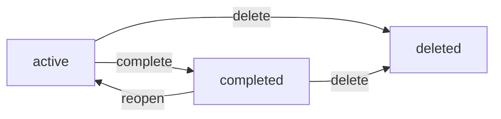
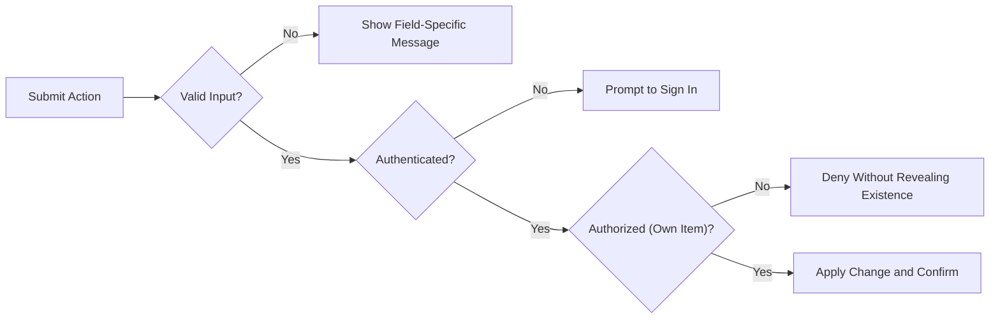
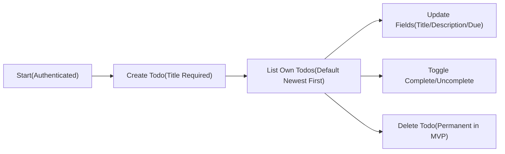
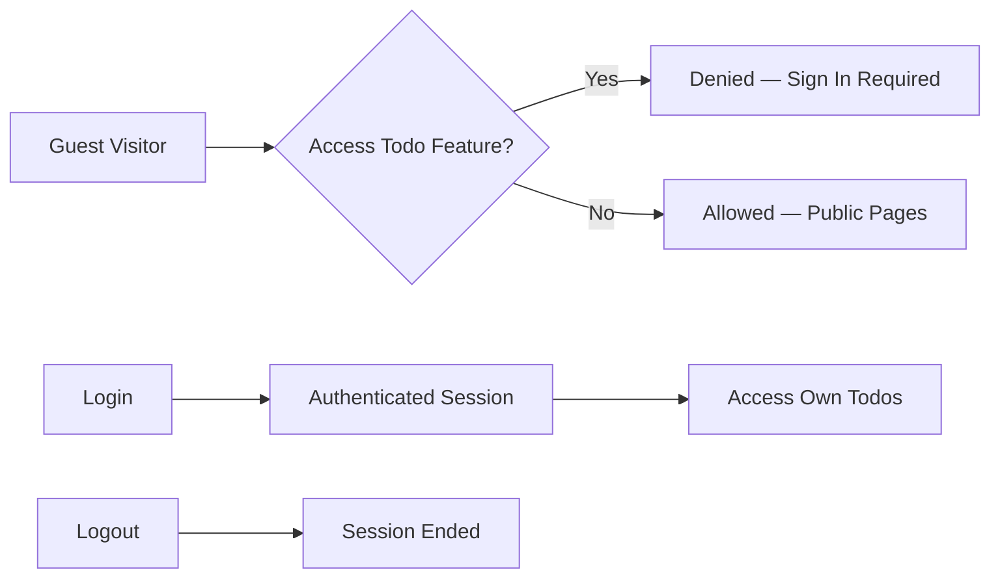

# MVP Business Requirements for todoApp

## 1. Business Objectives and Success Definition
- Provide a minimal, reliable personal task service that enables individuals to capture, track, and complete their own todos with minimal friction.
- Focus on the smallest viable scope: create, read/list, update, complete/uncomplete, delete; basic filtering and search; register, login, logout.
- Enforce privacy boundaries: each authenticated user accesses only their own data; administrators do not routinely view private todo content.
- Favor clarity and testability over feature depth to accelerate delivery.

Success definition (business-level):
- A new user registers, logs in, creates at least one todo, updates it, completes it, reopens it, deletes it, and logs out successfully.
- Listing, filtering, and search operate only over the user’s own todos.
- Common actions complete within user-perceived acceptable timeframes under typical usage conditions.

## 2. Scope and Boundaries (MVP)

### 2.1 In Scope
- Account lifecycle: register, login, logout.
- Personal todo management: create, read/list, update, complete/uncomplete, delete.
- Listing, paging, sorting, filtering, keyword search (own todos only).
- Minimal validation and clear user messages for errors.

### 2.2 Out of Scope (Explicit)
- Collaboration or sharing across users.
- Subtasks, tags/labels, priorities, projects/folders.
- Attachments or file uploads.
- Reminders/notifications and calendar integrations.
- Recurring tasks.
- Bulk operations (bulk delete/complete).
- Offline mode and device sync beyond standard authenticated sessions.
- Third-party integrations or public APIs.
- Multi-language UI (MVP uses en-US); localization is future scope.

## 3. User Roles and Permissions

Roles use camelCase identifiers and are expressed in business terms.

- guestVisitor (guest): Unauthenticated visitor. Access limited to public pages and starting registration or login. No access to any todo content.
- todoUser (member): Authenticated user. Full control over personal todo items only; can list, search, filter, create, update, complete/uncomplete, delete own items.
- systemAdmin (admin): Operational administrator for governance tasks (e.g., suspend/reactivate accounts, view aggregated service metrics). No routine access to private todo content.

### 3.1 Permission Matrix (Business-Level)

| Action (Business) | guestVisitor | todoUser | systemAdmin |
|-------------------|-------------:|---------:|------------:|
| View public pages (landing/terms/privacy) | ✅ | ✅ | ✅ |
| Register account | ✅ | ✅ | ✅ (support context) |
| Login | ✅ | ✅ | ✅ |
| Logout (end own session) | ❌ | ✅ | ✅ |
| Create todo (own) | ❌ | ✅ | ❌ |
| Read/list todos (own) | ❌ | ✅ | ❌ |
| Update todo (own) | ❌ | ✅ | ❌ |
| Complete/uncomplete todo (own) | ❌ | ✅ | ❌ |
| Delete todo (own) | ❌ | ✅ | ❌ |
| View other users’ todos | ❌ | ❌ | ❌ |
| Suspend/reactivate accounts | ❌ | ❌ | ✅ |
| View aggregated service metrics | ❌ | ❌ | ✅ |

Notes:
- "Own" refers strictly to the authenticated user’s personal items.
- Aggregated metrics exclude personal content and cannot reveal todo text or identities.

## 4. Functional Requirements (EARS)

All EARS keywords are in English. Descriptions use en-US.

### 4.1 Account Lifecycle
- THE todoApp SHALL enable registration sufficient to allow login to todo features.
- WHEN a person submits registration with unique email and a policy-compliant password, THE todoApp SHALL create an account and indicate next steps (e.g., login or verification if required by policy).
- WHEN a registered user submits valid login credentials, THE todoApp SHALL establish an authenticated session and grant access to the user’s own todos.
- IF a login attempt contains invalid credentials, THEN THE todoApp SHALL deny login without revealing which field is incorrect.
- WHEN an authenticated user requests logout, THE todoApp SHALL end the current session immediately and revert access to guestVisitor level.
- IF an unauthenticated person requests logout, THEN THE todoApp SHALL respond gracefully without exposing data or errors.

### 4.2 Create Todo
- THE todoApp SHALL require a non-empty title between 1 and 120 characters after trimming.
- WHERE a description is provided within limits (0–1000 characters), THE todoApp SHALL store it with the todo.
- WHERE a due date is provided and is a valid calendar date/time, THE todoApp SHALL accept it using the user’s timezone context.
- WHEN a todoUser submits a valid create request, THE todoApp SHALL create the todo as active (not completed) and record creation timestamp.
- IF the title is empty or whitespace-only, THEN THE todoApp SHALL reject creation and identify the rule.
- IF the due date format is invalid, THEN THE todoApp SHALL reject creation and describe the expected format in business terms.

### 4.3 Read/List Own Todos
- WHEN a todoUser requests their todo list, THE todoApp SHALL return only that user’s todos.
- THE todoApp SHALL provide default ordering by newest created first.
- WHERE pagination is not specified, THE todoApp SHALL return 20 items per page by default.
- WHERE filters are provided, THE todoApp SHALL apply status and due filters as specified.
- WHERE a keyword is provided, THE todoApp SHALL search case-insensitively in title and description and return only matching items owned by the user.

### 4.4 Update Todo
- WHEN a todoUser updates title, description, or due date on an owned todo with valid values, THE todoApp SHALL persist the change and set updated timestamp.
- IF validation fails for any updated field, THEN THE todoApp SHALL reject the update and identify the specific rule.
- IF the todo does not belong to the user, THEN THE todoApp SHALL deny the update without revealing resource existence.

### 4.5 Complete/Uncomplete Todo
- WHEN a todoUser marks an owned todo as completed, THE todoApp SHALL set completed status and record completed timestamp.
- WHEN a todoUser marks a completed todo as active, THE todoApp SHALL clear the completed timestamp and set status to active.
- IF a user attempts to toggle completion on a todo they do not own, THEN THE todoApp SHALL deny the action without revealing resource existence.

### 4.6 Delete Todo
- WHEN a todoUser confirms deletion of an owned todo, THE todoApp SHALL remove it from normal lists immediately for MVP.
- IF a delete request targets a todo not owned by the user, THEN THE todoApp SHALL deny the action without revealing resource existence.
- IF a delete request targets an already deleted or non-existent todo, THEN THE todoApp SHALL respond harmlessly indicating no such active item remains.

### 4.7 Listing, Sorting, Filtering, Searching
- THE todoApp SHALL support status filter: all, active, completed (deleted items excluded).
- WHERE a due filter is set, THE todoApp SHALL support overdue (due before now and not completed), due today (current local date), and future (due after today).
- WHERE sorting by due date is requested, THE todoApp SHALL order by due date ascending and list items without due date after those with due dates; ties break by creation time (newest first).
- WHEN a search keyword is provided, THE todoApp SHALL match case-insensitively against title and description substrings.

## 5. Business Rules and Validation

### 5.1 Fields (Conceptual)
- Title (required): 1–120 characters after trimming; must include at least one non-whitespace character.
- Description (optional): 0–1000 characters after trimming.
- Due date (optional): valid date or date-time interpreted in user’s local timezone (e.g., Asia/Seoul if that is the user’s setting); past dates allowed for state reporting but disallowed when policy requires future-only on create/update (see acceptance section variant below).
- Status (system-managed): active or completed.
- Timestamps (system-managed): createdAt, updatedAt, completedAt (when completed).

### 5.2 Validation Rules (Business-Level)
- Title must not be empty or whitespace-only after trimming and must not exceed 120 characters.
- Description must not exceed 1000 characters.
- Due date, if provided, must be parsable as a calendar date or date-time and associated to user’s timezone for interpretation.
- Requests must belong to the authenticated owner to proceed with todo operations.

### 5.3 Status Model and Transitions
- Allowed states: active, completed.
- Transitions: active → completed; completed → active; either state → deleted (terminal in MVP).

### 5.4 Sorting, Filtering, and Search Logic
- Default sort: createdAt descending (newest first).
- Due date sort: ascending; items without due date appear after those with due date.
- Status filter: active-only, completed-only, or all (excluding deleted).
- Due filters: overdue (due < now and not completed), today (same local date and not completed), future (due > today and not completed).
- Search behavior: case-insensitive substring matches; empty or whitespace-only search treated as no search input.

### 5.5 Pagination Rules
- Default page size: 20 items when not specified.
- Allowed page sizes: 1 to 100 items per page.

## 6. Error Handling and Recovery (Business-Facing)

- WHEN a validation rule fails, THE todoApp SHALL provide a specific message describing the field and rule and SHALL not persist changes.
- WHEN authentication is missing or expired, THE todoApp SHALL communicate that sign-in is required and SHALL not perform the action.
- WHEN authorization is insufficient (e.g., cross-user access attempt), THE todoApp SHALL deny the action without revealing resource existence.
- WHEN a conflict occurs due to stale state (e.g., item deleted elsewhere), THE todoApp SHALL inform the user and suggest refreshing the list.
- WHEN temporary unavailability or timeouts occur, THE todoApp SHALL communicate retry guidance in plain language.

Illustrative validation and auth gating:

## 7. Performance and Non-Functional Expectations (User Terms)

- WHEN a todoUser lists up to 200 of their own todos, THE todoApp SHALL return results within 2 seconds for at least 95% of attempts under normal load.
- WHEN creating, updating, completing, or deleting a todo, THE todoApp SHALL confirm the action within 2 seconds for at least 95% of attempts under normal load.
- WHEN performing keyword search over own todos, THE todoApp SHALL return results within 3 seconds for at least 95% of attempts under normal load.
- WHILE a session is active, THE todoApp SHALL authorize only the session owner’s actions and SHALL deny other users’ data access in 100% of tested cases.

## 8. Acceptance Criteria (Consolidated EARS)

Account lifecycle
- WHEN registration inputs are valid and unique, THE todoApp SHALL create an account and enable login.
- IF login credentials are invalid, THEN THE todoApp SHALL deny login without revealing whether the email exists.
- WHEN logout is requested by an authenticated user, THE todoApp SHALL end the session immediately.

Create todo
- WHEN a todoUser submits a title 1–120 characters and optional fields within limits, THE todoApp SHALL create the todo as active and record creation time.
- IF the title is empty after trimming or exceeds 120 characters, THEN THE todoApp SHALL reject creation with a specific message.
- IF the description exceeds 1000 characters, THEN THE todoApp SHALL reject creation with a specific message.
- IF the due date is not a valid date/time, THEN THE todoApp SHALL reject creation with format guidance.

Read/list own todos
- WHEN a todoUser requests their todo list, THE todoApp SHALL return only that user’s todos sorted by newest first by default.
- WHERE no page size is specified, THE todoApp SHALL return 20 items per page.

Update todo
- WHEN a todoUser updates an owned todo with valid values, THE todoApp SHALL persist changes and update the last modified time.
- IF any updated field violates its rule, THEN THE todoApp SHALL reject the update and identify the field.

Complete/uncomplete
- WHEN a todoUser marks an owned todo as completed, THE todoApp SHALL set completed status and record completion time.
- WHEN a todoUser reopens a completed todo, THE todoApp SHALL set status to active and clear completion time.

Delete todo
- WHEN a todoUser confirms deletion of an owned todo, THE todoApp SHALL remove it from normal views immediately.
- IF the todo does not exist or was already deleted, THEN THE todoApp SHALL respond without fatal error and indicate no such active item remains.

Filters and search
- WHERE status filters are applied, THE todoApp SHALL include only items matching the selected status.
- WHERE due filters are applied, THE todoApp SHALL include only items matching the selected time window and not completed when applicable.
- WHERE a search term is provided, THE todoApp SHALL match case-insensitively against title and description substrings.

Privacy and access
- THE todoApp SHALL restrict access to todo data so users can access only their own items.
- IF a cross-user access is attempted, THEN THE todoApp SHALL deny the action and avoid revealing existence.

Performance
- THE todoApp SHALL meet the response-time targets in Section 7 for 95% of successful requests under normal load.

## 9. KPIs and Measurement Guidance (Business-Level)

- Activation: Percentage of registrations that successfully log in within 24 hours of registration.
- Task creation velocity: Average number of todos created per weekly active user.
- Task completion rate: Percentage of created todos completed within 14 days.
- Retention (week 1): Percentage of new users who perform at least one todo action between day 7 and day 14.
- Error-free session rate: Percentage of sessions without user-visible validation/auth/system errors.
- Responsiveness P95: Percentage of operations meeting the 2–3 second targets (by operation type).

Guidance: Use business events (register, login, create, update, complete, delete, list/search) and user-perceived durations. Implementation and tooling are left to the development team.

## 10. Visuals (Mermaid)

Core todo path (conceptual):

Auth gating (conceptual):

## 11. Glossary
- Active: A todo that is not completed.
- Completed: A todo marked as done; has a completion timestamp.
- Due date: Optional target date/time for completion; interpreted in the user’s local timezone.
- Overdue: A todo with due date earlier than now (user’s timezone) and not completed.
- Session: Period during which a user is authenticated and can access protected actions.

---
Business requirements only. Technical implementation decisions (architecture, APIs, database design, and infrastructure) are at the discretion of the development team; the content above specifies WHAT todoApp must do for MVP, not HOW to build it.