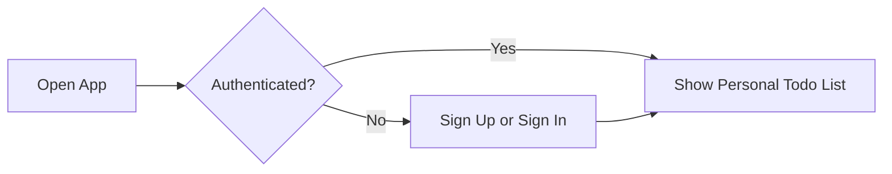
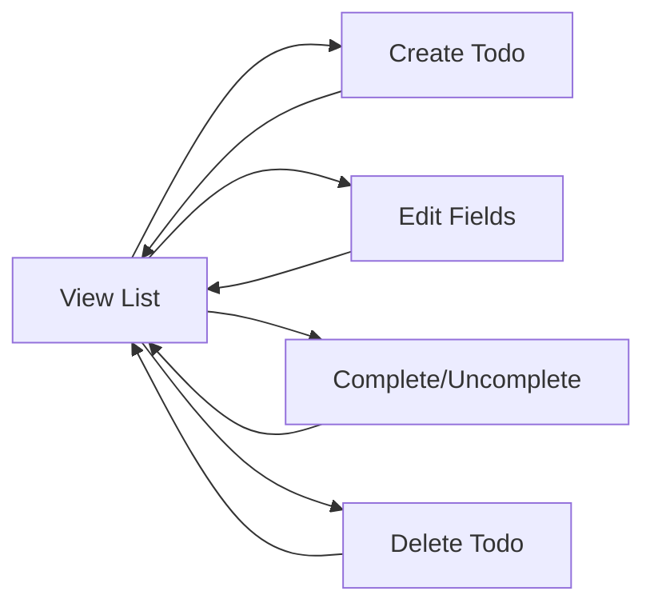
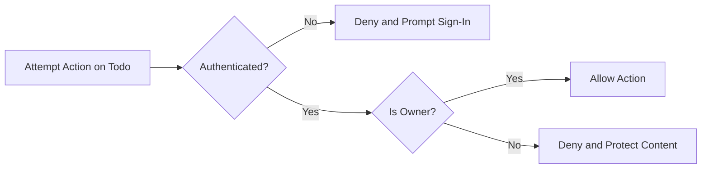

# Requirements Analysis — Todo MVP

Audience: newcomers to development and the delivery team building the smallest useful Todo list application. Focus: absolute minimum features with clear, testable business behavior written in plain language using EARS formatting.

## 1. Vision and Scope Summary

Problem and goal
- Individuals need a fast, distraction-free way to capture tasks, see what remains, and mark items done. Complex features slow people down and increase confusion.

Target users and value
- Single, authenticated individuals who manage only their own tasks. Value comes from speed, clarity, privacy, and predictable behavior.

MVP boundaries (business-level)
- Include only: create, list, update (title/notes/due), complete/uncomplete, delete; minimal authentication; basic filtering/sorting; simple, clear error handling.
- Exclude collaboration, tags, reminders, attachments, recurring tasks, import/export, social features, and any advanced account features.

## 2. Roles and Access Overview

Roles
- Guest: unauthenticated visitor; may read public information pages only; no Todo access.
- User: authenticated person managing only their own Todos.
- Admin: limited administrator for operational oversight (aggregate usage, account lifecycle); does not browse or edit member Todo content in MVP.

Ownership principle
- Every Todo belongs to exactly one User. No sharing, no delegation, no team lists in MVP.

EARS requirements (Roles)
- THE service SHALL restrict all Todo actions to authenticated owners only.
- IF a Guest attempts any Todo action, THEN THE service SHALL deny the action and guide sign-in.
- WHEN an Admin requests platform oversight, THE service SHALL provide only aggregate, non-content information in MVP.

## 3. Core Functional Requirements (Business-Level)

Todo concept
- Title (required), Notes (optional), Due Date (optional), Status (Active or Completed), Ownership (single user), Timestamps (created, last updated; completed time only when completed).

Create
- Users create a Todo by entering a Title and optionally Notes and Due Date. Default Status is Active.

Read/List
- Users view only their own Todos. Default list focuses on unfinished work with simple ordering and filtering.

Update
- Users may change Title, Notes, Due Date for their own Todos.

Complete/Uncomplete
- Users may toggle between Active and Completed for their own Todos.

Delete
- Users may permanently remove their own Todos (no recovery in MVP).

Basic filter/sort
- Status filter: All, Active, Completed. Minimal sorting: by due date (soonest first) or by creation time (newest first).

EARS requirements (Core)
- WHEN a user submits a new Todo with a non-empty Title after trimming, THE service SHALL create the Todo as Active and make it visible immediately.
- WHEN a user lists Todos, THE service SHALL present only that user’s Todos with predictable default ordering.
- WHEN a user edits Title/Notes/Due Date of their own Todo with valid input, THE service SHALL apply changes and reflect them immediately.
- WHEN a user toggles completion on their own Todo, THE service SHALL set Status accordingly and reflect changes immediately.
- WHEN a user deletes their own Todo, THE service SHALL remove it so it no longer appears anywhere for that user.
- IF a user attempts to act on another person’s Todo, THEN THE service SHALL deny the action without disclosing content.

## 4. Workflows and User Journeys (Conceptual)

High-level sign-in and access


Todo lifecycle operations


Authorization decision


## 5. Business Rules and Validation

Field semantics
- Title: short description identifying the task; required; trimmed of leading/trailing whitespace; preserves internal spacing.
- Notes: optional free-form text; multiline allowed; preserves line breaks.
- Due Date: optional calendar date; time-of-day not required in MVP; treated in user’s local time context.
- Status: Active or Completed only.
- Ownership: exactly one owner; no sharing.
- Timestamps: created time on creation; last updated time on successful edit; completed time only when set to Completed.

Validation limits (business-level)
- Title length: 1–120 characters after trimming.
- Notes length: up to 1,000 characters.
- Due Date: must be a valid calendar date if provided; may be in the past (indicates overdue) or future; clearing is allowed.

EARS requirements (Validation)
- WHEN a user creates a Todo, THE service SHALL reject the request IF Title is empty after trimming or exceeds limits.
- WHEN a user updates a Todo, THE service SHALL apply the same validation rules as on creation.
- WHERE Notes are provided, THE service SHALL accept up to 1,000 characters and treat whitespace-only Notes as empty.
- WHERE a Due Date is provided, THE service SHALL accept it only if it is a valid calendar date; clearing is permitted.

## 6. Authentication and Session Expectations

Journeys
- Registration: create an account with basic credentials.
- Sign-in: authenticate to access the personal Todo list.
- Sign-out: end session; prevent further access until next sign-in.
- Session persistence: keep session for a reasonable period; expire after inactivity; explicit sign-out ends immediately.

EARS requirements (Auth)
- THE authentication subsystem SHALL allow individuals to register, sign in, and sign out.
- WHILE a session is valid, THE service SHALL associate all Todo actions with that user.
- WHEN a session expires or the user signs out, THE service SHALL require sign-in again before any Todo action.
- IF a Guest attempts a protected action, THEN THE service SHALL deny the action and guide sign-in.

## 7. Authorization and Permission Requirements

Role capabilities (business-only)
- Guest: view public pages; cannot view or act on any Todo.
- User: full control over own Todos only.
- Admin: platform-level aggregates and account lifecycle; cannot browse or edit member Todo content in MVP.

EARS requirements (Authorization)
- THE authorization model SHALL restrict reads and writes to the owner’s Todos only.
- WHEN a user lists or reads Todos, THE service SHALL return only items owned by that user.
- WHEN a user edits, completes/uncompletes, or deletes a Todo, THE service SHALL permit the action only if the user owns that Todo.
- IF an Admin attempts to read or modify member Todo content in MVP, THEN THE service SHALL deny the action.

## 8. Error Handling and Recovery (Business Language)

Principles
- Short, clear messages; no technical jargon. Preserve valid input where feasible. Treat repeated submissions safely (idempotent behavior for status toggles and safe retries).

Key outcomes
- Validation failure: identify the field and rule; allow correction without losing other entries.
- Ownership denial: state that only the owner can act; protect content.
- Authentication failure/expiry: indicate sign-in required; preserve unsaved work where feasible.
- Not found/Already deleted: inform no action needed; recommend refreshing list.
- Concurrency conflict: inform change elsewhere; advise refresh and retry.

EARS requirements (Errors)
- IF validation fails, THEN THE service SHALL reject the operation, state the rule violated, and retain valid inputs where feasible.
- IF ownership is invalid, THEN THE service SHALL deny the action without revealing content.
- WHEN a session expires during an action, THE service SHALL stop the action and require sign-in, preserving input where feasible.
- WHEN a duplicate or repeat toggle is submitted, THE service SHALL confirm the final state without error.

## 9. Non-Functional Requirements (User-Centric)

Performance targets (normal conditions)
- List up to 100 items: P95 within 600 ms.
- Create, update, complete/uncomplete, delete: P95 within 700–800 ms.
- Authentication: P95 within 1,000 ms.
- Hard ceiling for any operation: 2,000 ms, after which recovery guidance applies.

Availability and reliability
- Target 99.5% monthly availability for core features.
- Confirmed writes are durable and visible on subsequent reads within 1 second in normal conditions.

Security and privacy (business-level)
- Authentication required for any Todo access. No exposure of another user’s content. Minimize personal data collection. Do not surface technical error details.

Accessibility
- Core tasks possible without pointer-only interactions; text-based feedback for outcomes to support assistive technologies.

EARS requirements (NFR)
- THE service SHALL meet or exceed the P95 targets above under normal load.
- WHERE load spikes occur, THE service SHALL maintain critical operation responsiveness and may defer large list retrieval.
- THE service SHALL deny access to Todo data unless authenticated.

## 10. Data Lifecycle and Retention (Conceptual)

Lifecycle states
- Active, Completed, Deleted (terminal). No archive or recycle bin in MVP.

Diagram
```mermaid
stateDiagram-v2
  direction LR
  ["start"] --> "Active"
  "Active" --> "Completed": "Toggle to Completed"
  "Completed" --> "Active": "Toggle to Active"
  "Active" --> "Deleted": "Delete"
  "Completed" --> "Deleted": "Delete"
```

Retention principles
- Todos persist indefinitely until user deletion. Deletion is immediate and irreversible from the user’s perspective in MVP. Admin compliance deletion uses the same permanence principle.

EARS requirements (Lifecycle)
- WHEN a Todo is created, THE service SHALL set Status to Active and record created time.
- WHEN a Todo is completed, THE service SHALL set Status to Completed and record completed time.
- WHEN a Todo is uncompleted, THE service SHALL set Status to Active and clear completed time.
- WHEN a Todo is deleted, THE service SHALL remove it so it no longer appears in list or detail views.

## 11. Acceptance Criteria (EARS Consolidated)

Access and ownership
- THE service SHALL restrict Todo visibility and actions to the authenticated owner.
- IF a Guest or another user attempts access, THEN THE service SHALL deny without revealing content.

Create
- WHEN a user submits Title with at least one non-space character after trimming, THE service SHALL create the Todo as Active and show it immediately.
- IF Title is empty or exceeds 120 characters after trimming, THEN THE service SHALL reject creation and indicate the rule.

Read/List
- THE service SHALL show only the owner’s Todos.
- THE service SHALL support a status filter of All, Active, Completed and at least one default sort (due date ascending or creation time newest first).

Update
- WHEN Title/Notes/Due Date are changed with valid values, THE service SHALL apply changes and update last updated time.
- IF a changed field violates its rule, THEN THE service SHALL reject the entire change and preserve prior values.

Complete/Uncomplete
- WHEN completion is toggled, THE service SHALL set Status accordingly and update ordering to reflect status and sort rules.

Delete
- WHEN a user confirms deletion of their own Todo, THE service SHALL remove it so it no longer appears in any list.
- IF deletion targets an item that no longer exists, THEN THE service SHALL indicate no action is needed and invite refresh.

Non-functional
- THE service SHALL reflect successful list and mutation actions to the user within 2 seconds under normal conditions, with P95 targets as stated.

## 12. Out-of-Scope (Strict MVP)

- Collaboration, shared lists, team features, or role delegation.
- Tags, labels, priorities, projects/folders, or custom fields.
- Reminders, notifications, recurring tasks, or calendar integrations.
- Attachments, images, or file uploads.
- Bulk operations, drag-and-drop ordering, or advanced sorting/filtering.
- Import/export, data migration, or third-party integrations.
- Admin content browsing or moderation of member Todos (beyond compliance deletion, which does not reveal content).
- Advanced authentication (social login, 2FA), password reset, or email verification.

## 13. Glossary

- Active: Todo is not yet completed.
- Completed: Todo marked done by the owner; remains editable; can be toggled back to Active.
- Deleted: Terminal state; item removed from user views; no recovery in MVP.
- Owner: The authenticated user account that created and controls the Todo.
- EARS: Easy Approach to Requirements Syntax; pattern for writing precise, testable requirements.
- P95: 95th percentile completion time of an operation measured end-to-end under normal conditions.

End of requirements analysis for the minimal Todo MVP.