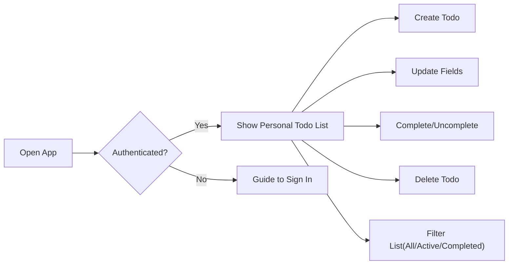
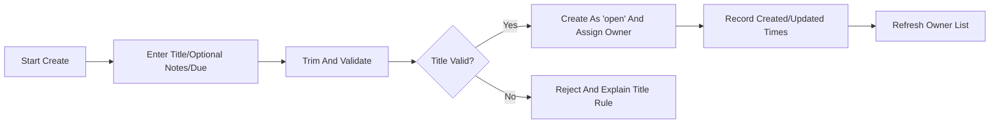
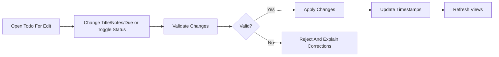
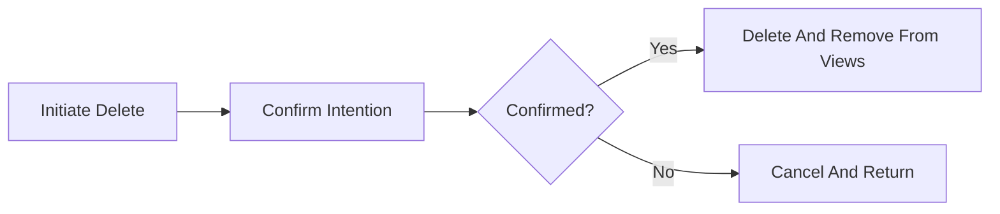

# Functional Requirements – Todo Management (MVP)

Audience: development team (business-level). Purpose: define WHAT the minimal Todo application must do to support a single user managing personal Todos. No technical specifications (no APIs, schemas, protocols, or stack choices). Focus is the smallest viable scope.

## 1. Overview and Scope
The Todo MVP enables an authenticated individual to manage a personal list of Todos with only essential capabilities: create, list/read, update (title/notes/due date), complete/uncomplete, and delete. Privacy and simplicity are paramount. All features beyond the essentials are excluded in MVP to ensure fast delivery and predictable behavior.

Objectives:
- Capture tasks quickly with minimal required input.
- Keep the list clear and focused on the user’s own items.
- Provide immediate, understandable feedback for all actions.
- Maintain strict ownership boundaries: no sharing or team features.

Constraints:
- Business language only; avoid technical details.
- Minimal authentication expectations only; no advanced account features.
- No collaboration, notifications, tags, projects, or attachments.

## 2. Roles and Access Summary (Business-Level)
Roles define who can do what in simple business terms:
- Guest: Unauthenticated visitor. May view public information pages only; cannot access Todo data or actions.
- User: Authenticated individual. May create, read, update, complete/uncomplete, and delete only their own Todos.
- Admin: Administrator for operational integrity. May access aggregate metrics or perform compliance actions; does not view or edit member Todo content in MVP.

Ownership and privacy:
- Each Todo belongs to exactly one user. No shared ownership. Only the owner can see or act on the Todo.

## 3. Todo Concept and Field Semantics (Business-Level)
- Title (required): Short label of the task; must be meaningful after trimming leading/trailing whitespace. Length: 1–120 characters after trim.
- Notes (optional): Additional context; free text up to 1,000 characters; whitespace-only notes are treated as empty.
- Due Date (optional): Calendar date indicating intended completion; may be in the past, present, or future; no time-of-day required in MVP.
- Status (required): Either "open" or "completed". New Todos are "open" by default.
- Ownership: Exactly one owner per Todo; all operations are restricted to the owner.
- Timestamps (business-level): System-managed creation time; last updated time; completion time recorded only when status becomes "completed" and cleared when reverted to "open".

## 4. Validation Rules (Business-Level)
- Title: Required; trim whitespace; must have at least one non-space character; length 1–120 after trim; everyday characters allowed; disallow non-printable control characters.
- Notes: Optional; up to 1,000 characters; preserve line breaks; everyday characters allowed; disallow non-printable control characters; whitespace-only treated as empty.
- Due Date: Optional; valid calendar date; may be past/present/future; user’s local time context assumed for day-based interpretation.
- Status: Only "open" or "completed"; default "open" on creation; toggle allowed either direction.
- Atomicity: Validation must pass for all provided fields or the change is rejected with no partial updates.

EARS requirements (validation):
- WHEN a user submits a Todo, THE system SHALL reject creation IF the Title is empty after trimming or exceeds 120 characters.
- WHEN a user updates a Todo title, THE system SHALL apply the same validation as on creation and reject invalid titles.
- WHERE Notes are submitted, THE system SHALL accept up to 1,000 characters and treat whitespace-only Notes as empty.
- WHEN a Due Date is provided, THE system SHALL accept it only if it represents a valid calendar date and SHALL allow clearing it later.
- WHEN multiple fields are submitted in one operation, THE system SHALL validate all fields and proceed only if all validations pass.

## 5. Core Functional Requirements (EARS)
All statements use EARS keywords and are testable in business terms.

### 5.1 Create Todo
- WHEN an authenticated user submits a new Todo with a valid Title, THE system SHALL create the Todo as "open" and associate it with that user.
- THE system SHALL record creation time and last updated time when the Todo is created.
- IF Title validation fails, THEN THE system SHALL reject creation and state that Title is required (1–120 chars after trim).
- WHERE a Due Date is provided, THE system SHALL accept any valid calendar date (including past dates) and store it; the user may omit or remove it at any time.
- WHERE Notes are provided, THE system SHALL accept up to 1,000 characters and store them.
- THE system SHALL make the newly created Todo visible in the owner’s list immediately after successful creation.

### 5.2 Read/List Todos
- THE system SHALL list only the requesting user’s Todos.
- THE system SHALL present the default list sorted by creation time (newest first) to ensure predictability.
- WHERE the user selects a status filter of Active or Completed, THE system SHALL show only Todos matching the selection; All shows both.
- THE system SHALL reflect any successful create/update/complete/uncomplete/delete operation in the visible list immediately.
- WHILE the user has zero Todos, THE system SHALL present an empty state with clear guidance to add a Todo.

### 5.3 Update Todo (Title/Notes/Due)
- WHEN the owner updates Title, Notes, or Due Date, THE system SHALL validate inputs and apply the changes if valid.
- THE system SHALL update the last updated time upon any successful edit.
- IF any updated field fails validation, THEN THE system SHALL reject the entire update and explain what to correct.
- WHERE Due Date is cleared, THE system SHALL remove the stored Due Date and keep other fields unchanged.

### 5.4 Complete/Uncomplete Todo
- WHEN the owner marks a Todo as completed, THE system SHALL set Status to "completed" and record completion time.
- WHEN the owner reopens a completed Todo, THE system SHALL set Status to "open" and clear completion time.
- THE system SHALL keep Completed Todos out of the default list unless the Completed filter is selected.
- WHILE rapid toggling occurs, THE system SHALL ensure the final stored state matches the user’s last action.

### 5.5 Delete Todo (Final)
- WHEN the owner confirms deletion, THE system SHALL remove the Todo from the owner’s accessible list immediately.
- THE system SHALL treat deletion as final in MVP; there is no recovery mechanism.
- IF a deletion is attempted on a Todo that no longer exists, THEN THE system SHALL indicate that no further action is needed and suggest refreshing the list.

## 6. Filtering and Sorting (Minimal MVP)
- Status Filter: All, Active, Completed.
- Default Sorting: Creation time, newest first, for all views.
- Completed View Ordering: Prefer most recently completed first; where completion time is not available, use creation recency.
- No additional filters (e.g., overdue, date ranges) or custom sorters in MVP.

EARS requirements (filtering/sorting):
- THE system SHALL provide a status filter with options All, Active, Completed.
- THE system SHALL apply default sorting by creation time (newest first) in all list views.
- WHERE the Completed filter is selected, THE system SHALL order items by most recently completed or, if absent, by creation recency.

## 7. Business Workflows (Conceptual)

### 7.1 Overall Usage Flow

### 7.2 Create Flow

### 7.3 Update and Completion Flow

### 7.4 Delete Flow

## 8. Error Handling and Messaging (Business Outcomes)
- Validation failures: State which field violates which rule (e.g., “Title is required and must be 1–120 characters after trimming”). Preserve other valid input where feasible.
- Ownership denials: Clarify that only the owner can manage the item; avoid revealing whether another user’s Todo exists.
- Session expiration: Explain that sign-in is required to continue and, where feasible, preserve unsaved input for retry after sign-in.
- Not found/already deleted: Say that no further action is needed and suggest refreshing the list.
- Idempotent toggles: Reapplying completion to an already-completed Todo confirms the current state without error.
- Rate limiting (if applied): Communicate that too many actions occurred in a short time and advise waiting briefly before retrying.

EARS requirements (errors):
- WHEN validation fails, THE system SHALL reject the operation and indicate what to correct in plain language.
- IF a guest attempts any Todo operation, THEN THE system SHALL deny the action and guide the guest to sign in.
- IF a user attempts to act on a Todo they do not own, THEN THE system SHALL deny the action and protect content.
- WHEN a session has expired, THE system SHALL require sign-in again and preserve unsaved input where feasible.
- WHEN a target Todo no longer exists, THE system SHALL report that no action is needed and advise refreshing.

## 9. Performance and Responsiveness (User-Centric)
- Perceived immediacy: Core actions (create, update, complete/uncomplete, delete, list) should feel immediate under normal conditions.
- Timing expectation: WHEN a user performs a core action, THE system SHALL reflect the result within approximately 2 seconds for typical lists (up to about 200 Todos).
- Feedback: IF processing takes longer than a brief moment, THEN THE system SHALL provide a non-technical waiting indication and avoid data loss.

## 10. Acceptance Criteria (Consolidated EARS)
General access and ownership:
- THE system SHALL restrict all Todo operations to authenticated owners only.
- WHEN a user views their list, THE system SHALL present only that user’s Todos.
- IF a user attempts to access a Todo not owned by them, THEN THE system SHALL deny without revealing existence.

Create:
- WHEN a valid Title is submitted, THE system SHALL create the Todo as "open" and display it immediately in the owner’s list.
- IF Title is empty after trimming or exceeds 120 characters, THEN THE system SHALL reject creation and explain the rule.
- WHERE Notes are provided within 1,000 characters, THE system SHALL save them.
- WHERE a valid Due Date is provided, THE system SHALL save it and allow clearing later.

Read/List:
- THE system SHALL default-sort by creation time (newest first) and support a status filter of All, Active, Completed.
- THE system SHALL update list views immediately after successful changes.

Update:
- WHEN Title/Notes/Due changes are valid, THE system SHALL apply them and update the last updated time.
- IF any change is invalid, THEN THE system SHALL reject the update and explain what to correct.

Complete/Uncomplete:
- WHEN completion is requested, THE system SHALL set Status to "completed" and record completion time.
- WHEN reopening is requested, THE system SHALL set Status to "open" and clear completion time.
- THE system SHALL exclude completed items from the default view unless the Completed filter is selected.

Delete:
- WHEN deletion is confirmed, THE system SHALL remove the Todo from the owner’s views immediately and treat the removal as final.
- IF the Todo is already absent, THEN THE system SHALL indicate that no action is needed and suggest refreshing.

Performance:
- WHEN core actions are performed under normal conditions, THE system SHALL present outcomes within about 2 seconds and show a waiting indication if longer.

## 11. Out-of-Scope Confirmation (MVP Discipline)
Excluded features in MVP:
- Collaboration, sharing, assigning Todos to others, or viewing others’ Todos.
- Projects, folders, tags/labels, priorities, custom fields, or color-coding.
- Reminders, notifications, recurring tasks, or calendar integration.
- Attachments, images, or file uploads.
- Text search, advanced filters, or analytics dashboards.
- Bulk operations or manual reordering and drag-and-drop sorting.
- Import/export or data migration features.
- Admin consoles for browsing user content.
- Email verification, password reset, social login, or 2FA.

## 12. Traceability and References
- Scope boundaries and minimal feature set: see the descriptive overview in "MVP Scope and Out-of-Scope Definition" in the documentation set.
- Role capabilities and ownership rules: see the descriptive "User Roles and Permissions Requirements" material.

This specification conveys business requirements only. All technical implementation decisions (architecture, APIs, storage) are at the discretion of the development team.