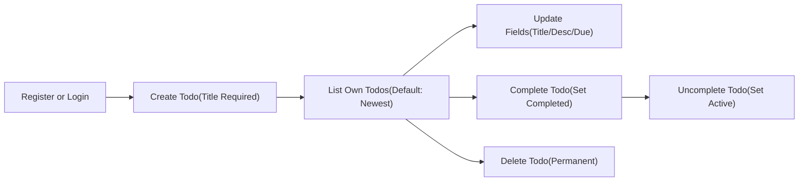
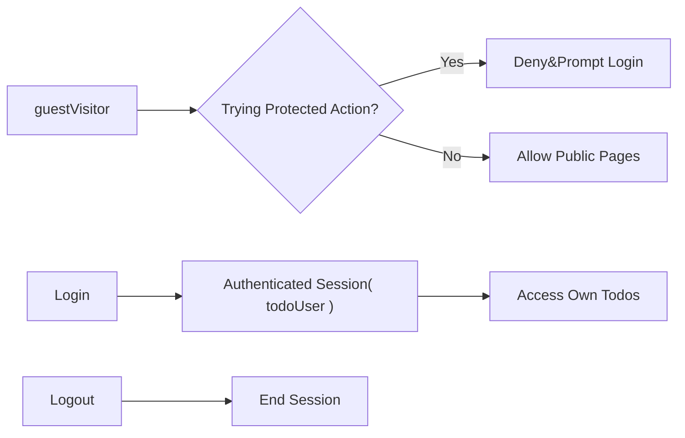
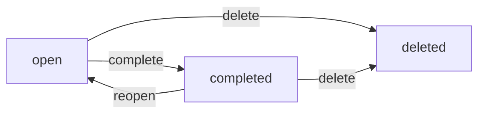

# 02-business-requirements.md — MVP Business Requirements for todoApp

## 1. Purpose and Scope
Defines WHAT todoApp must do for the MVP in precise business terms so developers can implement immediately. No APIs, database schemas, or technical architecture decisions are included. Developers have full autonomy over all technical implementation details. Content uses en-US language conventions, with EARS keywords in English.

Audience: product managers and backend developers who need unambiguous business requirements. Locale focus: en-US; time semantics are described relative to the user’s local timezone.

## 2. Business Objectives and Success Definition
- Provide a minimal, reliable personal Todo service that enables individuals to record, track, and complete their own items privately.
- Keep scope intentionally small: create, read, update, complete/uncomplete, delete personal Todos; list/filter/sort/search own items; register/login/logout; minimal account controls.
- Enforce privacy: each authenticated user can access only their own data.
- Define clear, testable acceptance criteria and performance expectations to enable rapid delivery and validation.

Success Definition (MVP):
- A new user registers, logs in, creates at least one Todo, updates it, marks it complete/uncomplete, deletes it, and logs out successfully, with responsive performance under normal conditions.
- All list/filter/search operations return only the user’s own items.
- Attempts to access another user’s data are denied without disclosure.
- Typical actions respond within user-perceived targets defined in this document.

## 3. Roles and Access Model (Business Terms)

### 3.1 Roles
- guestVisitor (guest): Unauthenticated visitor. Can view public pages (landing, terms, privacy) and initiate registration or login. Cannot access any Todo data.
- todoUser (member): Authenticated end user. Can perform all allowed actions only on their own Todos; can manage their account (change password, logout, initiate password reset).
- systemAdmin (admin): Operational governance. Can suspend/reactivate accounts and view aggregated service metrics. No routine access to private Todo content.

### 3.2 Permission Matrix (Business-Level)

| Action | guestVisitor | todoUser | systemAdmin | Notes |
|---|---|---|---|---|
| View landing/terms/privacy | ✅ | ✅ | ✅ | Public content |
| Register new account | ✅ | ❌ | ✅ (support use cases) | Logged-in users do not “register” again |
| Login (own), Logout (own) | ✅ (login only) | ✅ | ✅ | Logout applies only when authenticated |
| Initiate password reset | ✅ | ✅ | ✅ | Identity confirmation required |
| Change own password | ❌ | ✅ | ✅ | Admin for own admin account |
| Create Todo (own) | ❌ | ✅ | ❌ | Owner-only action |
| Read/List Todos (own) | ❌ | ✅ | ❌ | Owner-only visibility |
| Update Todo (own) | ❌ | ✅ | ❌ | Owner-only action |
| Complete/Uncomplete Todo (own) | ❌ | ✅ | ❌ | Owner-only action |
| Delete Todo (own) | ❌ | ✅ | ❌ | Owner-only action |
| View other users’ Todos | ❌ | ❌ | ❌ | Prohibited in MVP |
| Suspend/Reactivate user account | ❌ | ❌ | ✅ | Governance only |
| View aggregated service metrics | ❌ | ❌ | ✅ | No private content |

EARS (Access Principles):
- THE todoApp SHALL restrict access to Todo data to the resource owner only.
- THE todoApp SHALL treat unauthenticated usage as guestVisitor and deny protected actions.
- IF a user attempts to act on another user’s data, THEN THE todoApp SHALL deny the action without disclosing whether the target exists.

## 4. In-Scope Functionalities (MVP)
- Account lifecycle: register, login, logout; change password; initiate password reset.
- Personal Todo management: create, read/list, update, complete/uncomplete, delete.
- Listing and exploration: default sorting, pagination, status filters, due-window filters, keyword search on own Todos.
- Privacy and access enforcement for all protected actions.
- Clear user-facing validations and error communications in business terms.

Out of Scope (MVP): collaboration/sharing, tags/labels/projects, priorities, reminders/notifications, recurring tasks, subtasks, attachments, bulk operations, calendar views, third-party integrations, offline mode, public profiles.

## 5. Feature Descriptions (Natural Language)

### 5.1 Account Lifecycle (Minimal)
- Registration creates a personal account using essential information (e.g., email and password). Optional email verification may be enabled by policy.
- Login authenticates the user to access personal Todo features. On success, a session remains active until logout or expiration based on session policy.
- Logout ends the current device/browser session; subsequent protected actions are denied until login.
- Change password allows an authenticated user to set a new password with basic complexity rules.
- Password reset allows a user to request a reset using their registered email; delivery and verification occur through a secure channel.

### 5.2 Personal Todo Management (CRUD + Status)
- Create: Requires title; optional description and due date. New Todos start as active (not completed) and include a creation timestamp.
- Read/List: Shows the authenticated user’s own Todos only. Default sorting is newest created first. Results are paginated.
- Update: Owner can modify title, description, due date. Update sets a last-modified timestamp.
- Complete/Uncomplete: Owner can mark completed (records completion timestamp) or revert to active (clears completion timestamp).
- Delete: Owner can permanently remove the Todo in MVP; it disappears from listings immediately.

### 5.3 Listing, Filtering, Sorting, Search
- Listing: Returns only the owner’s Todos with default sort by created time, newest first.
- Filtering: Status filters (All, Active, Completed). Due-window filters (Overdue, Due Today, Upcoming) interpret dates in the user’s timezone.
- Sorting: Default createdAt desc; optional due date ascending (items without due date appear after those with due dates).
- Search: Case-insensitive keyword search against title and description of the user’s own Todos; combines with filters.

### 5.4 Privacy and Access Enforcement
- All protected operations require authentication and ownership of the target resource. System administrators do not view private Todo content during routine operations.

### 5.5 Feedback and Confirmations
- Each successful operation provides clear confirmation. Validation or permission failures provide specific, human-readable messages with guidance to recover.

### 5.6 Illustrative Flows (Business-Level)

Core lifecycle and CRUD:

Access gating:

## 6. Business Rules and Validation

### 6.1 Field Constraints (Business-Level)
- Title (required): plain text, 1–120 characters after trimming; must include at least one non-whitespace character; no control characters.
- Description (optional): 0–1000 characters after trimming; no control characters.
- Due date (optional): valid calendar date or date-time interpreted in the user’s timezone; must not be earlier than "now" at validation time; not more than 5 years in the future.
- Status (system-managed): active (open) or completed.
- Timestamps (system-managed): createdAt on creation; updatedAt on successful updates; completedAt on completion (cleared on uncomplete).
- Search query (optional): 0–100 characters after trimming; case-insensitive substring matching.

### 6.2 State Model and Transitions
- States: open, completed.
- Allowed transitions: open → completed; completed → open; either → deleted (terminal in MVP).
- Deleted items are immediately removed from listings and cannot be recovered (no trash in MVP).

State diagram:

### 6.3 Listing, Filtering, Sorting, Search Logic
- Default list: createdAt descending, page size 20 if not specified.
- Due-date sort: ascending; items without due date come last; ties broken by createdAt descending.
- Status filter: Active-only, Completed-only, or All (excludes deleted).
- Due-window filter: Overdue (due < now, not completed), Due Today (same local calendar date, not completed), Upcoming (due > today).
- Search: Case-insensitive substring match on title and description; multiple whitespace-separated terms match if all terms appear in any order; search results respect active filters and sorting.

### 6.4 Pagination Defaults and Limits
- Default page size: 20 items.
- Allowed page size range: 1–100 items.

### 6.5 Rate and Fair Use (Business-Level)
- Creation: up to 500 Todos per user per day.
- Write operations (create, update, toggle, delete): up to 60 per minute per user.
- Read operations (list/filter/search): up to 600 per minute per user.
- Per-item update ceiling: up to 120 updates per item per hour.

EARS (Validation & Rules):
- WHEN a title is provided, THE todoApp SHALL trim it and require length 1–120 with at least one non-whitespace character.
- WHEN a description is provided, THE todoApp SHALL accept 0–1000 characters after trimming.
- IF any field contains control characters, THEN THE todoApp SHALL reject the change with a field-specific message.
- IF a due date is earlier than now in the user’s timezone or more than 5 years into the future, THEN THE todoApp SHALL reject creation or update.
- WHERE no page size is specified, THE todoApp SHALL return 20 items by default.
- WHERE page size is outside 1–100, THE todoApp SHALL reject the request with guidance.

## 7. Authentication Requirements (Business-Level)

### 7.1 Core Functions
- Register: create a new account using essential information; prevent duplicate accounts by email.
- Verify (optional by policy): confirm ownership of the provided email within a reasonable time window.
- Login: authenticate to access personal Todo features; deny if unverified (where verification is required) or suspended.
- Logout: terminate the current session.
- Change password: allow authenticated users to set a new password meeting minimal complexity.
- Password reset: allow users to initiate a reset via their registered email; acknowledge requests without revealing account existence.

### 7.2 Session Expectations (User Perspective)
- Standard session remains active for typical daily use; inactivity or maximum duration limits are enforced per policy and communicated in business terms.
- “Keep me signed in” (if offered) permits seamless re-authentication on the same device for an extended period, subject to risk-based controls.
- Suspicious activity may require re-authentication.

### 7.3 EARS (Authentication)
- WHEN a person submits registration with a unique email and compliant password, THE todoApp SHALL create a new account and communicate next steps.
- IF the email is already in use, THEN THE todoApp SHALL reject registration and guide the person to login or password reset.
- WHERE email verification is required, THE todoApp SHALL deny login until verification is completed within the time window.
- WHEN a user submits valid credentials, THE todoApp SHALL establish an authenticated session and grant access to the user’s own Todos.
- IF credentials are invalid, THEN THE todoApp SHALL deny login without revealing whether the email exists.
- WHEN an authenticated user requests logout, THE todoApp SHALL end the current session immediately.
- WHEN a user initiates a password reset for any email, THE todoApp SHALL acknowledge the request without confirming account existence; if valid, THE todoApp SHALL process reset upon completion of the verification step.

## 8. Acceptance Criteria (EARS)

### 8.1 Account Lifecycle
- THE todoApp SHALL allow new users to register accounts sufficient to log in and use Todo features.
- WHEN a verified user submits correct credentials, THE todoApp SHALL establish a session and grant access to personal Todos.
- IF a user logs out, THEN THE todoApp SHALL end the session immediately and require login for further protected actions.
- IF a guestVisitor attempts a protected action, THEN THE todoApp SHALL deny access and communicate that login is required.
- WHERE a user initiates a password change with valid current credentials, THE todoApp SHALL update the password and require subsequent logins with the new credential.
- WHEN a password reset is completed with a compliant new password, THE todoApp SHALL accept the change and allow login with the new credential.

### 8.2 Create Todo
- WHEN a todoUser submits a new Todo with a non-empty title (1–120), THE todoApp SHALL create the Todo as open and set createdAt.
- WHERE a description is provided within 0–1000 characters, THE todoApp SHALL store it with the Todo.
- WHERE a due date is provided and is valid and not earlier than now (user timezone), THE todoApp SHALL associate it with the Todo.
- IF the title is empty, whitespace-only, or >120 characters, THEN THE todoApp SHALL reject creation with a clear message.
- IF description exceeds 1000 characters, THEN THE todoApp SHALL reject creation with a clear message.
- IF the due date is invalid, in the past, or beyond 5 years, THEN THE todoApp SHALL reject creation with a clear message.

### 8.3 Read/List Own Todos
- WHEN a todoUser requests their Todo list, THE todoApp SHALL return only that user’s Todos.
- THE todoApp SHALL sort the default list by createdAt descending.
- WHERE filters are provided, THE todoApp SHALL apply status and due-window filters as specified.
- WHERE search is provided, THE todoApp SHALL match case-insensitively on title and description and combine with active filters.
- WHERE no page size is specified, THE todoApp SHALL return 20 items by default.

### 8.4 Update Todo
- WHEN a todoUser updates an owned Todo with valid fields, THE todoApp SHALL persist changes and set updatedAt.
- IF the updated title is empty or >120 characters, THEN THE todoApp SHALL reject the update with a clear message.
- IF the updated description >1000 characters, THEN THE todoApp SHALL reject the update with a clear message.
- IF the updated due date is invalid, in the past, or beyond 5 years, THEN THE todoApp SHALL reject the update with a clear message.
- IF a user attempts to update a Todo they do not own, THEN THE todoApp SHALL deny access without confirming the target’s existence.

### 8.5 Complete/Uncomplete Todo
- WHEN a todoUser marks a Todo completed, THE todoApp SHALL set status to completed and record completedAt.
- WHEN a todoUser marks a completed Todo as active, THE todoApp SHALL clear completedAt and set status to open.
- IF a user attempts to change status on a Todo they do not own, THEN THE todoApp SHALL deny the action.

### 8.6 Delete Todo
- WHEN a todoUser deletes an owned Todo, THE todoApp SHALL remove it from listings immediately.
- IF a user attempts to delete a Todo they do not own, THEN THE todoApp SHALL deny the action.
- IF deletion targets a Todo that no longer exists, THEN THE todoApp SHALL inform the user that no such item is available.

### 8.7 Filtering, Sorting, and Searching
- WHERE a status filter is active, THE todoApp SHALL include only Todos matching the selected status.
- WHERE a due-window filter is active, THE todoApp SHALL include only Todos that meet the due condition and are not completed for Overdue and Due Today.
- WHERE sort by due date is requested, THE todoApp SHALL order Todos by due date ascending and list no-due-date items last; ties resolved by createdAt desc.
- WHERE a search keyword is provided, THE todoApp SHALL match case-insensitively against title and description substrings.

### 8.8 Privacy and Access Control
- THE todoApp SHALL restrict access to Todo data so that users access only their own items.
- IF any access attempt targets another user’s data, THEN THE todoApp SHALL deny the action and avoid revealing whether such data exists.
- WHERE a systemAdmin performs administrative tasks, THE todoApp SHALL avoid exposing private Todo content.

### 8.9 Performance Expectations (User Experience)
- WHEN a todoUser lists their Todos under typical conditions (up to 200 items), THE todoApp SHALL return results within 2 seconds for 95% of requests and within 4 seconds for 99%.
- WHEN creating, updating, completing, or deleting a Todo under typical conditions, THE todoApp SHALL confirm within 2 seconds for 95% of requests and within 4 seconds for 99%.
- WHERE a search keyword is provided under typical usage, THE todoApp SHALL return results within 2 seconds for 95% of requests and within 4 seconds for 99%.

### 8.10 Error Communication
- IF a validation error occurs, THEN THE todoApp SHALL present a specific, human-readable message describing the invalid field and rule.
- IF authentication fails or a session expires, THEN THE todoApp SHALL communicate that login is required to proceed.
- IF an unexpected error occurs, THEN THE todoApp SHALL communicate that an error occurred and advise to retry later.

## 9. Error Handling and Recovery (Business-Facing)

Categories:
- Validation errors: empty/overlong title or description, invalid/past due date, unsupported filters, overlong search query.
- Authentication errors: missing or expired session, invalid credentials, password reset link invalid/expired.
- Authorization errors: acting on non-owned items, guest attempting protected actions.
- Conflict/state errors: item deleted or changed elsewhere; repeated destructive operations.
- Availability/network errors: temporary service unavailability; client offline; timeouts.
- Rate-limiting/fair-use: excessive requests in short windows.
- Unexpected errors: general failures.

EARS (Recovery):
- IF validation fails, THEN THE todoApp SHALL indicate the specific field and rule and preserve safe inputs for resubmission.
- WHEN a session expires, THE todoApp SHALL prompt for login and, WHERE safe, SHALL retry the original action upon successful login.
- IF an unauthorized action is attempted, THEN THE todoApp SHALL deny and suggest allowed alternatives (e.g., act on own items).
- IF a conflict reveals the item changed or was deleted, THEN THE todoApp SHALL ask the user to refresh and re-apply the intended change as needed.
- WHEN the service is temporarily unavailable or offline, THE todoApp SHALL communicate the situation and allow retry.
- IF rate limits are exceeded, THEN THE todoApp SHALL inform the user of a cooldown before retrying.
- IF an unexpected error occurs, THEN THE todoApp SHALL advise to retry; repeated failures suggest trying again later.

## 10. Performance and Operational Expectations (Business-Level)
- Responsiveness: Core operations meet the targets in 8.9 under typical usage volumes (lists up to 200 items, search queries up to 100 characters, reasonable filters).
- Consistency: After a confirmed write, subsequent reads for the actor reflect the change immediately (read-after-write for the actor).
- Availability: Generally available with occasional maintenance communicated in advance; brief windows may limit access.
- Timezone: Due dates are validated and interpreted in the user’s local timezone; Overdue and Due Today evaluations use that timezone’s “now.”

EARS (Operational):
- WHEN a write action is confirmed, THE todoApp SHALL provide read-after-write visibility to the actor.
- THE todoApp SHALL communicate maintenance windows in advance whenever feasible.

## 11. KPIs and Measurement Methods
- New Account Activation Rate: registrations that log in within 24 hours.
- Task Creation Velocity: average Todos created per active user per week.
- Task Completion Rate: percentage of created Todos completed within 14 days.
- Retention (Week 1): new users who return to perform at least one Todo action during days 7–14 after registration.
- Error-Free Session Rate: sessions without validation, authentication, authorization, or unexpected error messages.
- Responsiveness (P95/P99): percentage of interactions meeting the performance targets.

Measurement Notes:
- Use business events (account created, login, Todo created/completed/deleted) and user-perceived timings. Tooling and technical methods are at developer discretion.

## 12. Glossary
- Active/Open: a Todo not yet completed.
- Completed: a Todo marked done, with completedAt timestamp.
- Due date: optional target date/time for completing a Todo; enables overdue/due-today/upcoming filters.
- Overdue: a Todo with a due date earlier than “now” in the user’s timezone, not completed.
- Session: a period during which a user is authenticated and can access protected features.
- Read-after-write: post-confirmation visibility of a change to the actor in subsequent reads.

---
Business requirements only. All technical implementation decisions (architecture, APIs, database design, protocols, tokens, and deployment) are owned by the development team. The document specifies WHAT todoApp must do for MVP, not HOW to build it.