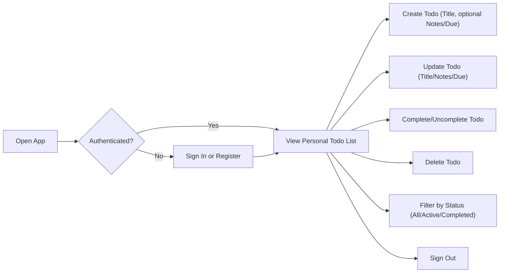
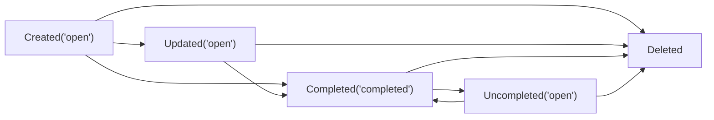
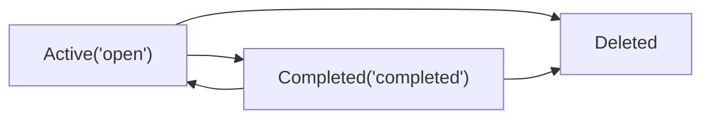

# Minimal Todo MVP Requirements Analysis

## Executive Summary
A focused, minimal Todo service (“todoMvp”) enables individuals to capture tasks quickly, keep them visible, and mark them done. Scope is deliberately constrained to the smallest set of features that make a single-user Todo list useful: authentication, create, read/list, update (title/notes/due), complete/uncomplete, delete, and a basic status filter with default sorting. Business requirements below are written to be implementation-ready for backend developers without dictating technology choices.

## 1. Vision and Scope
- Problem: Complex task apps slow people down. A minimal personal Todo list should feel instantaneous and predictable.
- Users: Single individuals managing only their own tasks. No collaboration in MVP.
- Value: Speed, clarity, and privacy via owner-only visibility.

In-scope (MVP):
- Minimal authentication (register, sign in, sign out).
- Todo CRUD: create, list/read, update (title, notes, due date), complete/uncomplete, delete.
- Basic filtering by status: All, Active, Completed. Default sorting only.

Out-of-scope (MVP):
- Sharing/collaboration, tags, priorities, reminders, recurring tasks, attachments, search, bulk actions, custom sorting, analytics dashboards, integrations, email verification, password reset, social login, multi-factor auth.

## 2. Roles and Access Model
- Guest: Unauthenticated visitor; can view public info pages only.
- User: Authenticated individual managing only their own Todos.
- Admin: Administrator with minimal oversight capabilities (account lifecycle and aggregate insights). Admin does not view or edit member Todo content in MVP.

Permission matrix (business actions):

| Action | Guest | User | Admin |
|-------|:-----:|:----:|:-----:|
| View public pages | ✅ | ✅ | ✅ |
| Register | ✅ | ❌ | ❌ |
| Sign in | ✅ | ✅ | ✅ |
| Sign out | ❌ | ✅ | ✅ |
| Create Todo (own) | ❌ | ✅ | ❌ |
| List/read Todos (own) | ❌ | ✅ | ❌ |
| Update Todo (own) | ❌ | ✅ | ❌ |
| Complete/uncomplete (own) | ❌ | ✅ | ❌ |
| Delete Todo (own) | ❌ | ✅ | ❌ |
| Manage user accounts | ❌ | ❌ | ✅ |
| View platform aggregates | ❌ | ❌ | ✅ |

## 3. Authentication and Session Expectations (Business-Level)
- Registration: minimal credential-based account creation.
- Sign in: credential-based access to the user’s own Todos.
- Sign out: ends the current session immediately.
- Session: persists for a reasonable daily usage period; expires automatically after inactivity; predictable sign-out ensures shared devices remain safe.

EARS requirements:
- THE authentication flow SHALL allow individuals to register, sign in, and sign out using minimal credentials.
- WHILE a session is active, THE system SHALL associate all Todo actions with that user’s identity.
- WHEN a user signs out, THE system SHALL end the session such that protected actions require a new sign in.
- WHEN a guest attempts a protected action, THE system SHALL deny access and direct the guest to sign in or register.

## 4. Core Concepts and Field Semantics (Business)
- Title (required): short label of the task; 1–120 chars after trimming.
- Notes (optional): additional details; up to 1,000 chars; may be empty.
- Due date (optional): calendar date in the user’s local time context; time-of-day not required.
- Status: "open" or "completed"; new Todos are "open" by default.
- Ownership: every Todo belongs to exactly one user.
- Timestamps: created time, last updated time, and completed time (only when status is "completed").

## 5. User Workflows (Conceptual)

### 5.1 End-to-End Flow

### 5.2 Todo Lifecycle

## 6. Functional Requirements (EARS)

### 6.1 General Access and Ownership
- THE todoMvp system SHALL restrict all Todo operations to authenticated owners only.
- WHEN a guest attempts any Todo operation, THE todoMvp system SHALL deny the action and provide clear sign-in guidance.
- IF a user attempts to access or modify a Todo not owned by them, THEN THE todoMvp system SHALL deny the action without revealing whether such a Todo exists.

### 6.2 Create Todo
- WHEN a user submits a Todo with a title containing at least one non-space character after trimming, THE todoMvp system SHALL create the Todo with status set to "open" and associate it with the user.
- WHERE notes are provided, THE todoMvp system SHALL accept up to 1,000 characters and treat whitespace-only notes as empty.
- WHERE a due date is provided, THE todoMvp system SHALL accept any valid calendar date in the user’s local time context.
- THE todoMvp system SHALL record created and last updated timestamps upon successful creation.

### 6.3 Read/List Todos
- THE todoMvp system SHALL list only the requesting user’s Todos.
- THE todoMvp system SHALL provide a status filter with options: All, Active, Completed.
- THE todoMvp system SHALL use a predictable default sort for Active Todos suitable for MVP (e.g., creation recency or due date ascending as configured consistently across views).
- THE todoMvp system SHALL reflect new or updated Todos in list views immediately after success.

### 6.4 Update Todo (Title/Notes/Due)
- WHEN a user updates the title, THE todoMvp system SHALL trim whitespace and reject the change IF the resulting title is empty or exceeds 120 characters.
- WHEN a user updates notes, THE todoMvp system SHALL accept up to 1,000 characters and preserve line breaks; whitespace-only notes SHALL be treated as empty.
- WHEN a user updates the due date, THE todoMvp system SHALL accept any valid calendar date and allow clearing the due date.
- THE todoMvp system SHALL set the last updated timestamp upon any successful edit.

### 6.5 Complete/Uncomplete
- WHEN a user marks a Todo as completed, THE todoMvp system SHALL set status to "completed" and record the completed time.
- WHEN a user reopens a completed Todo, THE todoMvp system SHALL set status to "open" and clear the completed time.
- THE todoMvp system SHALL hide completed Todos from the default main view unless the Completed filter is selected.

### 6.6 Delete Todo
- WHEN a user confirms deletion of their Todo, THE todoMvp system SHALL remove it so it no longer appears in any user list or detail view.
- IF a deletion is requested for a Todo that is already removed or inaccessible, THEN THE todoMvp system SHALL indicate that no further action is required and advise a refresh.

## 7. Validation Rules (EARS)
- THE todoMvp system SHALL require title length of 1–120 characters after trimming leading/trailing spaces.
- THE todoMvp system SHALL allow everyday text and emoji in titles and notes but SHALL disallow non-printable control characters.
- WHEN a due date is provided, THE todoMvp system SHALL accept it only if it is a valid calendar date; invalid dates SHALL be rejected without persisting other changes.
- WHEN multiple fields are submitted in one update, THE todoMvp system SHALL validate all fields and apply the change only if all validations pass.
- IF validation fails on any field, THEN THE todoMvp system SHALL not apply partial changes and SHALL present the violated rule in clear, non-technical language.

## 8. Authorization and Ownership (EARS)
- THE authorization model SHALL assign each Todo to exactly one owner at creation.
- WHEN an authenticated user lists Todos, THE system SHALL return only Todos owned by that user.
- WHEN an authenticated user reads, updates, completes, uncompletes, or deletes a Todo, THE system SHALL allow the action only if the user is the owner.
- IF an admin attempts to view or edit member Todo content beyond permitted compliance actions, THEN THE system SHALL deny the action in MVP.

## 9. Error Handling and Recovery (Business-Level) (EARS)
- WHEN invalid credentials are submitted during sign-in, THE system SHALL present an invalid-credentials outcome and allow retry without exposing technical details.
- WHEN a protected action is attempted by a guest, THE system SHALL deny the action and request sign-in.
- WHEN validation fails on create or update, THE system SHALL specify which field is invalid and how to correct it, preserving other valid inputs where feasible.
- WHEN a concurrency conflict is detected (e.g., item changed elsewhere), THE system SHALL reject the operation and advise refresh then retry.
- WHEN a Todo targeted for action no longer exists, THE system SHALL confirm no further action is needed and recommend refreshing the list.
- WHERE unusually rapid repeated actions occur, THE system SHALL apply a temporary cooldown and advise retry after waiting.

## 10. Non-Functional Requirements (EARS)
Performance and responsiveness:
- THE todoMvp system SHALL complete create/update/complete/uncomplete/delete outcomes within 2 seconds under normal conditions for lists up to 200 items.
- WHEN rendering a user’s Todo list up to 100 items, THE todoMvp system SHALL present results within about 1 second in typical conditions.

Availability and reliability:
- THE todoMvp system SHALL target 99.5% monthly availability for core features (authentication and Todo CRUD).
- IF an incident disrupts service, THEN THE todoMvp system SHALL publish a status update within 30 minutes and restore core functionality within 60 minutes under normal recovery conditions.

Security and privacy:
- THE todoMvp system SHALL require authentication for any access to a user’s Todos and SHALL restrict data visibility to the owner.
- THE todoMvp system SHALL minimize personal data collection and SHALL avoid exposing sensitive content in logs.

Usability and accessibility:
- THE todoMvp system SHALL provide clear success/failure outcomes in text so assistive technologies can announce status.
- THE todoMvp system SHALL allow completion of core tasks without pointer-specific interactions (keyboard-capable paths).

## 11. Session Management (Business-Level)
- THE session management SHALL keep a user signed in for a reasonable period unless they sign out or the session expires due to inactivity.
- WHEN a session expires, THE system SHALL require sign-in again and, where feasible, preserve unsaved input.
- AFTER sign-out, THE system SHALL treat subsequent actions as unauthenticated until the user signs in again.

## 12. Data Lifecycle and Retention (Conceptual)
- Todos persist indefinitely until deleted by the owner or removed by admin for compliance.
- Deletion is immediate and irreversible in MVP; there is no recycle bin or restore.
- Minimal auditability exists for key events (create, update, complete/uncomplete, delete) without storing Todo content in logs.

Lifecycle diagram:

EARS:
- WHEN a user creates a Todo, THE system SHALL create it as "open" and set created time.
- WHEN a user updates a Todo, THE system SHALL set last updated time.
- WHEN a user completes a Todo, THE system SHALL set completed time; WHEN a user reopens it, THE system SHALL clear completed time.
- WHEN a user deletes a Todo, THE system SHALL remove it such that it does not appear in lists or details thereafter.

## 13. Success Metrics (Business-Centric Targets)
- Activation: percentage of new users who create at least one Todo in first session ≥ 80%.
- 7-day retention: percentage of new users who return and interact ≥ 35%.
- Essential flow success: proportion of sessions where create/update/complete/delete succeed without error ≥ 95%.
- Perceived responsiveness: core actions feel immediate (typically within ~2 seconds).

## 14. Explicit Out-of-Scope (Guardrails)
- Collaboration, sharing, or assigning Todos to others.
- Subtasks, checklists, tags/labels, priorities, color-coding, or custom fields.
- Reminders/notifications, recurring tasks, or calendar integrations.
- Attachments or file uploads.
- Text search or advanced filters; custom sorters beyond the default.
- Bulk operations or drag-and-drop reordering.
- Admin browsing of user Todo content; admin content edits except compliance removals (not part of normal MVP flows).
- Email verification, password reset, social login, multi-factor authentication.

## 15. Glossary
- Active: a Todo in state "open" (not completed).
- Completed: a Todo in state "completed" (done) that can be reopened.
- Owner: the authenticated user to whom the Todo belongs.
- Session: authenticated period during which protected actions are allowed.
- Validation: checks ensuring inputs meet business rules.

