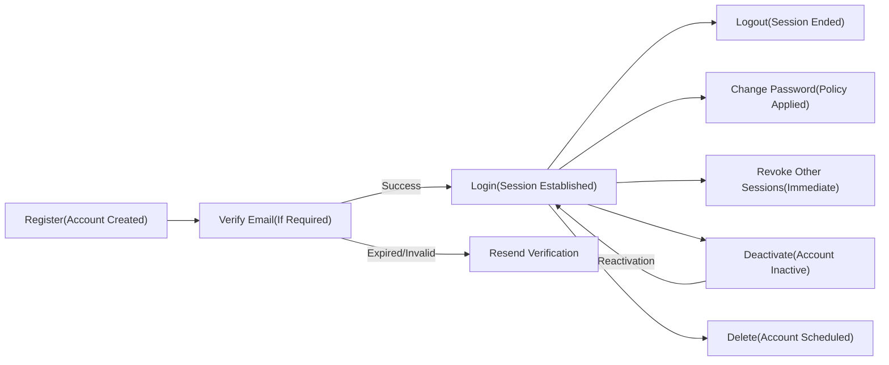
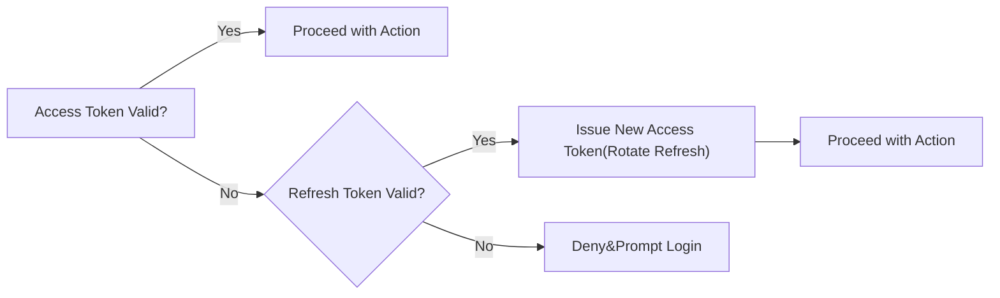

# User Roles and Authentication Requirements (todoApp)

Business requirements defining roles, permissions, authentication behavior, session expectations, and token management for the minimal Todo service (todoApp). Content specifies WHAT must happen in business terms; developers retain full autonomy over technical implementation (architecture, protocols, storage, and tooling). All applicable requirements use EARS with keywords in English.

## 1. Purpose and Scope
- Define role hierarchy and permission boundaries for todoApp MVP.
- Specify access control decisions for all core features using EARS.
- Describe complete account lifecycle: register, verify email, login, logout, password reset, change password, revoke sessions, deactivate, delete.
- Establish session duration expectations and access-denial behavior testable by QA.
- Exclusions: No API endpoints, no database schemas, no UI/UX layouts, no low-level token storage mechanics or cryptographic details.

## 2. Role Overview and Hierarchy
Roles use camelCase identifiers. Authority pertains to governance scope, not private data rights.
- guestVisitor (kind: guest) — Unauthenticated visitor; limited to public content and account entry points.
- todoUser (kind: member) — Authenticated end user; full control over personal Todos only.
- systemAdmin (kind: admin) — Operational governance; manages accounts and service-level settings; no routine access to private Todo content.

Business hierarchy (governance): systemAdmin > todoUser > guestVisitor. Private data rights do not inherit along this hierarchy.

## 3. Role Definitions and Responsibilities

### 3.1 guestVisitor (kind: guest)
- May view public pages: landing, terms, privacy, help.
- May register and attempt login.
- May initiate password reset for a known email address.
- May not access any Todo data or private user content.

### 3.2 todoUser (kind: member)
- Owns and manages personal Todo items.
- Can create, read, update, complete/uncomplete, delete own Todos.
- Can list, sort, filter, and search own Todos only.
- Can manage own account: change password, logout, revoke sessions, deactivate, request account deletion.
- Cannot access any other user’s data.

### 3.3 systemAdmin (kind: admin)
- Can suspend/reactivate user accounts per policy and manage governance workflows.
- Can view aggregated, non-personal service metrics.
- Cannot routinely access private Todo content; exceptional access requires lawful, audited process and is not part of MVP routine.

## 4. Permission Matrix by Feature (Business-Level)

| Action (Business Function) | guestVisitor | todoUser | systemAdmin | Notes |
|----------------------------|--------------|----------|-------------|-------|
| View public pages (landing, terms, privacy, help) | ✅ | ✅ | ✅ | Public content |
| Register new account | ✅ | ✅ | ✅ | Admin-assisted onboarding if policy permits |
| Verify email address | ✅ | ✅ | ✅ | Required to unlock full features if policy requires |
| Login (own account) | ✅ | ✅ | ✅ | 
| Logout (end own session) | ❌ | ✅ | ✅ | Guest has no session to end |
| Initiate password reset | ✅ | ✅ | ✅ | Privacy-preserving acknowledgments |
| Change password (authenticated) | ❌ | ✅ | ✅ (own) | Admin changes own only; user changes own |
| Revoke own active sessions (other devices) | ❌ | ✅ | ✅ (own) | Ends other sessions for the same account |
| Create Todo (own) | ❌ | ✅ | ❌ | Admin does not manage user Todos |
| Read Todo (own) | ❌ | ✅ | ❌ | 
| Update Todo (own) | ❌ | ✅ | ❌ | 
| Complete/Uncomplete Todo (own) | ❌ | ✅ | ❌ | 
| Delete Todo (own) | ❌ | ✅ | ❌ | 
| List/Filter/Search Todos (own) | ❌ | ✅ | ❌ | 
| View aggregated service metrics | ❌ | ❌ | ✅ | Non-personal aggregates only |
| Suspend/Reactivate user account | ❌ | ❌ | ✅ | Requires audit trail |
| Manage service-wide configurations | ❌ | ❌ | ✅ | Business-level settings |
| Review/resolve abuse reports | ❌ | ❌ | ✅ | No routine access to private content |

Notes:
- "Own" strictly refers to resources created by the authenticated identity.
- Aggregated metrics must be non-identifiable and non-reconstructable into private Todo content.

## 5. Access Control Rules (EARS)

Ubiquitous principles:
- THE todoApp SHALL restrict Todo data access to the resource owner only.
- THE todoApp SHALL treat unauthenticated access as guestVisitor.
- THE todoApp SHALL enforce role-specific permissions consistently across all features.

Event-driven and unwanted behavior:
- IF guestVisitor requests any Todo operation, THEN THE todoApp SHALL deny access and indicate that sign-in is required.
- WHEN guestVisitor initiates registration with valid inputs, THE todoApp SHALL create a pending account and issue verification instructions if policy requires.
- IF guestVisitor attempts logout, THEN THE todoApp SHALL indicate that no active session exists.
- WHEN todoUser attempts to read, update, complete/uncomplete, or delete a Todo, THE todoApp SHALL allow the operation only if the Todo is owned by that user.
- IF todoUser attempts an operation on a Todo not owned by them, THEN THE todoApp SHALL deny access without disclosing resource existence.
- WHEN systemAdmin suspends a user account under policy, THE todoApp SHALL block that account from authenticated actions until reactivated.
- THE todoApp SHALL allow systemAdmin to view aggregated metrics containing no private Todo content.

Consistency and auditability (business-level):
- THE todoApp SHALL record administrative account status changes (suspend/reactivate) with actor, target, timestamp, and business-level reason.
- WHERE an exceptional lawful or emergency access process is authorized by policy, THE todoApp SHALL require explicit justification and create an auditable record stating authority, scope, and timeframe.

## 6. Authentication Requirements

### 6.1 Register
Business rules:
- Unique email and policy-compliant password are required.
- Initial account state may be pending verification per policy.

EARS:
- WHEN a person submits registration with a unique email and a policy-compliant password, THE todoApp SHALL create a new account in a pending or active state and provide next-step instructions.
- IF the provided email already exists, THEN THE todoApp SHALL reject registration and guide toward password reset or login.
- IF the password fails policy, THEN THE todoApp SHALL reject registration and explain the minimum criteria.

### 6.2 Verify Email (if required by policy)
Business rules:
- Email verification unlocks full authenticated features.
- Verification is time-bound; expired or invalid instructions must be rejected.

EARS:
- WHEN a person follows a valid verification instruction within the allowed window, THE todoApp SHALL mark the account verified and allow login.
- IF a verification instruction is expired or invalid, THEN THE todoApp SHALL deny verification and offer to resend a new instruction.

### 6.3 Login
Business rules:
- Only verified and unsuspended accounts establish full sessions.

EARS:
- WHEN a verified, unsuspended user submits correct credentials, THE todoApp SHALL establish an authenticated session as todoUser.
- IF credentials are incorrect, THEN THE todoApp SHALL deny login without revealing whether the email exists.
- IF the account is unverified, THEN THE todoApp SHALL deny login and instruct verification or resending instructions.
- IF the account is suspended, THEN THE todoApp SHALL deny login and communicate suspension status with support contact guidance.

### 6.4 Logout
EARS:
- WHEN an authenticated user requests logout, THE todoApp SHALL end the current session and confirm logout.
- IF no authenticated session exists on the current device, THEN THE todoApp SHALL indicate that there is nothing to log out from.

### 6.5 Password Reset
EARS:
- WHEN a password reset is requested for any email, THE todoApp SHALL acknowledge the request without confirming whether the email exists.
- WHEN reset instructions are followed with a valid new password, THE todoApp SHALL complete the reset and allow login with the new password.
- IF a reset instruction is expired or invalid, THEN THE todoApp SHALL deny the reset and allow requesting a new instruction.

### 6.6 Change Password (authenticated)
EARS:
- WHEN a todoUser submits current password and a policy-compliant new password, THE todoApp SHALL update the password and require subsequent logins with the new credential.
- IF the current password is incorrect or the new password fails policy, THEN THE todoApp SHALL reject the change and explain the applicable rule in business terms.

### 6.7 Revoke Sessions (other devices)
EARS:
- WHEN a todoUser requests to revoke active sessions on other devices, THE todoApp SHALL revoke those sessions promptly and confirm completion.
- IF no other active sessions exist, THEN THE todoApp SHALL confirm that nothing was revoked.

### 6.8 Deactivate and Delete Account
EARS:
- WHEN a todoUser requests account deactivation and confirms intent, THE todoApp SHALL deactivate the account and block new logins until reactivated.
- IF a deactivated user attempts to log in, THEN THE todoApp SHALL deny access and offer reactivation guidance.
- WHEN a todoUser requests account deletion and completes confirmation, THE todoApp SHALL schedule deletion of the account and personal Todo data per policy and confirm the schedule.

### 6.9 Authentication Lifecycle Diagram

## 7. Token Management (JWT) — Business-Level Expectations

Token usage expresses business expectations only; developers choose exact technical mechanisms.

### 7.1 Token Types and Validity
- THE todoApp SHALL use JWT for authenticated access.
- THE todoApp SHALL issue an access token with a validity window of 15–30 minutes.
- THE todoApp SHALL issue a refresh token with a validity window of 7–30 days.
- WHERE a user selects a "Keep me signed in" option, THE todoApp SHALL rely on refresh token validity to provide seamless re-authentication on the same device within the configured window.

### 7.2 Rotation and Revocation
- WHEN a refresh token is used, THE todoApp SHALL rotate the refresh token and invalidate the prior one.
- WHEN a user changes password or revokes sessions, THE todoApp SHALL invalidate existing refresh tokens and any corresponding access tokens for other sessions.
- WHEN a systemAdmin suspends an account, THE todoApp SHALL invalidate active tokens and block issuance of new tokens until reactivation.

### 7.3 Required JWT Payload Fields (Business-Level)
These fields are required in the token claims at a business level; developers choose exact claim names and structures.
- userId — Identifies the authenticated account.
- role — One of: guestVisitor, todoUser, systemAdmin (guestVisitor normally has no token).
- permissions — Array of business permission identifiers applicable to the role (e.g., ["todo:read:own","todo:write:own","account:password:change"]).

EARS:
- THE todoApp SHALL include userId, role, and permissions array in authenticated JWTs.
- WHEN role-based permissions change (e.g., suspension), THE todoApp SHALL ensure newly issued tokens reflect the updated permissions.
- IF a token is expired or invalid, THEN THE todoApp SHALL deny protected actions and guide the user to re-authenticate.

### 7.4 Token Handling Diagram (Conceptual)

## 8. Session Duration Expectations (Business Terms)
- THE todoApp SHALL establish a standard interactive session that remains active for up to 12 hours of inactivity or 24 hours maximum elapsed time, whichever comes first, unless an extended option is selected.
- WHERE a user selects "Keep me signed in", THE todoApp SHALL allow seamless re-authentication on the same device for up to 30 days unless risk indicators require re-authentication.
- IF suspicious activity is detected (e.g., unusual device or location at a business level), THEN THE todoApp SHALL require immediate re-authentication.
- THE todoApp SHALL end the session upon explicit logout on that device.
- THE todoApp SHALL provide advance communication before automatic sign-out where feasible in business terms.

## 9. Access Denied and Error Behavior (Business-Facing)
- WHEN authentication is missing, THE todoApp SHALL inform that sign-in is required and provide a path to login or registration.
- WHEN authorization is insufficient, THE todoApp SHALL deny the action and avoid disclosing protected resource existence.
- WHEN a requested resource is not owned by the user, THE todoApp SHALL respond with a generic denial without confirming existence.
- WHEN an account is suspended, THE todoApp SHALL communicate suspension status and provide support contact guidance.
- WHEN an operation fails validation, THE todoApp SHALL present concise guidance on how to correct inputs and allow retry.

Related error behaviors and messages are detailed in the [Error Handling and Recovery Requirements](./07-error-handling-and-recovery.md).

## 10. Related Documents (Descriptive Links)
- [Service Overview and Vision for Minimal Todo](./01-service-overview.md)
- [MVP Business Requirements and Acceptance Criteria](./02-business-requirements.md)
- [User Stories and Persona-Driven Scenarios](./04-user-stories.md)
- [End-to-End User Flows (Authentication and Todos)](./05-user-flows.md)
- [Business Rules and Validation (Fields, States, Filters)](./06-business-rules-and-validation.md)
- [Error Handling and Recovery Requirements](./07-error-handling-and-recovery.md)
- [Non-Functional Requirements (Performance, Security, Reliability)](./08-non-functional-requirements.md)
- [Data Lifecycle and Privacy Policies](./09-data-lifecycle-and-privacy.md)

## 11. Glossary
- Ownership — Relationship between a user and their personal Todo items; only the owner can access their own items.
- Session — Period in which a user is recognized as authenticated.
- Suspension — Administrative state that blocks login and token issuance until reactivation.
- JWT — Token format used to convey authenticated identity and role/permissions in business terms.

---
This content provides business requirements only. Technical implementation decisions (architecture, APIs, token storage, cryptography, database design, and infrastructure) are at the discretion of the development team. It specifies WHAT todoApp must do, not HOW to build it.