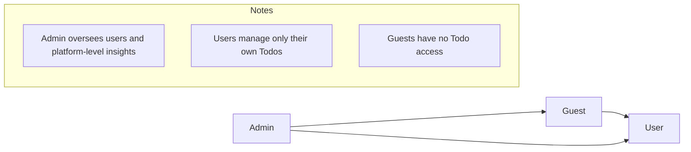
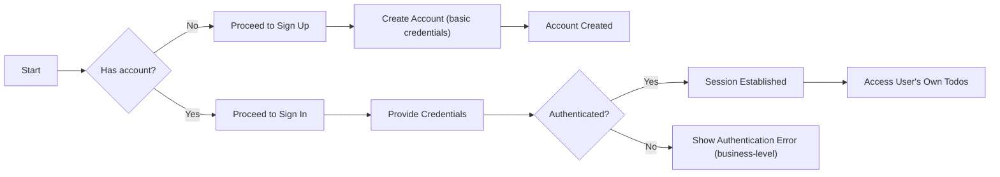
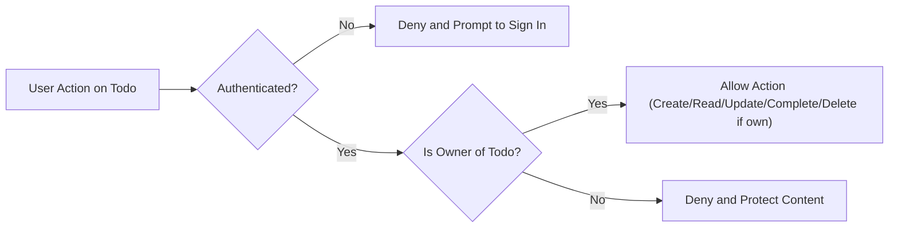
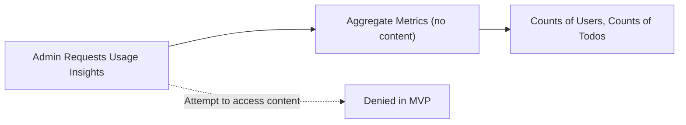

# User Roles and Permissions Requirements for todoMvp

## 1. Introduction and Scope
This document defines the minimal roles, authentication expectations, and permission boundaries for the todoMvp service. It focuses on business behavior only, describing WHAT the system must do in terms of access and permissions, not HOW to implement it. Technical details such as API endpoints, database schemas, or token field specifications are intentionally excluded.

This document should be read alongside the [Service Overview](./01-service-overview.md) and the [Scope and Out-of-Scope Summary](./02-scope-and-out-of-scope.md) to ensure a consistent understanding of the MVP constraints and goals. It provides the foundational access control logic that underpins the core Todo functions defined elsewhere.

Goals of this document:
- Define user roles and their capabilities with minimal, unambiguous boundaries.
- Specify authentication and session expectations in business terms suitable for MVP.
- Provide a permission matrix and EARS-formatted requirements that are testable.

Non-goals:
- UI/UX descriptions, screen flows, or visual designs.
- API specifications, HTTP codes, or DB schema/field definitions.
- Token type or field-level specifications.

## 2. Role Overview and Hierarchy
Roles in todoMvp exist to partition access according to the minimum needs of a basic Todo service. The roles are deliberately few and simple to respect MVP constraints.

- Guest: An unauthenticated visitor. May access public information pages (e.g., landing page, help). Cannot access or modify any Todo data.
- User: An authenticated member. Can create, read, update, complete/uncomplete, and delete only their own Todo items.
- Admin: An administrator. Can manage user accounts at a basic level and access platform-level usage insights. Admins do not edit member Todos in MVP.

Hierarchy and control:
- There is no cross-user delegation in MVP (no shared Todos).
- Admin has oversight capabilities but does not gain edit privileges over member Todos in MVP.

Role relationships (conceptual):

## 3. Authentication and Session Expectations (Business-Level)
The MVP supports minimal authentication to enable personal Todo management. The following expectations are business requirements.

- Registration: Individuals can create an account using basic credentials to become a User.
- Sign-in: Users can authenticate to access their account and manage their own Todos.
- Sign-out: Users can terminate their active session.
- Session lifecycle: Sessions persist for a reasonable period to support normal use and end automatically after inactivity; explicit sign-out ends the session immediately.
- Single-account ownership: Each Todo is owned by exactly one User; there is no sharing in MVP.

Key principles:
- Minimal friction while ensuring each User’s Todos remain private to that User.
- Predictable session behavior to prevent unintentional access by others using the same device.

## 4. Role Capabilities and Restrictions
This section lists the business actions each role may perform in MVP.

Guest (unauthenticated):
- May view public information pages.
- May not view, create, update, complete/uncomplete, or delete any Todo.
- May register for an account and subsequently sign in.

User (authenticated):
- May create a new Todo for themselves.
- May read a list of their own Todos and view details for their own Todos.
- May update properties of their own Todo: title, notes, due date, and completion status.
- May complete or uncomplete their own Todo.
- May delete their own Todo.
- May not access any other User’s Todos in any way.

Admin (administrator):
- May view platform-level usage insights (e.g., counts of active users, total Todos) at an aggregate level.
- May manage user accounts at a basic level (e.g., deactivate/reactivate accounts) as necessary for operational integrity.
- May not view or edit the content of member Todos in MVP.
- May not create, update, or delete member Todos in MVP.

## 5. Permission Matrix (Business Actions)

| Business Action | Guest | User | Admin |
|-----------------|:-----:|:----:|:-----:|
| View public info pages | ✅ | ✅ | ✅ |
| Register for an account | ✅ | ❌ | ❌ |
| Sign in | ✅ | ✅ | ✅ |
| Sign out | ❌ | ✅ | ✅ |
| Create a Todo (self-owned) | ❌ | ✅ | ❌ |
| List/read own Todos | ❌ | ✅ | ❌ |
| View another user’s Todos | ❌ | ❌ | ❌ |
| Update own Todo (title, notes, due, status) | ❌ | ✅ | ❌ |
| Complete/uncomplete own Todo | ❌ | ✅ | ❌ |
| Delete own Todo | ❌ | ✅ | ❌ |
| Create/update/delete other users’ Todos | ❌ | ❌ | ❌ |
| View platform usage insights (aggregate) | ❌ | ❌ | ✅ |
| Manage user accounts (deactivate/reactivate) | ❌ | ❌ | ✅ |

Notes:
- “Sign out” is not applicable to Guest because no authenticated session exists.
- Admin privileges are limited to platform oversight and account management in MVP, not content moderation of Todos.

## 6. Business Rules and Requirements (EARS)
All applicable requirements use EARS syntax. Keywords WHEN/WHILE/IF/THEN/WHERE/THE/SHALL remain in English; other text is in business language.

### 6.1 Authentication
- THE authentication subsystem SHALL allow individuals to register an account to become a User.
- THE authentication subsystem SHALL allow Users to sign in to access their account.
- THE authentication subsystem SHALL allow Users to sign out to end their session.
- THE authentication subsystem SHALL maintain a session for a reasonable period to support ongoing use without frequent sign-ins.
- THE authentication subsystem SHALL end the session immediately when the User signs out.
- THE authentication subsystem SHALL end inactive sessions automatically after a period of inactivity to reduce the risk of unauthorized access.
- WHEN an unauthenticated Guest attempts to access any Todo data, THE system SHALL deny access and direct them to sign in or register.
- WHEN a User is already signed in, THE system SHALL associate all Todo actions with that User’s identity.

### 6.2 Authorization and Ownership
- THE authorization model SHALL restrict access to Todo data based on role and ownership.
- THE authorization model SHALL assign ownership of each Todo to exactly one User at creation time.
- WHEN a User creates a Todo, THE system SHALL assign that Todo to the creating User.
- WHEN a User attempts to read a Todo, THE system SHALL allow the read ONLY where the Todo is owned by that User.
- WHEN a User attempts to list Todos, THE system SHALL return only Todos owned by that User.
- WHEN a User attempts to update a Todo, THE system SHALL allow the update ONLY where the Todo is owned by that User.
- WHEN a User attempts to complete or uncomplete a Todo, THE system SHALL allow the action ONLY where the Todo is owned by that User.
- WHEN a User attempts to delete a Todo, THE system SHALL allow the deletion ONLY where the Todo is owned by that User.
- IF a User attempts to access another User’s Todo in any way, THEN THE system SHALL deny access and prevent disclosure of any Todo content.
- THE system SHALL not share Todos between Users in MVP.

### 6.3 Admin Oversight (MVP)
- THE admin oversight capability SHALL be limited to platform-level aggregates and user account lifecycle actions in MVP.
- WHEN an Admin requests platform-level usage insights, THE system SHALL provide only aggregate, non-content metrics (e.g., counts) without exposing Todo content.
- WHEN an Admin manages user accounts, THE system SHALL allow deactivation/reactivation actions without exposing Todo content.
- IF an Admin attempts to read or modify any member Todo content, THEN THE system SHALL deny the action in MVP.
- WHERE operational policy requires taking action on a user account (e.g., deactivation), THE system SHALL ensure the action does not expose or alter member Todo content.

### 6.4 Session and Security Expectations (Business-Level)
- THE session management SHALL keep a User signed in for a reasonable period unless they sign out or the session expires due to inactivity.
- THE session management SHALL ensure that after sign-out, subsequent actions are treated as unauthenticated until the User signs in again.
- WHEN a session expires due to inactivity, THE system SHALL require the User to sign in again before accessing their Todos.
- IF simultaneous access from multiple devices occurs, THEN THE system SHALL treat each session independently and apply the same inactivity and sign-out rules to each session.
- WHERE a device is shared, THE system SHALL provide predictable sign-out behavior so that later device users cannot access the previous User’s Todos.

## 7. User Scenarios and Conceptual Flows (with Mermaid)
The following diagrams illustrate conceptual flows for authentication and Todo access decisions. They are non-technical and describe business behavior only.

### 7.1 Sign Up and Sign In Flow (Conceptual)

### 7.2 Authorization Decision for Todo Access (Conceptual)

### 7.3 Admin Oversight (Aggregate Insights Only)

## 8. Compliance and Privacy Considerations
- Least Privilege: Roles grant only the minimal access required for MVP tasks. Users see only their own Todos; Admins see only aggregates and account controls.
- Data Minimization: MVP should collect only essential information to operate authentication and Todo ownership. No unnecessary personal data is stored.
- Confidentiality: Todo content is considered private to the owning User and must not be disclosed to other Users or Admins in MVP.
- Accountability: Business actions that change account state (e.g., deactivation) should be traceable at a business level (e.g., who performed the action and when) without exposing Todo content.
- Regional/Legal: Any jurisdictional requirements related to personal data should be handled through general privacy practices appropriate to MVP. Specific legal implementations are not covered here.

## 9. Assumptions, Constraints, and Out-of-Scope for This Document
Assumptions:
- Users manage only their own Todos; no shared or team features exist in MVP.
- Admin activities are limited to aggregates and account lifecycle actions without exposure to Todo content.
- A basic credential-based authentication is available to enable sign in/out and session management.

Constraints:
- Business behavior only; no API endpoints, transport, or storage details.
- No JWT or token field specifications in this document.
- No UI/UX, screen flows, or design specifications.

Out-of-Scope (MVP):
- Shared Todos, collaborators, or role delegation.
- Content moderation by Admin on member Todos.
- Advanced authentication features (e.g., multi-factor authentication, social logins).
- Account recovery flows and email verification flows (if required, they are defined elsewhere post-MVP).

## 10. Traceability and References
This document is consistent with:
- [Service Overview for todoMvp](./01-service-overview.md) — business goals and value proposition.
- [MVP Scope and Out-of-Scope](./02-scope-and-out-of-scope.md) — minimal feature set and exclusions.

Cross-References (for context; not normative here):
- Functional behaviors for Todo CRUD are captured in the [Functional Requirements for Todo Management](./04-functional-requirements-todo-management.md).
- Error states and recovery patterns are described in the [Error Handling and Recovery](./08-error-handling-and-recovery.md).

End of document.