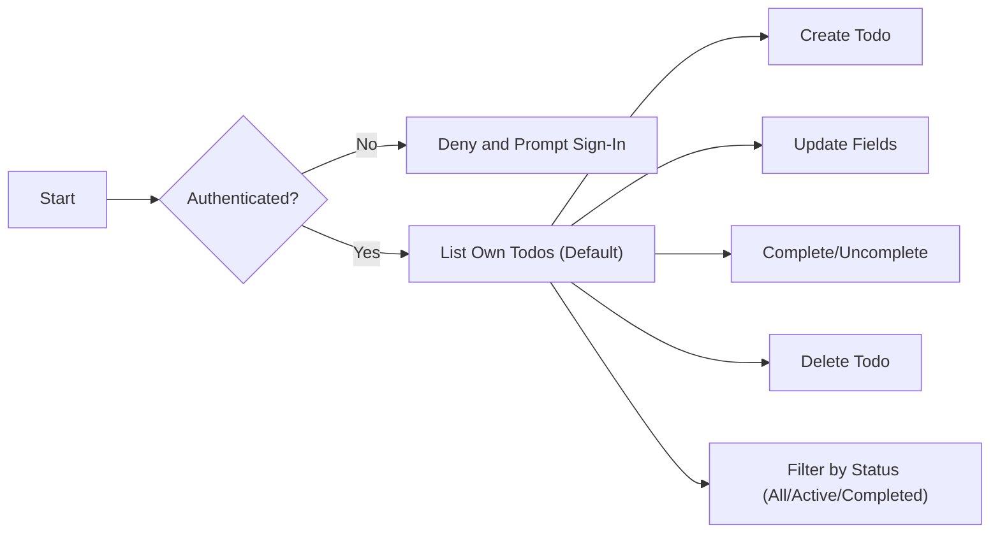
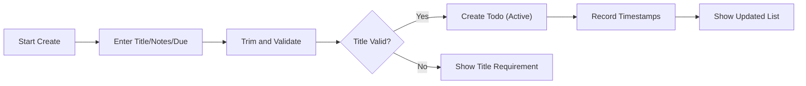
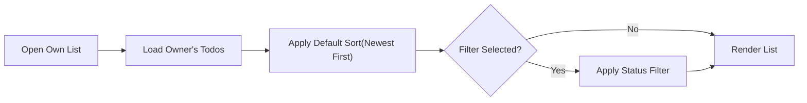
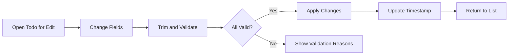
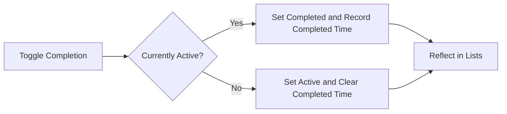
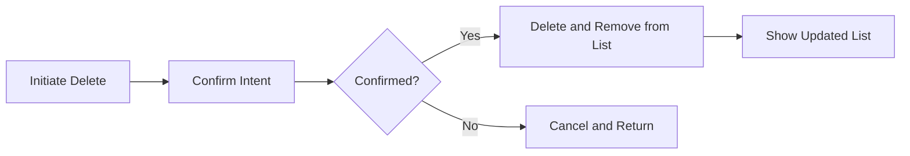

# Functional Requirements – Todo Management (MVP)

## Todo Item Concept and Principles
A Todo represents a single actionable item owned by an authenticated individual. The MVP intentionally limits features to the smallest set necessary to capture, view, update, complete/uncomplete, and delete personal tasks. There is no sharing, collaboration, tags, priorities, attachments, reminders, bulk actions, or custom sorting in MVP.

Business semantics of a Todo:
- Title (required): short human-readable text that captures the task intent.
- Notes (optional): free-form supplemental text, may be empty.
- Due Date (optional): calendar date indicating target completion day; time-of-day is not required.
- Status (required): one of two values, Active or Completed. New Todos start as Active.
- Ownership: every Todo belongs to exactly one authenticated user; only the owner can view and manage it.
- Timestamps (business-level): created time and last updated time; completed time is recorded only when the Todo is Completed.

Guiding principles:
- Simplicity over completeness; avoid features not listed here.
- Predictable validation and outcomes; no partial updates on failure.
- Immediate visibility of successful changes in list views.

## Roles, Ownership, and Access (Business-Level)
- Guest: unauthenticated visitor; cannot view or manipulate any Todo data.
- User: authenticated individual; can create, read/list, update, complete/uncomplete, and delete only their own Todos.
- Admin: administrator; has no routine permission to view or edit member Todo content in MVP; may have platform oversight outside of Todo content. Admin involvement is out of scope for normal Todo flows.

Ownership rules:
- Each Todo is owned by exactly one user and is private to that owner.
- No shared Todos or delegation in MVP.

EARS access requirements:
- THE system SHALL require authentication for any Todo operation.
- THE system SHALL restrict all Todo operations to the authenticated owner only.
- IF a guest attempts any Todo operation, THEN THE system SHALL deny the action and indicate that sign-in is required.
- IF a user attempts to access or modify a Todo they do not own, THEN THE system SHALL deny the action without revealing whether the Todo exists.

## High-Level Flow Overview (Conceptual)

## Validation Rules (Business-Level)
- Title: required; after trimming leading/trailing whitespace, must contain at least 1 non-space character; maximum 200 characters.
- Notes: optional; maximum 1,000 characters; whitespace-only notes are treated as empty.
- Due Date: optional; must be a valid calendar date; past dates are allowed; no time-of-day requirement.
- Status: Active or Completed only; default is Active on create.
- Atomicity: on any create/update, all provided fields must be valid for the operation to succeed.

EARS validation requirements:
- WHEN a user creates a Todo, THE system SHALL reject creation IF the title is empty after trimming or exceeds 200 characters.
- WHEN a user updates a Todo title, THE system SHALL apply the same validation as on creation.
- WHERE notes are provided on create or update, THE system SHALL accept up to 1,000 characters and treat whitespace-only notes as empty.
- WHERE a due date is provided, THE system SHALL accept it only when it is a valid calendar date; otherwise reject the change and preserve the prior value.
- WHEN multiple fields are updated at once, THE system SHALL validate all fields and apply no partial changes if any validation fails.

## Create Todo
Business function: allow the owner to create a Todo with a required Title and optional Notes and Due Date; Status defaults to Active.

Inputs (business terms):
- Title (required), Notes (optional), Due Date (optional)

Processing rules:
- Trim leading and trailing whitespace for Title and Notes.
- Set Status to Active by default.
- Record created and last updated timestamps.

Outcomes:
- On success, the new Todo appears in the owner’s list immediately.
- On failure, a clear message indicates what to correct; no partial creation occurs.

Create flow (conceptual):

EARS – Create:
- WHEN a user submits a new Todo with a non-empty Title after trimming, THE system SHALL create the Todo with Status set to Active and record created and last updated timestamps.
- IF Title is missing, empty after trimming, or exceeds 200 characters, THEN THE system SHALL reject creation and present a corrective message.
- WHERE Notes are provided, THE system SHALL store up to 1,000 characters and treat whitespace-only Notes as empty.
- WHERE a valid Due Date is provided, THE system SHALL store it; otherwise, THE system SHALL reject the date and keep the Todo uncreated until corrected.

## Read/List Todos
Business function: present only the owner’s Todos with predictable default ordering and basic status filtering.

Default presentation:
- Show only the owner’s Todos.
- Default sort: newest first by creation time.
- No custom sort orders in MVP.

Processing rules:
- Apply the chosen status filter (All/Active/Completed) when selected.
- Reflect changes from create/update/complete/delete immediately in list views.

List and filter flow (conceptual):

EARS – Read/List:
- THE system SHALL list only the authenticated owner’s Todos in any list or detail view.
- THE system SHALL apply a default sort of newest-first by creation time.
- WHEN a user selects the Active or Completed filter, THE system SHALL show only Todos with the selected Status.
- WHEN the user selects All, THE system SHALL show both Active and Completed Todos.
- WHEN the list is requested, THE system SHALL reflect recent successful changes without requiring a manual refresh.

## Update Todo (Title/Notes/Due/Status)
Business function: allow the owner to modify Title, Notes, or Due Date of their own Todo; Status changes are handled in the next section.

Inputs:
- Any subset of Title, Notes, Due Date.

Processing rules:
- Validate Title using the same rules as creation when provided.
- Accept Notes and Due Date within limits; allow clearing Notes and Due Date.
- Update last updated timestamp upon any successful change.

Outcomes:
- On success, the updated Todo is reflected in list views immediately.
- On failure, no partial changes are applied; a corrective message is provided.

Update flow (conceptual):

EARS – Update:
- WHEN a user updates a Title, THE system SHALL trim whitespace and reject the change IF the resulting Title is empty or exceeds 200 characters.
- WHERE a user updates Notes, THE system SHALL accept up to 1,000 characters and treat whitespace-only Notes as empty.
- WHERE a user updates the Due Date, THE system SHALL accept any valid calendar date and allow clearing the Due Date.
- THE system SHALL update the last updated timestamp after any successful edit.

## Complete/Uncomplete Todo
Business function: allow the owner to toggle completion state between Active and Completed.

Processing rules:
- Completing sets Status to Completed and records completed time.
- Uncompleting sets Status to Active and clears completed time.
- No other fields are altered by toggling status.

Outcomes:
- Completed Todos appear in All and Completed views; by default, both Active and Completed appear in All, and Active only in Active.

Toggle flow (conceptual):

EARS – Complete/Uncomplete:
- WHEN a user marks a Todo as Completed, THE system SHALL set Status to Completed, record the completed time, and reflect the change in list views immediately.
- WHEN a user marks a Completed Todo as Active, THE system SHALL set Status to Active, clear the completed time, and reflect the change immediately.
- WHEN a user repeats a toggle to the same state, THE system SHALL confirm the current state without error (idempotent behavior).

## Delete Todo
Business function: allow the owner to permanently remove a Todo.

Processing rules:
- Deletion is final in MVP; no restore or recycle bin.
- Remove the Todo from the owner’s accessible list immediately upon success.

Outcomes:
- After deletion, the item no longer appears in any view for the owner.
- If the item no longer exists at the time of deletion, respond as already deleted and provide no further action needed.

Delete flow (conceptual):

EARS – Delete:
- WHEN a user confirms deletion of their own Todo, THE system SHALL remove it from the owner’s accessible list immediately and make it unavailable for further actions.
- IF a deletion request targets a Todo that no longer exists or is not owned by the requester, THEN THE system SHALL deny the action or confirm no action is needed without revealing additional details.

## Basic Filtering and Sorting (MVP)
Scope:
- Status filter only: All, Active, Completed.
- Default sort: newest first by creation time across all views.
- No custom sort orders in MVP.

Consistency rules:
- Filters and default sort affect only the current user’s view and shall never expose other users’ data.

EARS – Filtering and Sorting:
- THE system SHALL provide a status filter with options All, Active, and Completed.
- THE system SHALL apply a single default sort of newest-first by creation time in all views.
- WHEN a user selects a status filter, THE system SHALL show only Todos that match the selected status without changing the default sort.

## Error Outcomes and Messaging (Business-Level)
- Validation failures: clearly state which field violates which rule and how to correct it; retain entered input where feasible.
- Ownership and access violations: state that only the owner can manage the item; do not disclose whether the item exists.
- Session expiration: indicate that sign-in is required and preserve unsaved input where feasible.
- Concurrency conflicts (e.g., the item changed or was deleted during edit): instruct to refresh and retry.

EARS – Error and Recovery:
- WHEN validation fails on any field, THE system SHALL reject the operation, leave stored data unchanged, and present a corrective message naming the rule.
- IF the user is not authenticated at operation time, THEN THE system SHALL deny the operation and prompt sign-in.
- IF a concurrency conflict is detected, THEN THE system SHALL reject the operation and advise refreshing before retrying.

## Performance Expectations (User-Perceived)
- Typical operations (create, update, complete/uncomplete, delete, list) should feel immediate under normal conditions.

EARS – Performance:
- WHEN a user performs create, update, complete/uncomplete, or delete, THE system SHALL reflect the change in relevant views within 2 seconds under normal conditions.
- WHEN a user opens their Todo list of up to 200 items, THE system SHALL render the initial view within 2 seconds under normal conditions.

## Edge Cases and Unwanted Behaviors
- Empty Title on update: reject and explain that Title is required.
- Past Due Date: allow and interpret as overdue; do not alter Status.
- Duplicate-looking Titles: allow; uniqueness is not required.
- Rapid toggle of completion: final stored state matches the last user action; no error for repeated requests with the same final state.
- Delete vs Complete: deletion removes the item entirely; completion retains it and shows it in Completed/All views.
- No Todos: render a clear empty state and guidance to create a Todo; do not treat as an error.

EARS – Edge Cases:
- IF a Title becomes empty after trimming during update, THEN THE system SHALL reject the update and keep the original value.
- WHEN a Due Date earlier than today is provided, THE system SHALL accept it as a past date and compute “overdue” conceptually without changing Status.
- WHEN the same action is submitted repeatedly (e.g., completing an already completed Todo), THE system SHALL confirm the current state without duplication or error.

## Glossary
- Owner: the authenticated user to whom a Todo belongs.
- Active: a Todo that is not completed.
- Completed: a Todo that has been marked as done.
- Overdue: a conceptual designation when Due Date is before today; does not change Status by itself.
- Default sort: newest-first by creation time; the only sort order in MVP.
