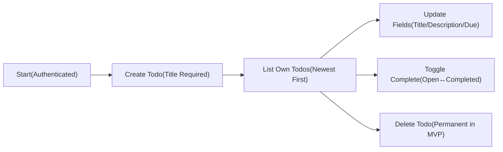
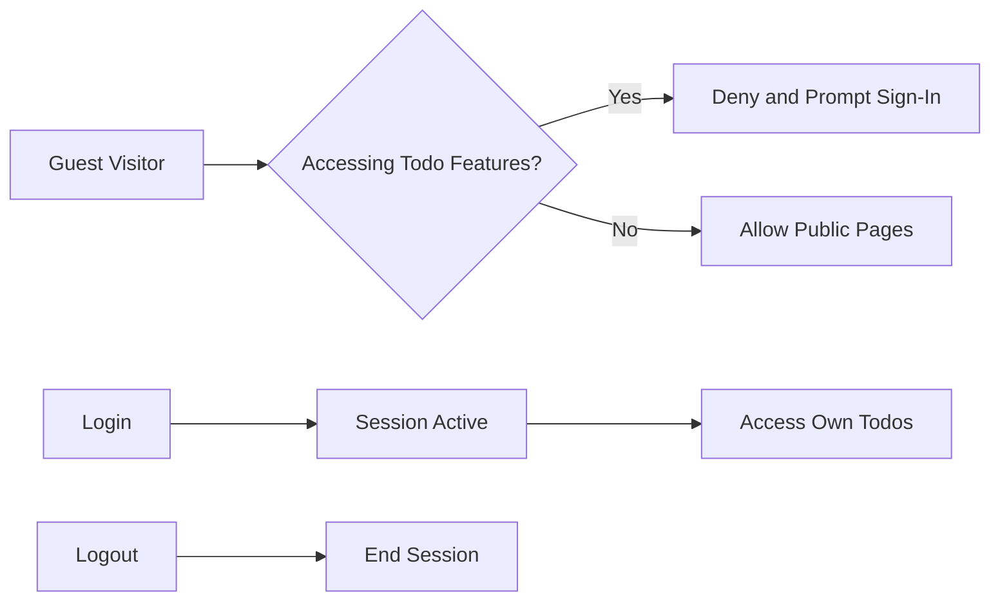

# 02-business-requirements.md — MVP Business Requirements for todoApp

## 1. About and Scope
todoApp provides a minimal personal Todo service for individuals to capture and complete tasks with the least cognitive load. Content in this document defines WHAT the service must do in clear business terms, not HOW to implement it. All technical decisions (architecture, APIs, storage, infrastructure) are at the discretion of the development team. Requirements use EARS (WHEN/WHILE/IF/THEN/WHERE/THE/SHALL) for clarity and testability.

## 2. Business Objectives and Success Definition
- Enable a new user to register, sign in, create a todo with a required title (and optional fields), view their list, update it, complete/uncomplete it, delete it, and sign out — all within a short first session.
- Maintain strict privacy boundaries so that users can access only their own todos; administrators do not routinely view private todo content.
- Keep MVP scope minimal to accelerate delivery and reduce complexity, focusing on create, read/list, update, complete/uncomplete, delete, filter, and basic search.

Success definition (MVP):
- A first-time user can complete the core end-to-end flow (register → create → complete → delete) without assistance.
- The service meets the user-perceived performance targets for core operations under normal conditions.
- Error messages are clear, actionable, and align with the error taxonomy; users can recover when feasible.

## 3. Roles and Access Overview
Roles are defined in business terms, with distinct permission boundaries.
- guestVisitor: Unauthenticated visitor limited to public pages (landing, terms, privacy) and account flows (register, login, request password reset). No access to any Todo data.
- todoUser: Authenticated user who owns and manages personal todos; can perform all CRUD actions on own items and use list, filter, and search for own data only.
- systemAdmin: Operational administrator who may suspend/reactivate accounts and view aggregated metrics. No routine access to private Todo content.

### 3.1 Permission Matrix (Business-Level)
| Action (Business Function) | guestVisitor | todoUser | systemAdmin | Notes |
|----------------------------|--------------|----------|-------------|-------|
| View public pages (landing, terms, privacy) | ✅ | ✅ | ✅ | Public content |
| Register account | ✅ | ✅ | ✅ | Admin may assist as policy permits |
| Login (own) | ✅ | ✅ | ✅ | Authenticates identity |
| Logout (own) | ❌ | ✅ | ✅ | Guest has no session |
| Request password reset | ✅ | ✅ | ✅ | Privacy-preserving acknowledgments |
| Create Todo (own) | ❌ | ✅ | ❌ | Owner-only operation |
| Read/List Todos (own) | ❌ | ✅ | ❌ | No cross-user access |
| Update Todo (own) | ❌ | ✅ | ❌ | Owner-only operation |
| Complete/Uncomplete Todo (own) | ❌ | ✅ | ❌ | Owner-only operation |
| Delete Todo (own) | ❌ | ✅ | ❌ | Owner-only operation |
| View aggregated service metrics | ❌ | ❌ | ✅ | Never exposes private content |
| Suspend/Reactivate account | ❌ | ❌ | ✅ | Operates on account states only |

## 4. In-Scope and Out-of-Scope (MVP)

### 4.1 In-Scope Functionalities
- Account lifecycle: register, login, logout, request password reset.
- Personal Todo management: create, read/list, update, complete/uncomplete, delete.
- List controls: pagination (default 20 items per page), sorting, filtering by completion status and due windows, and keyword search across own todos (title/description).
- Privacy boundaries: strict ownership; no cross-user visibility.

### 4.2 Out-of-Scope for MVP (Explicit)
- Collaboration/sharing, tags/labels, priorities, reminders/notifications, recurring tasks, subtasks, file attachments, bulk operations, calendar views, third-party integrations, public profiles, social features, offline mode beyond ordinary connectivity, advanced admin tooling, and multi-language UI localization beyond en-US.

## 5. Feature Descriptions in Natural Language

### 5.1 Account Lifecycle
- Registration collects minimal information necessary to create an account; after registration, the user can log in to access Todo features. Email verification is optional for MVP; password reset is available via request.
- Login authenticates the user and establishes a session that remains valid within session policies.
- Logout ends the current session immediately.

### 5.2 Personal Todo Management
- Create: A todo requires a non-empty title. Description and due date are optional. New todos initialize as active (not completed) and record creation time.
- Read/List: Lists return only the authenticated user’s own todos, ordered by newest created first by default, with pagination.
- Update: The owner may modify title, description, and due date. Updates record a last-modified time.
- Complete/Uncomplete: Toggling to completed sets a completion time; toggling back to active clears the completion time.
- Delete: Deletion permanently removes the todo in MVP and excludes it from listings and subsequent reads.

### 5.3 Filtering, Sorting, and Searching
- Filters: Status (All, Active, Completed); Due windows (Overdue, Due Today, Upcoming).
- Sorting: Default by created time descending (newest first); sorting by due date ascending places items without due date last.
- Search: Case-insensitive substring match across title and description; can be combined with filters and sorting.

## 6. Business Rules and Validation

### 6.1 Ownership and Isolation
- THE todoApp SHALL restrict each todo to exactly one owner and SHALL ensure only the owner can access or modify it.
- WHEN a user is unauthenticated, THE todoApp SHALL deny all Todo operations.
- WHERE a systemAdmin performs governance actions, THE todoApp SHALL avoid exposing private Todo content.

### 6.2 Field Constraints (Business-Level)
- Title: required; after trimming, 1–120 characters; must include at least one non-whitespace character; no control characters.
- Description: optional; after trimming, 0–1,000 characters; no control characters.
- Due date: optional; must be a valid calendar date or date-time interpreted in the user’s timezone; must not be in the past at submission time; must not be more than 5 years in the future.

### 6.3 Status Model and State Transitions
- States: open, completed.
- Allowed transitions: open → completed; completed → open; any state → deleted (terminal in MVP).
- Deleted items are excluded from listings and cannot be modified.

### 6.4 Sorting, Filtering, and Search Behavior
- Default sort by created time descending (newest first).
- Due-date sorting places no-due-date items after those with due dates; ties break by created time descending.
- Status filters: Active (open), Completed, All (excludes deleted).
- Due windows: Overdue (due earlier than now and not completed), Due Today (same local calendar date), Upcoming (future due date).
- Search matches title/description case-insensitively; multiple terms match if all appear in any order.

### 6.5 Pagination
- Default page size: 20 items; allowed sizes: 1–100 items per page.

## 7. Acceptance Criteria (EARS Format)

### 7.1 Account Lifecycle
- THE todoApp SHALL allow new users to register accounts sufficient to log in and use Todo features.
- WHEN a verified user submits valid login credentials, THE todoApp SHALL establish a session and grant access to the user’s own todos.
- IF a user logs out, THEN THE todoApp SHALL end the session immediately and treat the user as guestVisitor.
- IF a guestVisitor attempts any Todo action, THEN THE todoApp SHALL deny access and communicate that login is required.
- WHERE a user initiates a password reset request, THE todoApp SHALL acknowledge the request without revealing whether the email exists.

### 7.2 Create Todo
- WHEN a todoUser submits a new todo with a non-empty title that meets length rules, THE todoApp SHALL create the todo with status open and record created time.
- WHERE a description is provided within limits, THE todoApp SHALL store it.
- WHERE a due date is provided and valid, THE todoApp SHALL store it.
- IF the title is empty, only whitespace, or exceeds 120 characters, THEN THE todoApp SHALL reject creation with a clear field-level message.
- IF the description exceeds 1,000 characters, THEN THE todoApp SHALL reject creation with a clear field-level message.
- IF the due date is invalid, in the past, or more than 5 years in the future, THEN THE todoApp SHALL reject creation with a clear field-level message.

### 7.3 Read/List Own Todos
- WHEN a todoUser requests their todo list, THE todoApp SHALL return only that user’s todos.
- THE todoApp SHALL present todos by default sorted by newest created first.
- WHERE filters are provided, THE todoApp SHALL apply status and due-window filters as specified.
- WHERE a search keyword is provided, THE todoApp SHALL return only todos whose title or description contains the keyword case-insensitively.
- WHERE pagination is unspecified, THE todoApp SHALL return 20 items by default.

### 7.4 Update Todo
- WHEN a todoUser updates their own todo with valid inputs, THE todoApp SHALL apply changes and record a last-modified time.
- IF a user attempts to update a todo they do not own, THEN THE todoApp SHALL deny access without revealing whether the item exists.
- IF any updated field violates validation rules, THEN THE todoApp SHALL reject the update with specific messages.

### 7.5 Complete/Uncomplete Todo
- WHEN a todoUser marks a todo completed, THE todoApp SHALL set status to completed and record a completion timestamp.
- WHEN a todoUser marks a completed todo active, THE todoApp SHALL clear the completion timestamp and set status to open.
- IF a user attempts to change status on a todo they do not own, THEN THE todoApp SHALL deny access.

### 7.6 Delete Todo
- WHEN a todoUser deletes their own todo, THE todoApp SHALL remove it from lists and subsequent reads immediately for MVP.
- IF a user attempts to delete a todo they do not own, THEN THE todoApp SHALL deny access.
- IF deletion targets a todo that no longer exists, THEN THE todoApp SHALL indicate that the item is already removed.

### 7.7 Filtering, Sorting, and Searching
- WHERE a status filter is active, THE todoApp SHALL include only todos matching the selection.
- WHERE a due window is active, THE todoApp SHALL include only todos matching the due condition and not completed for overdue.
- WHERE sort by due date is requested, THE todoApp SHALL order todos by increasing due date with no-due-date items last and break ties by created time descending.
- WHERE a search keyword is provided, THE todoApp SHALL perform a case-insensitive substring match across title and description and intersect results with any active filters.

### 7.8 Privacy and Access Control
- THE todoApp SHALL restrict access so that users can only access their own todos.
- IF an access attempt targets another user’s data, THEN THE todoApp SHALL deny the action and avoid disclosing whether the resource exists.
- WHERE a systemAdmin performs administrative tasks, THE todoApp SHALL avoid exposing private todo content.

### 7.9 Performance Expectations (User-Perceived)
- WHEN a todoUser lists up to 200 own todos, THE todoApp SHALL return results within 1.0 second for 95% and within 2.0 seconds for 99% of successful requests.
- WHEN creating, updating, completing, or deleting a todo under normal load, THE todoApp SHALL confirm within 1.0 second for 95% and within 2.0 seconds for 99% of successful requests.
- WHEN toggling completion, THE todoApp SHALL confirm within 500 ms for 95% and within 1.5 seconds for 99% of successful requests.
- WHEN performing keyword search with up to 200 results, THE todoApp SHALL return results within 1.5 seconds for 95% and within 3.0 seconds for 99% of successful requests.

### 7.10 Error Communication
- IF a validation error occurs, THEN THE todoApp SHALL provide a specific human-readable message naming the field and rule.
- IF authentication fails or a session expires, THEN THE todoApp SHALL communicate that sign-in is required to proceed.
- IF an unexpected error occurs, THEN THE todoApp SHALL communicate that an error occurred and recommend retrying later.

## 8. Error Handling and Recovery (Business-Facing)

Error categories and user-facing behaviors:
- Validation: Field-specific messages; preserve valid inputs when safe; allow immediate retry.
- Authentication: Prompt for login; after reauthentication, retry the intended action when safe.
- Authorization: Deny access without revealing private resource details; suggest allowed actions.
- Conflict/Concurrency: Inform the user that the item changed or was deleted elsewhere; suggest a refresh or new item as appropriate.
- Availability/Network: Communicate temporary issues, offline state, or timeouts; allow retry when conditions improve.
- Rate limiting: Communicate temporary limits and earliest retry expectations.
- Unknown/system: Provide a concise apology and a retry suggestion; avoid technical details.

## 9. Performance and Non-Functional Expectations (Business-Level)

User-experience performance targets (aligned with non-functional requirements):
- Interactive CRUD: 95th percentile ≤ 1.0 s; 99th percentile ≤ 2.0 s.
- Toggle completion: 95th percentile ≤ 0.5 s; 99th percentile ≤ 1.5 s.
- List/filter up to 200 items: 95th percentile ≤ 1.0 s; 99th percentile ≤ 2.0 s.
- Search up to 200 items: 95th percentile ≤ 1.5 s; 99th percentile ≤ 3.0 s.
- Availability target: 99.5% monthly excluding scheduled maintenance.
- Read-after-write visibility for the actor on confirmed writes.

EARS summary:
- THE todoApp SHALL satisfy the percentile response-time targets for core operations.
- THE todoApp SHALL achieve at least 99.5% monthly availability excluding scheduled maintenance.
- WHEN a write action is confirmed, THE todoApp SHALL provide read-after-write visibility to the actor.

## 10. KPIs and Measurement

Business KPIs and methods:
- Activation: Percentage of registrations that log in within 24 hours and create at least one todo.
- Completion: Percentage of created todos completed within 14 days.
- Retention: Day-7 and Week-4 return rates with at least one todo action.
- Engagement: Median todos created and completed per weekly active user.
- Error-Free Session Rate: Percentage of sessions without validation/authentication/unknown error messages.
- Responsiveness P95/P99: Share of interactions meeting performance targets.

Measurement notes:
- Use business events (register, login, create, complete, delete) and user-perceived timings; technical instrumentation is developer’s choice.

## 11. Visual Aids (Mermaid)

### 11.1 Core CRUD Flow (Business-Level)

### 11.2 Access Gating (Business-Level)

## 12. Glossary and References
- Active (open): A todo not yet completed.
- Completed: A todo marked done with a recorded completion time.
- Overdue: A todo with a due date earlier than “now” in the user’s timezone and not completed.
- Session: The period during which a user is authenticated and authorized to act on own data.

Related reading with descriptive links:
- See the [Service Overview and MVP Scope](./01-service-overview.md) for vision, scope, and success metrics.
- See the [User Roles and Authentication Requirements](./03-user-roles-and-authentication.md) for role definitions and access boundaries.
- See the [Business Rules and Validation Guide](./06-business-rules-and-validation.md) for detailed input rules and transitions.
- See the [Error Handling and Recovery Requirements](./07-error-handling-and-recovery.md) for error taxonomy and recovery flows.
- See the [Non-Functional Requirements](./08-non-functional-requirements.md) for measurable performance and availability targets.
- See the [Data Lifecycle and Privacy Policies](./09-data-lifecycle-and-privacy.md) for ownership, retention, and export.

---
This document provides business requirements only. All technical implementation decisions (architecture, APIs, database/storage, and infrastructure) belong to the development team. It specifies WHAT todoApp must do for MVP, not HOW to build it.