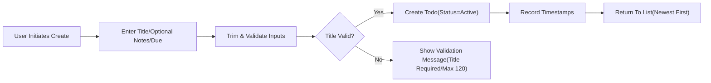
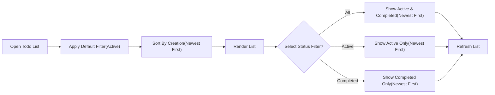
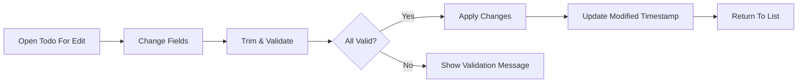
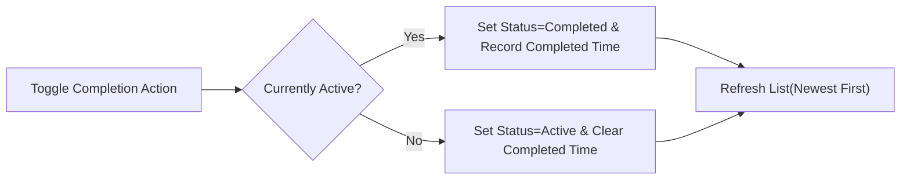
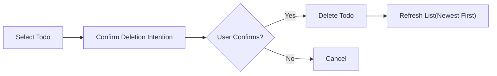
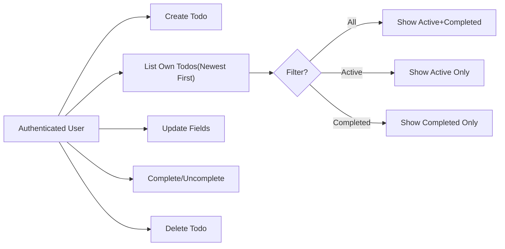

# Functional Requirements — Todo Management (MVP)

Minimal, business-level specification for managing personal Todos within a strictly bounded MVP. Content focuses on WHAT the service must do for end users, avoiding technical implementation details.

## Scope and Intent
- Provide only the essential capabilities to manage personal Todos owned by a single authenticated user: create, list/read, update (title, notes, due date), complete/uncomplete, and delete.
- Enforce owner-only access; guests have no Todo access; admins do not edit member Todo content in MVP.
- Keep filtering to status only (All, Active, Completed). Keep sorting to a single default (creation time, newest first).
- Exclude all advanced features: collaboration, tags, priorities, projects, reminders/notifications, recurring tasks, attachments, search, bulk actions, custom sorting, and integrations.

## Todo Concept and Business Semantics
- Title (required): short label that captures the task; meaningful after trimming leading/trailing whitespace.
- Notes (optional): additional free-form text for details; may be empty.
- Due Date (optional): calendar date that expresses intention; day-level only; time-of-day not required in MVP.
- Status (required): “Active” or “Completed”. New Todos are Active by default.
- Ownership: each Todo belongs to exactly one authenticated user; no sharing.
- Timestamps (business-level): creation time and last modified time are maintained; completion time exists only when status is Completed.

## Roles and Access Boundaries (Business Terms)
- Guest: may view public policy/info pages; cannot access or manipulate any Todo data.
- User: authenticated individual; can manage only their own Todos.
- Admin: limited oversight in MVP (aggregate insight, account lifecycle); does not browse or edit member Todo content in normal operations.

## Validation Rules (Business-Level)
- Title: required; at least 1 non-space character after trimming; maximum 120 characters.
- Notes: optional; maximum 1,000 characters; whitespace-only notes are treated as empty.
- Due Date: optional; must be a valid calendar date; past dates are allowed and indicate the item may be overdue.
- Status: allowed values are Active or Completed; defaults to Active on creation.

## Create Todo

Business function: allow the owner to create a Todo with minimal input and immediate visibility upon success.

Inputs (business terms):
- Title (required): text meeting validation rules.
- Notes (optional): up to 1,000 characters.
- Due Date (optional): valid calendar date.

Processing rules:
- Trim leading/trailing whitespace on Title and Notes.
- Reject creation if Title is empty after trimming or exceeds 120 characters.
- Set Status to Active by default.
- Record creation and last modified timestamps.

Outcomes:
- On success, the new Todo appears immediately in the owner’s list according to default sorting (newest first).
- On failure, an actionable message explains which rule was violated and how to correct it.

Create flow (conceptual):

## Read/List Todos

Business function: present only the owner’s Todos with a minimal, predictable listing and a status filter.

Default presentation (business terms):
- Show only the owner’s Todos.
- Default filter: Active.
- Default sorting: creation time, newest first.
- Completed items are hidden by default; visible when the Completed filter is chosen.

Processing rules:
- Do not expose whether other users’ Todos exist.
- Compute “overdue” conceptually when Due Date is before today in the user’s local context; does not change Status.

Outcomes:
- Listing updates immediately after create, update, complete/uncomplete, or delete.
- Empty state presented clearly when no items match the current filter.

List/filter flow (conceptual):

## Update Todo (Title/Notes/Due/Status)

Business function: permit owners to edit field values of their Todos and see results immediately.

Inputs (business terms):
- Title: may be changed; must remain valid after trimming; 1–120 characters.
- Notes: may be added, changed, or cleared; up to 1,000 characters; whitespace-only becomes empty.
- Due Date: may be added, changed, or cleared; must be a valid calendar date if present.
- Status: may be set to Active or Completed; see toggle semantics below.

Processing rules:
- Reject updates that violate validation rules (e.g., empty Title after trim, Title > 120 chars, invalid date).
- Update last modified timestamp on any successful change.

Outcomes:
- Successful updates appear in list views immediately, ordered by default sorting.
- Rejected updates return a specific, actionable message; no partial updates are applied.

Update flow (conceptual):

## Complete/Uncomplete Todo

Business function: toggle completion state; keep behavior simple and predictable.

Processing rules:
- Marking Completed sets Status to Completed and records completion time.
- Marking Uncompleted sets Status to Active and clears completion time.
- Toggling does not change Title, Notes, or Due Date.

Outcomes:
- Completed items leave the default Active view and appear when the Completed or All filter is selected.
- Rapid, repeated toggles resolve to the last submitted state without data loss.

Toggle flow (conceptual):

## Delete Todo

Business function: allow permanent removal by the owner with immediate effect in views.

Processing rules:
- Deletion is final from the user perspective in MVP; no recycle bin, undo, or restore.
- Confirmation may be required conceptually to avoid unintended loss.

Outcomes:
- After deletion, the Todo no longer appears in any owner-visible list.
- Attempts to act on an item that no longer exists produce a clear, non-technical message.

Delete flow (conceptual):

## Basic Filtering and Sorting (MVP)
- Status filter only: All, Active, Completed.
- Default sorting only: creation time, newest first.
- No custom sorts, manual reordering, or multi-key sorting in MVP.
- Filter and sorting choices do not expose other users’ data and affect only the current user’s view.

## Acceptance Criteria (EARS)

General access and ownership:
- THE todoMvp system SHALL restrict all Todo operations to authenticated owners only.
- WHEN a guest attempts any Todo operation, THE todoMvp system SHALL deny the action and provide guidance to sign in.
- IF a user attempts to access or modify a Todo not owned by them, THEN THE todoMvp system SHALL deny the action without revealing whether such a Todo exists.

Create Todo:
- WHEN a user submits a new Todo with a Title containing at least one non-space character after trimming and not exceeding 120 characters, THE todoMvp system SHALL create the Todo with Status set to Active.
- IF Title is missing, empty after trim, or exceeds 120 characters, THEN THE todoMvp system SHALL reject creation and state the rule and correction.
- WHERE Notes are provided, THE todoMvp system SHALL accept up to 1,000 characters and treat whitespace-only as empty.
- WHERE a Due Date is provided, THE todoMvp system SHALL accept any valid calendar date, including past dates.
- THE todoMvp system SHALL record creation and last modified timestamps on success.

Read/List Todos:
- THE todoMvp system SHALL list only the requesting user’s Todos.
- THE todoMvp system SHALL show Active Todos by default and sort by creation time (newest first).
- WHERE the user selects All, THE todoMvp system SHALL display both Active and Completed Todos sorted by creation time (newest first).
- WHERE the user selects Completed, THE todoMvp system SHALL display Completed Todos sorted by creation time (newest first).
- THE todoMvp system SHALL reflect newly created or updated Todos in list views immediately.

Update Todo:
- WHEN a user updates Title, THE todoMvp system SHALL trim whitespace and reject the update IF the resulting Title is empty or exceeds 120 characters.
- WHERE a user updates Notes, THE todoMvp system SHALL accept up to 1,000 characters and treat whitespace-only as empty.
- WHERE a user updates the Due Date, THE todoMvp system SHALL accept any valid calendar date and allow clearing the Due Date.
- THE todoMvp system SHALL update the last modified timestamp upon any successful edit and apply changes atomically.

Complete/Uncomplete Todo:
- WHEN a user marks a Todo as Completed, THE todoMvp system SHALL set Status to Completed and record completion time.
- WHEN a user marks a Completed Todo as Active, THE todoMvp system SHALL set Status to Active and clear completion time.
- THE todoMvp system SHALL exclude Completed Todos from the default view unless the Completed or All filter is selected.

Delete Todo:
- WHEN a user confirms deletion, THE todoMvp system SHALL remove the Todo from the owner’s visible lists immediately.
- IF a user attempts to delete a Todo that does not exist or is not accessible, THEN THE todoMvp system SHALL respond that the item is not available and advise refresh; no details about existence are disclosed.
- THE todoMvp system SHALL treat deletion as final in MVP with no restore option.

Messaging and error handling (business language):
- IF validation fails for any field, THEN THE todoMvp system SHALL present a clear message naming the rule and how to correct it and preserve valid inputs where feasible.
- IF authentication is lost during an operation, THEN THE todoMvp system SHALL stop the operation, preserve input where feasible, and instruct the user to sign in again.

Performance expectations (user-centric):
- WHEN a user performs create, update, complete/uncomplete, or delete, THE todoMvp system SHALL reflect the change in the user’s view within 2 seconds under normal conditions for up to 200 Todos.
- WHEN a user opens their Todo list, THE todoMvp system SHALL produce the initial view within 2 seconds for up to 200 Todos.

Localization and time semantics:
- THE todoMvp system SHALL treat Due Date as a day-level concept interpreted in the user’s local time context and present consistent, human-readable dates.

## Non-Goals and Out-of-Scope (MVP Discipline)
- No projects, lists/folders, tags/labels, priorities, colors, or custom fields.
- No recurring tasks, reminders, notifications, or calendar integrations.
- No attachments, images, file uploads, or link management.
- No sharing, collaboration, or assignments to other users.
- No bulk actions, manual sorting, or custom sorters.
- No search or advanced filters beyond status filter.
- No offline mode or real-time sync guarantees beyond basic authenticated access.

## Conceptual Overview Diagram

## Alignment and Traceability
- Scope boundaries and exclusions align with MVP scope and out-of-scope discipline.
- Role restrictions align with business role definitions: owner-only access, guest denial, minimal admin oversight.
- Validation and time semantics align with business rules: title 1–120 chars, notes up to 1,000 chars, due date optional and may be in the past, day-level interpretation.

End of functional requirements for Todo management in the MVP.