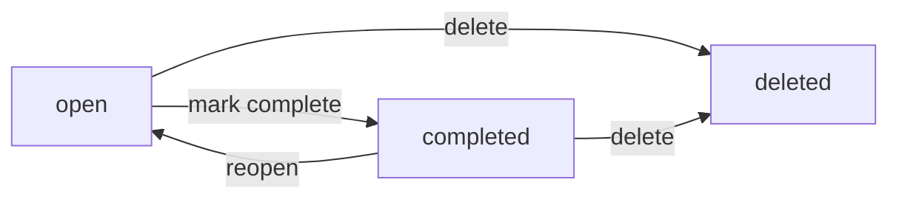

# 06 - Business Rules and Validation for todoApp (MVP)

This document defines the business rules, input validation, allowed state transitions, sorting/filtering behavior, and fair-use limits for the minimal Todo service. It focuses exclusively on business requirements in natural language so developers can implement with autonomy over technical choices. All applicable requirements are expressed using EARS (Easy Approach to Requirements Syntax). The system name used below is "todoApp".

## 1) Introduction and Scope
- Purpose: Establish unambiguous, testable rules governing todos and related actions for the MVP.
- In scope: Personal todo creation, reading, updating, completion, deletion; listing with basic sorting and filtering; simple text search; role-based access in business terms; rate limits and fair use.
- Out of scope in this document: APIs, database schemas, UI layout/behavior, infrastructure specifics, HTTP status codes, and implementation details such as libraries or storage engines.

## 2) Todo Entity Business Rules (conceptual)
The following rules define the core business behavior for todos in the MVP.

### 2.1 Ownership and Access
- THE todoApp SHALL restrict each todo to exactly one owner of role "todoUser".
- THE todoApp SHALL ensure that only the owner can create, read, update, complete, or delete their own todos.
- WHEN a user is not authenticated (role "guestVisitor"), THE todoApp SHALL deny any attempt to access todo content.
- WHERE the actor has role "systemAdmin", THE todoApp SHALL not allow routine access to private todo content.
- IF lawful or policy-driven escalations are required for administrators, THEN THE todoApp SHALL treat them as out of MVP scope.

### 2.2 Creation
- WHEN a "todoUser" submits a new todo, THE todoApp SHALL create the todo if and only if all validation rules pass.
- THE todoApp SHALL initialize new todos with status "open".
- THE todoApp SHALL record conceptual timestamps for creation and last update at business-event time.

### 2.3 Reading
- WHEN a "todoUser" requests their list, THE todoApp SHALL return only their own todos that are not deleted, constrained by sorting and filtering rules.
- WHEN a "todoUser" requests a single todo by identifier, THE todoApp SHALL return it only if it belongs to the user and is not deleted.

### 2.4 Updating
- WHEN a "todoUser" updates title, description, or due date, THE todoApp SHALL apply changes only if validation rules pass and the todo is not deleted.
- THE todoApp SHALL update the conceptual last-updated timestamp upon successful modifications.

### 2.5 Completion and Reopening
- WHEN a "todoUser" marks a todo as completed, THE todoApp SHALL set status to "completed" and record a conceptual completion timestamp.
- WHEN a "todoUser" reopens a completed todo, THE todoApp SHALL set status to "open" and clear the conceptual completion timestamp.
- IF a todo is deleted, THEN THE todoApp SHALL disallow completion or reopening.

### 2.6 Deletion
- WHEN a "todoUser" deletes a todo, THE todoApp SHALL remove the todo from the user’s accessible lists and treat the deletion as irreversible in MVP.
- IF a delete request is repeated for a todo already deleted, THEN THE todoApp SHALL treat the operation as idempotent with no change.

### 2.7 Idempotency and Safe Repeats
- WHEN an operation that toggles status to its current value is requested (e.g., completing an already completed todo), THE todoApp SHALL succeed without changing state beyond what is already true.
- WHEN identical update data is resubmitted, THE todoApp SHALL succeed without altering the conceptual updated timestamp requirement beyond normal update semantics defined by implementation policy.

### 2.8 Visibility and Listing Defaults
- THE todoApp SHALL exclude deleted todos from standard listings.
- THE todoApp SHALL default the list filter to status "open" unless the user explicitly requests a different filter.

## 3) Field Validation Rules (title, description, due date)
All fields are subject to the following business-level validation. Validation occurs on create and on update for fields provided in the request.

### 3.1 Summary Table of Constraints
| Field | Required | Length/Format | Content Rules | Additional Constraints |
|------|----------|---------------|---------------|------------------------|
| title | Yes | 1–120 characters after trimming | No control characters | Must contain at least one non-whitespace character |
| description | No | 0–2000 characters after trimming | No control characters | Optional; empty permitted |
| dueDate | No | Calendar date with optional time | Interpreted in user’s timezone | Allowed in the past (considered overdue); not more than 5 years in the future |

Notes:
- "Control characters" refers to non-printable characters; standard whitespace (spaces, tabs, newlines) is allowed but will be trimmed at ends.
- "User’s timezone" means due date/time semantics are evaluated in the user’s configured local timezone preference. If no preference is configured, the service’s default timezone policy applies (outside the scope of this document).

### 3.2 Title Rules
- WHEN a "todoUser" submits a title, THE todoApp SHALL trim leading and trailing whitespace before validation.
- THE todoApp SHALL require title length to be between 1 and 120 characters after trimming.
- IF the title contains only whitespace after trimming, THEN THE todoApp SHALL reject the input.
- IF the title contains control characters, THEN THE todoApp SHALL reject the input.

### 3.3 Description Rules
- WHEN a "todoUser" submits a description, THE todoApp SHALL trim leading and trailing whitespace before validation.
- THE todoApp SHALL allow description length from 0 to 2000 characters after trimming.
- IF the description contains control characters, THEN THE todoApp SHALL reject the input.

### 3.4 Due Date Rules
- WHEN a "todoUser" provides a due date, THE todoApp SHALL interpret the value in the user’s timezone.
- WHERE only a calendar date is provided without a time component, THE todoApp SHALL treat the due time as the end of that day in the user’s timezone.
- WHERE a due date is earlier than "now" in the user’s timezone, THE todoApp SHALL accept the value and consider the item overdue until completed.
- WHERE a due date is provided, THE todoApp SHALL ensure it is not more than 5 years in the future relative to "now" in the user’s timezone.
- WHEN a todo is marked completed, THE todoApp SHALL allow the due date to remain unchanged and SHALL still enforce all due date rules on subsequent updates.

## 4) Status and State Transitions

### 4.1 Status Values
- "open": The todo is active and incomplete.
- "completed": The todo has been completed.
- "deleted": The todo has been irreversibly removed from the user’s accessible set (terminal state in MVP).

### 4.2 Allowed Transitions
- open → completed (mark complete)
- completed → open (reopen)
- open → deleted (delete)
- completed → deleted (delete)

### 4.3 Forbidden Transitions
- deleted → any other state (no recovery in MVP)

### 4.4 State Diagram (Conceptual)

### 4.5 Transition Rules
- WHEN a todo is in "deleted" status, THE todoApp SHALL deny any operation other than safely acknowledging redundant deletes.
- WHEN transitioning to "completed", THE todoApp SHALL set the conceptual completion timestamp.
- WHEN transitioning to "open" from "completed", THE todoApp SHALL clear the conceptual completion timestamp.

## 5) Sorting and Filtering Business Logic
The list operation returns a user’s own todos only. The following rules define conceptual ordering and filtering.

### 5.1 Default Behavior
- THE todoApp SHALL by default list only todos with status "open".
- THE todoApp SHALL sort the default list by creation time descending (newest first).

### 5.2 Sorting Options
- WHERE a user requests sorting by due date, THE todoApp SHALL sort by due date ascending, placing todos without a due date after those with a due date.
- WHERE two todos have the same due date/time, THE todoApp SHALL apply a stable secondary sort by creation time descending.
- WHERE sorting by creation time is requested, THE todoApp SHALL sort by creation time descending.

### 5.3 Filtering by Status
- WHERE status filter is explicitly set to "open", THE todoApp SHALL include only open todos.
- WHERE status filter is explicitly set to "completed", THE todoApp SHALL include only completed todos.
- WHERE status filter is explicitly set to "all", THE todoApp SHALL include both open and completed todos and SHALL exclude deleted todos.

### 5.4 Filtering by Due Window
- WHERE the user selects "overdue", THE todoApp SHALL include todos with due date/time earlier than "now" in the user’s timezone and status not "completed".
- WHERE the user selects "dueToday", THE todoApp SHALL include todos with due date on the current calendar date in the user’s timezone and status not "completed".
- WHERE the user selects "dueThisWeek", THE todoApp SHALL include todos with due date from the start to the end of the current calendar week in the user’s timezone and status not "completed".

### 5.5 Text Search (Title/Description)
- WHEN a user provides a free-text query, THE todoApp SHALL perform a case-insensitive substring match against title and description.
- WHERE multiple terms separated by whitespace are provided, THE todoApp SHALL match todos that contain all terms in either title or description in any order.
- THE todoApp SHALL ignore leading/trailing spaces in the search query.

### 5.6 Pagination (Business-Level)
- THE todoApp SHALL return list results in pages with a default page size of 20 items unless the user specifies a different size within allowed limits.
- WHERE a custom page size is requested, THE todoApp SHALL allow sizes from 1 to 100 items per page.

## 6) Rate Limits and Fair Use (business-level)
The following limits exist to prevent accidental misuse and to protect overall service quality. Values are defined for MVP and may be revised later by policy.

### 6.1 Per-User Operational Limits
- THE todoApp SHALL limit todo creation to at most 500 per user per day.
- THE todoApp SHALL limit write operations (create, update, complete/reopen, delete) to at most 60 operations per user per minute.
- THE todoApp SHALL limit read/list operations to at most 120 operations per user per minute.

### 6.2 Per-Todo Constraints
- THE todoApp SHALL limit updates on a single todo to at most 120 changes per hour to prevent thrashing.
- THE todoApp SHALL reject any field that exceeds its stated maximum lengths.

### 6.3 Storage-Independent Size Constraints (Business-Level)
- THE todoApp SHALL cap title length at 120 characters and description length at 2000 characters as defined above.
- THE todoApp SHALL reject todos whose combined textual content (title + description) exceeds 2120 characters after trimming.

### 6.4 Abuse Prevention
- IF unusual activity suggests automation or abuse (e.g., sustained near-limit write bursts over an extended period), THEN THE todoApp SHALL temporarily curtail actions for the affected account per policy, with user-facing guidance to try again later.

## 7) Acceptance Criteria (EARS)
This section consolidates key acceptance criteria in EARS format for testability.

### 7.1 Ownership and Access
- WHEN a "guestVisitor" attempts any todo action, THE todoApp SHALL deny the action.
- WHEN a "todoUser" attempts to access another user’s todo, THE todoApp SHALL deny the action.
- WHERE the actor role is "systemAdmin" without exceptional lawful process, THE todoApp SHALL deny access to private todo content.

### 7.2 Create Todo
- WHEN a "todoUser" submits a title meeting the title rules and optional description/due date meeting their rules, THE todoApp SHALL create a new todo with status "open".
- IF the title is missing or empty after trimming, THEN THE todoApp SHALL reject creation.
- IF the title exceeds 120 characters after trimming, THEN THE todoApp SHALL reject creation.
- IF the description exceeds 2000 characters after trimming, THEN THE todoApp SHALL reject creation.
- IF the title or description contains control characters, THEN THE todoApp SHALL reject creation.
- WHERE the due date is earlier than "now" in the user’s timezone, THE todoApp SHALL accept creation and consider the item overdue until completed.
- IF the due date is more than 5 years into the future, THEN THE todoApp SHALL reject creation.

### 7.3 Update Todo
- WHEN a "todoUser" updates a todo they own and the todo is not deleted, THE todoApp SHALL apply valid changes and update the conceptual last-updated timestamp.
- IF an update attempts to set the title outside 1–120 characters after trimming, THEN THE todoApp SHALL reject the update.
- IF an update attempts to set the description above 2000 characters after trimming, THEN THE todoApp SHALL reject the update.
- IF an update attempts to set a due date more than 5 years into the future (user’s timezone), THEN THE todoApp SHALL reject the update.
- IF an update is requested for a deleted todo, THEN THE todoApp SHALL reject the update.

### 7.4 Complete/Reopen
- WHEN a "todoUser" completes an open todo, THE todoApp SHALL set status to "completed" and record the conceptual completion timestamp.
- WHEN a "todoUser" reopens a completed todo, THE todoApp SHALL set status to "open" and clear the conceptual completion timestamp.
- IF a completion or reopen is requested for a deleted todo, THEN THE todoApp SHALL reject the request.
- WHERE a completion request is made for an already completed todo, THE todoApp SHALL return success without changing state.
- WHERE a reopen request is made for an already open todo, THE todoApp SHALL return success without changing state.

### 7.5 Delete Todo
- WHEN a "todoUser" deletes an open or completed todo they own, THE todoApp SHALL mark it as deleted and exclude it from subsequent lists.
- WHERE a delete request is issued again for the same deleted todo, THE todoApp SHALL treat the operation as idempotent.

### 7.6 List, Sort, Filter, Search
- WHEN a "todoUser" requests a list without filters, THE todoApp SHALL return only open todos sorted by creation time descending.
- WHERE sorting by due date is requested, THE todoApp SHALL order todos by due date ascending with no-due-date items last and apply creation time descending as a secondary sort for ties.
- WHERE status=completed is requested, THE todoApp SHALL return only completed todos.
- WHERE status=all is requested, THE todoApp SHALL return both open and completed todos, excluding deleted todos.
- WHERE filter=overdue is requested, THE todoApp SHALL include only todos with due date earlier than now (user’s timezone) and not completed.
- WHERE filter=dueToday is requested, THE todoApp SHALL include only todos due on the current calendar date (user’s timezone) and not completed.
- WHERE filter=dueThisWeek is requested, THE todoApp SHALL include only todos due within the current week (user’s timezone) and not completed.
- WHEN a user provides a free-text query, THE todoApp SHALL match todos where all whitespace-separated terms appear in either title or description in any order, ignoring case.
- WHERE pagination is applied without page size specified, THE todoApp SHALL return 20 items by default.
- WHERE page size is specified outside 1–100, THE todoApp SHALL reject the request.

### 7.7 Rate Limits and Fair Use
- WHEN a user exceeds 500 creations in a day, THE todoApp SHALL deny further creations for that day.
- WHEN a user exceeds 60 write operations in a minute, THE todoApp SHALL temporarily deny further write operations and SHALL allow retry after a cooldown consistent with policy.
- WHEN a user exceeds 120 read operations in a minute, THE todoApp SHALL temporarily deny further read operations and SHALL allow retry after a cooldown consistent with policy.
- WHEN more than 120 updates are requested on the same todo within an hour, THE todoApp SHALL deny subsequent updates until the limit window passes.

### 7.8 Error Messaging (Business-Level)
- IF any validation fails, THEN THE todoApp SHALL provide a business-level message indicating which field failed and why in understandable terms.
- IF access is denied, THEN THE todoApp SHALL provide a business-level message stating that the action is not permitted for the current user.

## 8) Glossary
- "todo": A user-owned record with title, optional description, and optional due date.
- "open": Status meaning the todo is pending/incomplete.
- "completed": Status meaning the todo is done.
- "deleted": Status representing an irreversible removal from user access in MVP.
- "user’s timezone": The timezone context used to evaluate due dates against the current time for that user.

This document describes business requirements only. All technical implementation decisions (architecture, APIs, database design, storage models, and infrastructure) are determined by the development team. It specifies WHAT the system shall do, not HOW to implement it.