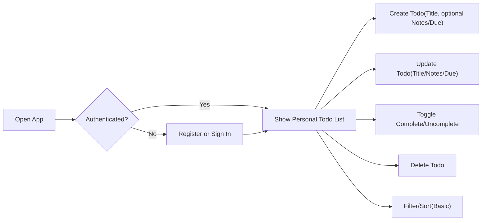
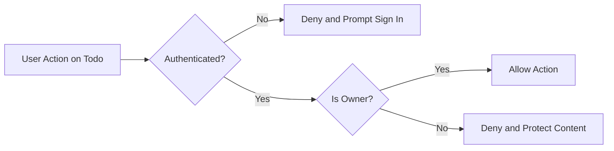
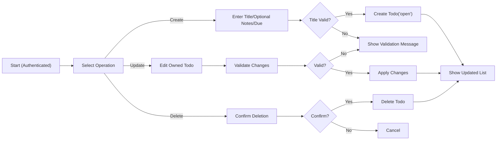

# Requirements Analysis — Minimal Todo List (MVP)

## Vision and MVP Goal
Provide the smallest-possible, easy-to-use Todo list for individuals to capture tasks quickly, keep them visible, mark them done, and remove them when no longer needed. The experience prioritizes speed, clarity, and privacy. Only essential capabilities are included: create, list, update (title/notes/due), complete/uncomplete, delete, and basic filtering/sorting. All requirements are stated in business terms; technical implementation details are intentionally excluded.

## Roles and Permissions (Business-Level)
- Guest: Unauthenticated visitor with access to general information pages only. Cannot access or manipulate any Todo data.
- User: Authenticated individual who can manage only their own Todos.
- Admin: Administrator with limited oversight (aggregate insights and account lifecycle actions). Admins do not view or edit member Todo content in MVP.

Permission boundaries (business actions):
- Guest: register, sign in; cannot access Todo data.
- User: create/read/update/complete/uncomplete/delete owned Todos; list/filter/sort owned Todos; sign out.
- Admin: aggregate usage insights; deactivate/reactivate accounts (as required for policy). No direct access to Todo content in MVP.

## Core Concepts and Business Semantics
- Title (required): short human-readable label. 1–120 characters after trimming leading/trailing whitespace.
- Notes (optional): free-form details up to 1,000 characters; whitespace-only notes are treated as empty.
- Due Date (optional): calendar date interpreted in the user’s local time context; time-of-day not required.
- Status: one of two values — “open” or “completed”. New Todos start as “open”.
- Ownership: every Todo belongs to exactly one User; no sharing or delegation.
- Timestamps (business-level): created time; last updated time; completed time (only while status is “completed”).

Validation overview:
- Title: required; trimmed length 1–120; printable characters.
- Notes: optional; up to 1,000; printable characters; preserve line breaks.
- Due Date: optional; valid calendar date; may be in the past for record keeping.
- Status: open/completed only; toggling allowed.

## Business Processes and Workflows

### Conceptual End-to-End Flow


### Authorization Decision Flow (Conceptual)


## Functional Requirements (EARS)

### Access and Ownership
- THE service SHALL restrict all Todo operations to authenticated owners only.
- IF a guest attempts any Todo operation, THEN THE service SHALL deny the action and guide to sign in.
- IF a user attempts to access or modify a Todo not owned by them, THEN THE service SHALL deny the action without revealing whether such a Todo exists.

### Create Todo
- WHEN a user submits a new Todo with a Title containing at least one non-space character after trimming, THE service SHALL create the Todo with Status set to “open”.
- WHERE Notes are provided, THE service SHALL accept up to 1,000 characters and treat whitespace-only Notes as empty.
- WHERE a Due Date is provided, THE service SHALL accept any valid calendar date, including past dates.
- THE service SHALL record created time and last updated time upon creation.
- IF Title is missing or exceeds 120 characters after trimming, THEN THE service SHALL reject creation and explain the rule.

### Read/List Todos
- THE service SHALL list only the requesting user’s Todos.
- THE service SHALL provide a default list focused on “open” Todos.
- THE service SHALL reflect newly created or updated Todos in list views immediately.

### Update Todo
- WHEN a user updates Title, THE service SHALL trim whitespace and reject the update IF the resulting Title is empty or exceeds 120 characters.
- WHERE a user updates Notes, THE service SHALL accept up to 1,000 characters and treat whitespace-only Notes as empty.
- WHERE a user updates the Due Date, THE service SHALL accept any valid calendar date and allow clearing the Due Date.
- THE service SHALL update the last updated time upon any successful edit.

### Complete/Uncomplete Todo
- WHEN a user marks a Todo as completed, THE service SHALL set Status to “completed” and record completed time.
- WHEN a user reopens a completed Todo, THE service SHALL set Status to “open” and clear completed time.
- THE service SHALL exclude completed Todos from the default view unless the Completed filter is selected.

### Delete Todo
- WHEN a user confirms deletion of an owned Todo, THE service SHALL remove it from the user’s visible list immediately.
- IF a user attempts to delete a Todo that does not exist or is not accessible, THEN THE service SHALL present a clear message without disclosing whether the Todo ever existed.
- THE service SHALL treat deletion as final in MVP (no restore).

### Filtering and Sorting (Basic)
- THE service SHALL provide a status filter with options: All, Open, Completed.
- THE service SHALL apply a default sort that is predictable and simple (e.g., “open” by due date ascending, undated items after dated by recent creation; “completed” by most recently completed first).

## Authentication and Session Requirements (EARS)
- THE authentication subsystem SHALL allow individuals to register an account to become a User.
- THE authentication subsystem SHALL allow Users to sign in and sign out.
- WHILE a session is active, THE authentication subsystem SHALL allow the User to access their own Todos.
- THE authentication subsystem SHALL end the session immediately on sign out.
- THE authentication subsystem SHALL end inactive sessions automatically after a period of inactivity suitable for personal use.
- WHEN a guest attempts a protected action, THE authentication subsystem SHALL deny access and prompt sign in.

## Authorization Rules (EARS)
- THE authorization model SHALL assign ownership of each Todo to exactly one User at creation time.
- WHEN a User lists Todos, THE authorization model SHALL return only Todos owned by that User.
- WHEN a User attempts to read/update/complete/delete, THE authorization model SHALL allow the action ONLY if the Todo is owned by that User.
- IF an Admin attempts to view or edit user Todo content in MVP, THEN THE authorization model SHALL deny the action.

## Error Handling and Recovery (Business-Level, EARS)
- WHEN validation fails for any field, THE service SHALL present an actionable message naming the field and rule violated and preserve other valid inputs where feasible.
- WHEN invalid credentials are submitted, THE service SHALL inform the user that authentication failed without exposing sensitive details and allow retry.
- WHEN a session expires during an operation, THE service SHALL request sign-in again and preserve unsaved input where feasible.
- WHEN a concurrency conflict is detected (e.g., item changed or deleted elsewhere), THE service SHALL inform the user, recommend refreshing, and avoid partial updates.
- WHERE unusually rapid repeated operations occur, THE service SHALL slow or temporarily limit further actions and communicate simple waiting guidance.

## Non-Functional Requirements (User-Centric)
- THE service SHALL present outcomes for create/update/complete/uncomplete/delete within 2 seconds under normal conditions for typical list sizes (up to 200 Todos per user).
- THE service SHALL render the default list of up to 100 items within 2 seconds under normal conditions.
- THE service SHALL target 99.5% monthly availability for core features (authentication and Todo operations).
- WHEN planned maintenance is necessary, THE service SHALL provide advance notice and aim for low-traffic hours in Asia/Seoul.
- THE service SHALL ensure that confirming success implies durable storage of the change.
- THE service SHALL avoid logging sensitive content (e.g., passwords or full Todo text) and use minimal, privacy-preserving diagnostics.
- THE service SHALL provide text-based feedback for all outcomes and allow keyboard-only operation for core flows.

## Acceptance Criteria and Release Readiness (EARS)
- WHEN an authenticated user submits a valid Todo, THE service SHALL create it and show it in the user’s list immediately after creation.
- WHEN a user views their Todo list, THE service SHALL present only that user’s Todos using the default view described.
- WHEN a user edits their Todo with valid input, THE service SHALL apply the changes and reflect them immediately.
- WHEN a user toggles completion, THE service SHALL change status accordingly and reflect it immediately.
- WHEN a user deletes an owned Todo, THE service SHALL remove it from the list immediately and treat the deletion as final.
- WHEN a user applies the status filter, THE service SHALL display only items matching All/Open/Completed as selected.
- THE service SHALL exclude advanced features listed in the Out-of-Scope section for MVP.

## Out-of-Scope (Explicit Exclusions for MVP)
- Collaboration, shared lists, or assignment to others.
- Subtasks, checklists, or hierarchical structures.
- Tags, labels, projects/folders, priorities, or custom fields.
- Reminders, notifications, recurring tasks, or calendar integrations.
- Attachments, uploads, or embedded media.
- Text search and advanced filters beyond status.
- Bulk actions and manual drag-and-drop ordering.
- Admin content moderation of personal Todos.
- Import/export and third-party integrations.
- Multi-language localization beyond basic date display; advanced accessibility beyond simple text feedback.

## Visual References (Mermaid)

### Create/Update/Delete Flow (Conceptual)


### Todo Lifecycle (Conceptual)
```mermaid
stateDiagram-v2
  direction LR
  ["start"] --> "Open"
  "Open" --> "Completed": "Mark Complete"
  "Completed" --> "Open": "Reopen"
  "Open" --> "Deleted": "Delete"
  "Completed" --> "Deleted": "Delete"
```

## Glossary
- Owner: The authenticated account to which a Todo belongs.
- Open/Completed: Status values indicating whether a Todo is unfinished or done.
- Default View: The initial listing configuration focused on useful visibility of open items.
- Personal Scope: A guarantee that only the owner can see and manage their Todos in MVP.
- Asia/Seoul Context: The primary time reference for planned maintenance windows; user due dates are interpreted in the user’s own local time.
