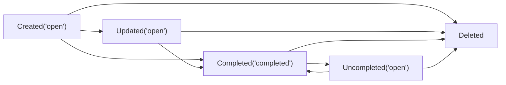
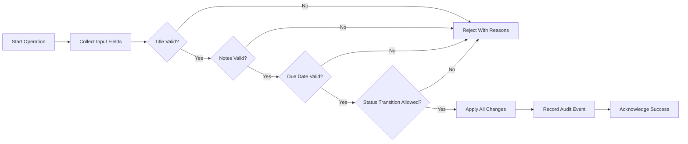

# Business Rules and Validation — todoMvp (MVP)

## 1. Purpose and Scope
Minimal business rules and validation criteria for todoMvp’s essential Todo features: create, list/read, update (title, notes, due date, status), complete/uncomplete, and delete. Requirements are expressed in business language suitable for developers and QA to verify behavior without prescribing technical stacks, schemas, or APIs. Advanced functionality is intentionally excluded to protect MVP scope.

THE todoMvp service SHALL implement only the features and rules necessary for a simple, personal Todo list owned and managed by a single authenticated user.

## 2. Guiding Principles (MVP Minimalism)
- Single-owner personal productivity; no sharing or collaboration.
- Small, predictable set of fields with strict but simple validation.
- Clear access boundaries based on role (guest, user, admin).
- Immediate, legible feedback for success/failure through user-facing messages (details in the error-handling guide).
- No technical specifications (APIs, database designs, tokens) included here.

## 3. Todo Field Semantics (Business Meaning)

### 3.1 Title
- Short label that captures the essence of the task.
- Must be meaningful after trimming leading/trailing whitespace.

### 3.2 Notes (Optional)
- Free-form context to clarify details of the task.
- May include everyday text and emoji; not intended for rich formatting.

### 3.3 Due Date (Optional)
- Calendar date indicating when the item is intended to be completed.
- Interpreted in the user’s local time context; time-of-day is not required in MVP.

### 3.4 Status
- Current completion state of the task: "open" or "completed".

### 3.5 Ownership
- Identifies the account to which the Todo belongs; all operations are restricted to the owner.

### 3.6 Timestamps (Business-Level)
- Created time; last updated time; completed time (only when status is "completed").

## 4. Input Validation Rules
Validation applies to create and update operations and must be enforced uniformly across all entry points. Values are interpreted in business terms; technical formats are at developer discretion as long as user-facing semantics hold.

### 4.1 Title Rules
- Required on create; non-empty after trimming.
- Duplicate titles are permitted for the same user.
- Internal whitespace is preserved as entered (excluding leading/trailing trimming).
- Everyday characters allowed; non-printable control characters are disallowed.
- Length: 1–200 characters after trimming.

EARS:
- WHEN a user creates a Todo, THE todoMvp service SHALL reject creation IF the title is empty after trimming.
- WHEN a user updates a Todo title, THE todoMvp service SHALL apply the same validation as on creation.
- IF a provided title exceeds 200 characters after trimming, THEN THE todoMvp service SHALL reject the change and preserve the existing stored value.

### 4.2 Notes Rules (Optional)
- Optional on create and update.
- Line breaks are preserved.
- Everyday characters allowed; non-printable control characters are disallowed.
- Length: up to 1,000 characters.

EARS:
- WHEN a user creates or updates notes, THE todoMvp service SHALL accept the notes IF within 1,000 characters and free of disallowed control characters.
- IF notes exceed 1,000 characters, THEN THE todoMvp service SHALL reject the input and keep the prior value unchanged.

### 4.3 Due Date Rules (Optional)
- Optional on create and update.
- Represents a valid calendar date in the user’s local time context.
- Past dates are allowed (e.g., backfilling tasks already done or overdue tracking).
- Time-of-day is not required.

EARS:
- WHEN a user provides a due date, THE todoMvp service SHALL accept it IF it represents a valid calendar date.
- IF a provided due date is not a valid calendar date, THEN THE todoMvp service SHALL reject the input and keep the prior value unchanged.
- WHEN a user removes a due date, THE todoMvp service SHALL clear the due date and retain other fields unchanged.

### 4.4 Status Rules
- Exactly two statuses: "open" and "completed".
- Default status on creation: "open".
- Toggling between "open" and "completed" is permitted by the owner.
- Completed time is set only when transitioning to "completed" and cleared when reverting to "open".

EARS:
- WHEN a user marks a Todo as completed, THE todoMvp service SHALL set status to "completed" and record the completed time.
- WHEN a user marks a Todo as uncompleted, THE todoMvp service SHALL set status to "open" and clear the completed time.

### 4.5 General Validation Behavior
- All applicable validation rules are applied before any change is persisted.
- No partial updates on invalid requests; either all provided fields pass, or none are applied.
- User-facing feedback identifies which rule failed and how to correct it in plain language (see error-handling guide).

EARS:
- WHEN multiple fields are provided in a single operation, THE todoMvp service SHALL validate all fields and proceed only if all validations pass.
- IF any validation fails, THEN THE todoMvp service SHALL not apply partial changes and SHALL communicate specific correction guidance.

## 5. Ownership and Access Rules
Roles: guest (unauthenticated), user (authenticated owner), admin (administrator with aggregate oversight and account lifecycle controls). In MVP, admins do not read or edit member Todo content.

### 5.1 Role Capabilities (Business Perspective)
| Action (Business) | Guest | User (Owner) | Admin |
|-------------------|:-----:|:------------:|:-----:|
| Create Todo | ❌ | ✅ (own) | ❌ |
| Read/List Todos | ❌ | ✅ (own) | ❌ |
| Update Title/Notes/Due | ❌ | ✅ (own) | ❌ |
| Complete/Uncomplete | ❌ | ✅ (own) | ❌ |
| Delete Todo | ❌ | ✅ (own) | ❌ |
| View aggregates, manage accounts | ❌ | ❌ | ✅ |

Clarification: Aggregate platform insights and account lifecycle actions (e.g., deactivate/reactivate accounts) are allowed for admins in MVP; they do not expose Todo content or permit content edits.

### 5.2 Ownership and Access EARS
- THE todoMvp service SHALL associate each Todo with exactly one owner account.
- WHEN a user is authenticated as "user", THE todoMvp service SHALL permit access only to Todos owned by that account.
- IF a user attempts to access a Todo not owned by that account, THEN THE todoMvp service SHALL deny the request without revealing whether the Todo exists.
- WHERE the actor role is guest, THE todoMvp service SHALL deny all Todo operations and direct the user to sign in.
- WHILE a user account is deactivated or suspended, THE todoMvp service SHALL deny create/update/complete/uncomplete/delete operations for that account’s Todos.

## 6. Time and Localization Considerations

### 6.1 Local Time Interpretation
- Due date is a day-level concept in the user’s local time context. "Due today" means the current local calendar day.
- Timestamps displayed to users are interpreted in the user’s locale/time zone.

EARS:
- WHEN a due date is provided without a time, THE todoMvp service SHALL consider it due by the end of that local calendar day.
- WHEN the local date rolls over at midnight, THE todoMvp service SHALL update "overdue" and "due today" classifications accordingly for user-facing logic.

### 6.2 Time Zone Example (Illustrative)
- A user in Asia/Seoul (KST) setting a due date of 2025-10-01 expects it to be treated as due until the end of 2025-10-01 in KST.

EARS:
- IF a user changes their time zone preference, THEN THE todoMvp service SHALL re-interpret due date classifications (e.g., "due today", "overdue") based on the new local time context without altering the stored calendar date.

### 6.3 Timestamp Semantics
- Created time is recorded upon creation; last updated time is recorded on any successful edit; completed time is recorded only when status transitions to "completed" and is cleared on revert to "open".

EARS:
- WHEN status transitions to "completed", THE todoMvp service SHALL set completed time.
- WHEN status transitions to "open", THE todoMvp service SHALL clear completed time.

## 7. Audit and Traceability (Business-Level)
Minimal accountability without exposing Todo content to administrators.

### 7.1 Audit Scope
- Audited events: create, update (any field), complete, uncomplete, delete, and admin account lifecycle actions (e.g., deactivate/reactivate account).
- For each audited event: capture actor role (user or admin), actor identity (business identifier), event time, and action description (business-level).

EARS:
- WHEN any audited event occurs, THE todoMvp service SHALL record it before acknowledging success to the initiator.
- IF audit recording fails, THEN THE todoMvp service SHALL fail the associated operation and present a recoverable message per the error-handling guidance.

### 7.2 Audit Visibility and Retention
- Audit entries are available to administrators for oversight but do not contain Todo content.
- Minimum business retention window: 90 days for audit entries.

EARS:
- WHERE legal or policy requires longer retention, THE todoMvp service SHALL retain audit entries accordingly.
- WHEN the audit retention window elapses, THE todoMvp service SHALL permit removal of older audit entries in accordance with policy.

### 7.3 Integrity Expectations
- Audit records must be protected from tampering by non-admin users.

EARS:
- IF an audit record cannot be verified for integrity, THEN THE todoMvp service SHALL flag it for administrative review.

## 8. Todo Lifecycle (Diagram)

Legend: "Created('open')" indicates a Todo created with status "open". "Deleted" removes the Todo from the owner’s accessible list. Updates can occur in any non-deleted state.

## 9. Validation Flow (Diagram)

## 10. Non-Goals and Explicit Exclusions
- No tags, labels, categories, priorities, or custom fields.
- No subtasks, checklists, hierarchies, or projects/folders.
- No attachments or file uploads.
- No reminders, notifications, recurring tasks, or calendar integrations.
- No sharing, collaboration, mentions, or comments.
- No bulk operations, manual ordering, or drag-and-drop sorting.
- No offline mode or cross-device sync specifics beyond basic authenticated access.
- No archival separate from deletion.
- No technical API specifications, HTTP codes, database schemas, or token details.

## 11. Consolidated EARS Requirements (Test Checklist)

Ubiquitous access and ownership
- THE todoMvp service SHALL associate each Todo with exactly one owner account.
- THE todoMvp service SHALL restrict all Todo operations to authenticated owners only.
- IF a guest attempts any Todo operation, THEN THE todoMvp service SHALL deny the action and guide the user to sign in.
- IF a user attempts to access or modify a Todo they do not own, THEN THE todoMvp service SHALL deny the action without revealing whether the Todo exists.

Title
- WHEN creating a Todo, THE todoMvp service SHALL reject the title IF it is empty after trimming.
- WHEN updating a Todo title, THE todoMvp service SHALL apply the same validation as on creation.
- IF a title exceeds 200 characters after trimming, THEN THE todoMvp service SHALL reject the change and preserve the prior value.

Notes
- WHEN creating or updating notes, THE todoMvp service SHALL accept up to 1,000 characters and disallow non-printable control characters.
- IF notes exceed the limit, THEN THE todoMvp service SHALL reject the input and keep the prior value.

Due Date
- WHEN a due date is provided, THE todoMvp service SHALL accept any valid calendar date and allow clearing it later.
- IF a due date cannot be recognized as a valid calendar date, THEN THE todoMvp service SHALL reject the input.

Status and timestamps
- WHEN marking a Todo as completed, THE todoMvp service SHALL set status to "completed" and record the completed time.
- WHEN reverting to open, THE todoMvp service SHALL clear the completed time.
- WHEN any successful edit occurs, THE todoMvp service SHALL update the last updated time.

All-or-nothing validation
- WHEN multiple fields are provided together, THE todoMvp service SHALL apply all-or-nothing validation and persistence.
- IF any field fails validation, THEN THE todoMvp service SHALL not apply partial changes and SHALL present corrective guidance.

Time and localization
- WHEN a due date has no time-of-day, THE todoMvp service SHALL treat it as due by the end of the local calendar day.
- WHEN midnight passes in the user’s local time, THE todoMvp service SHALL recompute "due today" and "overdue" classifications for user-facing logic.
- IF a user changes their time zone preference, THEN THE todoMvp service SHALL re-interpret classifications without altering stored calendar dates.

Audit
- WHEN any audited event occurs, THE todoMvp service SHALL record it before acknowledging success.
- IF audit recording fails, THEN THE todoMvp service SHALL fail the associated operation with recoverable guidance.
- WHERE longer retention is mandated, THE todoMvp service SHALL retain audit entries accordingly and permit removal after the retention window.
- IF an audit record cannot be verified for integrity, THEN THE todoMvp service SHALL flag it for administrative review.

Deletion
- WHEN an owner requests deletion, THE todoMvp service SHALL remove the Todo from the owner’s accessible list immediately.
- IF a deletion target no longer exists, THEN THE todoMvp service SHALL inform that no further action is needed and recommend refreshing the list.

Scope guardrails
- THE todoMvp service SHALL exclude advanced features (tags, priorities, attachments, reminders, sharing, recurring tasks, search) from MVP.

End of business rules and validation for MVP.