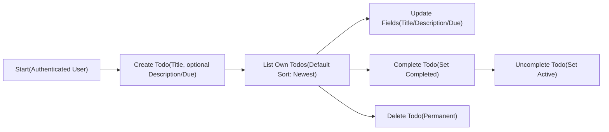
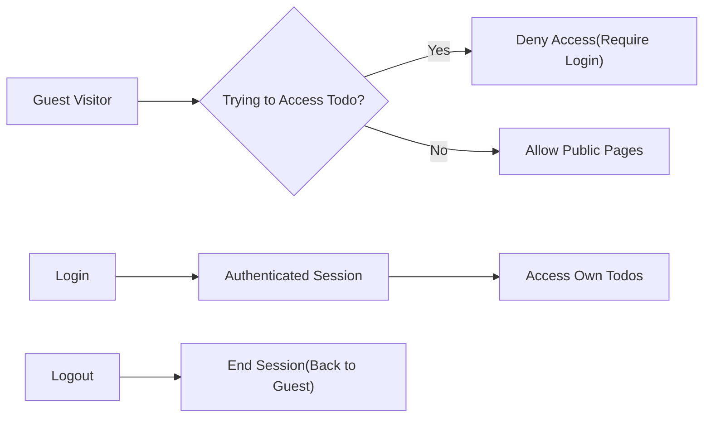

# 02-business-requirements.md — MVP Business Requirements for todoApp

## 1. About This Document
This document defines business requirements only for the todoApp MVP. It describes WHAT the system must do in business terms, not HOW to implement it. All technical implementation decisions (architecture, APIs, databases, frameworks, tokens, deployment) are at the discretion of the development team. Content is written for en-US locale and targets product managers as the primary audience, with sufficient specificity for developers and QA to implement and validate behavior.

## 2. Business Objectives
- Provide a minimal, reliable personal task management service enabling individuals to record, track, and complete their own Todo items.
- Minimize scope to core value: create, read, update, complete, and delete personal Todos; basic filtering and search; account creation/login/logout.
- Ensure privacy by restricting access so that each authenticated user can access only their own data.
- Establish simple but clear business rules and acceptance criteria to allow rapid MVP delivery and testing.

Success Definition for MVP (business-level):
- A new user can register, sign in, and manage a personal list of Todos end to end (create, update, complete, delete), then sign out.
- The user can list and filter their Todos and perform text search across their own items.
- Typical actions (create, read list, update, complete, delete) feel responsive within a couple of seconds under normal usage volume.
- The service protects user privacy and communicates errors in clear, user-understandable terms.

## 3. Product Principles and Scope Boundaries
- Minimal First: Only include capabilities essential to capturing and completing tasks.
- Privacy by Default: Users can only access their own Todo data.
- Clarity Over Complexity: Simple field set and status model; unambiguous rules and messages.
- Recoverable States Not Required in MVP: No recycle bin/undo for deletions in MVP.
- Non-Essential Features Deferred: Collaboration, attachments, reminders/notifications, recurring tasks, categories/labels, and integrations are out of scope for MVP.

Out of Scope (MVP):
- Shared lists or task assignment to other users.
- File uploads or attachments.
- Reminders, push notifications, or scheduled alerts.
- Recurring tasks.
- Tags, categories, or projects.
- Subtasks or checklists.
- Offline mode and synchronization across unreliable networks (beyond normal connectivity expectations).
- Multi-language support beyond en-US business copy requirements.

## 4. User Roles and Access Overview
Defined roles for todoApp:
- guestVisitor: Unauthenticated visitor. Can view public pages such as landing, terms, and privacy; can register or log in. No access to any Todo content.
- todoUser: Authenticated user. Can create, read, update, complete/incomplete, and delete only their own Todos; can filter and search only their own Todos; can manage their own account (change password, logout). No access to other users’ data.
- systemAdmin: Operational administrator. Can manage user accounts (suspend/reactivate), view aggregated metrics, manage service-wide configurations. No routine access to private Todo content without explicit lawful process. Not required to intervene in daily Todo operations.

Permission Matrix (business-level):

| Action (Business) | guestVisitor | todoUser | systemAdmin |
|-------------------|-------------|----------|-------------|
| View landing/terms/privacy | ✅ | ✅ | ✅ |
| Register an account | ✅ | ❌ | ✅ (as support process if applicable) |
| Login/Logout self | ✅ (login only) | ✅ | ❌ (not applicable) |
| Create Todo (own) | ❌ | ✅ | ❌ |
| Read/List Todos (own) | ❌ | ✅ | ❌ |
| Update Todo (own) | ❌ | ✅ | ❌ |
| Complete/Uncomplete Todo (own) | ❌ | ✅ | ❌ |
| Delete Todo (own) | ❌ | ✅ | ❌ |
| View other users’ Todos | ❌ | ❌ | ❌ (unless lawful process outside MVP) |
| Suspend/Reactivate user accounts | ❌ | ❌ | ✅ |
| View aggregated service metrics | ❌ | ❌ | ✅ |

## 5. In-Scope Functionalities (MVP)
- Account lifecycle: register, login, logout.
- Personal Todo management: create, read/list, update, complete/incomplete, delete.
- Basic filtering and sorting on the user’s own list.
- Basic keyword search across the user’s own Todos (title and description).
- Minimal profile/account management: change password (business-level expectation).
- Clear error handling and validation messaging in business terms.

## 6. Feature Descriptions in Natural Language
### 6.1 Account Lifecycle (Minimal)
- Registration collects essential information to create a personal account. After successful registration, the user can log in and begin using the Todo features. Email verification is optional for MVP; password reset may be deferred; change password is in scope as a personal security control.
- Login authenticates the user to access their personal Todo data. On success, the user has an active session until they explicitly log out or a session timeout occurs according to business expectations.
- Logout ends the user session immediately; subsequent requests behave as a guestVisitor until the next login.

### 6.2 Personal Todo Management
- Creating a Todo requires a title. A description and due date are optional. The system sets creation timestamp automatically and initializes status as active (not completed).
- Listing Todos shows only the authenticated user’s own Todos, with default sorting by newest created first. The list supports pagination or chunked loading per business expectations.
- Updating a Todo allows changing title, description, due date, and status (complete/incomplete). Only the owner can update their Todos.
- Completing a Todo sets its status to completed and records a completion timestamp for auditability and analytics. Uncompleting removes the completion timestamp and returns status to active.
- Deleting a Todo permanently removes it from the user’s list. In MVP, deletion is immediate and irreversible from the user’s perspective.

### 6.3 Filtering, Sorting, and Searching
- Filtering supports status (active vs completed) and due-date filters (overdue, due today, due in future). Users can combine filters where it makes sense (e.g., show active and due today).
- Sorting options include created time (newest first by default), due date (soonest first, with items without due date listed last), and status priority (active first) as applicable.
- Searching allows keyword queries against title and description of the user’s own Todos; search is case-insensitive and matches substrings.

### 6.4 Privacy and Access Enforcement
- Only the authenticated owner can access their Todo data. Guest visitors cannot see or manipulate any Todo content. System administrators cannot view user Todo details as part of routine operations.

### 6.5 Usability and Feedback (Business-Level)
- The system provides clear confirmation of successful actions and clear error messages when actions fail, with guidance for recovery if applicable.

### 6.6 Illustrative Business Flow Diagrams
Core Todo CRUD and status flow (business-level):

Authentication gating (business-level):

## 7. Business Rules and Validation
### 7.1 Todo Fields (Conceptual)
- Title (required): plain text, minimum 1 character, maximum 120 characters.
- Description (optional): plain text, maximum 2,000 characters.
- Due date (optional): calendar date or date-time interpretable in user’s local timezone; if present, it represents the intended completion deadline.
- Status (system-managed): active or completed.
- Timestamps (system-managed): createdAt set upon creation; updatedAt set when content changes; completedAt set when status becomes completed; cleared when uncompleted.

### 7.2 Validation Rules
- Title must not be empty or whitespace-only after trimming.
- Description, if provided, must not exceed the maximum length.
- Due date, if provided, must be a valid date or date-time; past due dates are allowed but are considered overdue in filtering logic.
- Users may have any number of Todos within fair-use limits (see Rate/Fair Use below).

### 7.3 Status Model and Transitions
- Possible states: active, completed.
- Allowed transitions:
  - active → completed (sets completedAt)
  - completed → active (clears completedAt)
- Deletion removes the Todo from the user’s accessible list immediately.

### 7.4 Sorting and Filtering Logic (Business-Level)
- Default sort: createdAt descending (newest first).
- Due date sort: ascending by due date; Todos without due date appear after those with due dates.
- Status ordering: when sorting by status, active items are shown before completed items.
- Filtering options:
  - Status filter: active only, completed only, or all.
  - Due filter: overdue (due date before “now” and not completed), due today, due in future.

### 7.5 Search Behavior (Business-Level)
- Keyword search applies to title and description fields of the user’s own Todos.
- Search is case-insensitive and matches partial substrings.
- Search results respect filtering and sorting selections when combined.

### 7.6 Rate and Fair Use (Business-Level)
- Creation limit: for MVP fairness and abuse prevention, a typical user is expected to create no more than 500 Todos per day.
- Update/complete/delete actions are expected to be used in normal personal productivity patterns; excessive automated behavior is considered out of scope for MVP.

### 7.7 Privacy and Access Rules
- Only the Todo owner can access, modify, or delete their Todos.
- Guest visitors cannot access any Todo data.
- System administrators do not access private Todo content during routine operations.

## 8. Acceptance Criteria (EARS format)
All requirements keep EARS keywords in English and write the rest in en-US natural language.

### 8.1 Account Lifecycle
- THE todoApp SHALL allow new users to register accounts sufficient to log in and use Todo features.
- WHEN a user submits valid login credentials, THE todoApp SHALL establish a user session and grant access to the user’s own Todos.
- IF a user logs out, THEN THE todoApp SHALL end the session immediately and treat the user as a guestVisitor.
- IF a guestVisitor attempts to access Todo features, THEN THE todoApp SHALL deny access and communicate that login is required.
- WHERE a user initiates a password change with valid current credentials, THE todoApp SHALL update the password and require subsequent logins with the new credential.

Acceptance Tests (business-level):
- WHEN registration fields are valid, THE todoApp SHALL confirm account creation and allow login.
- IF login credentials are invalid, THEN THE todoApp SHALL communicate that login failed without exposing which field is incorrect.
- WHEN logout is requested, THE todoApp SHALL immediately revoke access to Todo features until the next login.

### 8.2 Create Todo
- WHEN a todoUser submits a new Todo with a non-empty title, THE todoApp SHALL create the Todo as active with createdAt timestamp.
- WHERE a description is provided within limits, THE todoApp SHALL store it with the Todo.
- WHERE a due date is provided and is a valid date/time, THE todoApp SHALL associate it with the Todo.
- IF the title is empty or whitespace-only, THEN THE todoApp SHALL reject creation with a clear validation message.

### 8.3 Read/List Own Todos
- WHEN a todoUser requests their Todo list, THE todoApp SHALL return only that user’s Todos.
- THE todoApp SHALL present Todos by default sorted by newest created first in the listing.
- WHERE filters are provided, THE todoApp SHALL apply status and due filters as specified.
- WHERE a search keyword is provided, THE todoApp SHALL return only Todos whose title or description contains the keyword (case-insensitive).

### 8.4 Update Todo
- WHEN a todoUser updates their own Todo with valid field values, THE todoApp SHALL persist the changes and set updatedAt accordingly.
- IF a user attempts to update a Todo they do not own, THEN THE todoApp SHALL deny access.
- IF an update attempts to set fields beyond validation limits, THEN THE todoApp SHALL reject the update with specific validation messages.

### 8.5 Complete/Uncomplete Todo
- WHEN a todoUser marks a Todo as completed, THE todoApp SHALL set status to completed and record completedAt.
- WHEN a todoUser marks a completed Todo as active, THE todoApp SHALL clear completedAt and set status to active.
- IF a user attempts to change status on a Todo they do not own, THEN THE todoApp SHALL deny access.

### 8.6 Delete Todo
- WHEN a todoUser deletes their own Todo, THE todoApp SHALL remove it from their list immediately.
- IF a user attempts to delete a Todo they do not own, THEN THE todoApp SHALL deny access.
- IF a delete request targets a Todo that no longer exists, THEN THE todoApp SHALL inform the user that the item is already removed.

### 8.7 Filtering, Sorting, and Searching
- WHERE a status filter is active, THE todoApp SHALL include only Todos matching the selected status criteria.
- WHERE a due filter is active, THE todoApp SHALL include only Todos that meet the due condition (overdue, today, future) and are not completed for overdue.
- WHERE sort by due date is requested, THE todoApp SHALL order Todos by increasing due date and place items without due date after those with due dates.
- WHERE a search keyword is provided, THE todoApp SHALL match case-insensitively against title and description substrings.

### 8.8 Privacy and Access Control
- THE todoApp SHALL restrict access to Todo data so that users only access their own items.
- IF any access attempt targets another user’s data, THEN THE todoApp SHALL deny access and avoid revealing whether such data exists.
- WHERE a systemAdmin performs administrative tasks, THE todoApp SHALL avoid exposing private Todo content.

### 8.9 Performance Expectations (User Experience)
- WHEN a todoUser lists their Todos under typical usage conditions (up to 200 Todos), THE todoApp SHALL return results within 2 seconds for 95% of requests.
- WHEN creating, updating, completing, or deleting a Todo under typical usage, THE todoApp SHALL confirm the action within 2 seconds for 95% of requests.
- WHERE a search keyword is provided under typical usage, THE todoApp SHALL return results within 2 seconds for 95% of requests.

### 8.10 Error Communication
- IF a validation error occurs, THEN THE todoApp SHALL provide a specific, human-readable message describing the invalid field and rule.
- IF authentication fails or a session expires, THEN THE todoApp SHALL communicate that login is required to proceed.
- IF an unexpected error occurs, THEN THE todoApp SHALL communicate that an error occurred and advise to retry later.

## 9. Error Handling and Recovery (Business-Facing)
Error Categories (business terms):
- Validation errors: incorrect or missing input values (e.g., empty title, invalid due date).
- Authentication errors: missing or invalid session.
- Authorization errors: attempting to access or modify data not owned by the user.
- Conflict or state errors: operations on already-deleted or already-updated items.
- Unexpected system errors: general failures.

Business Responses:
- Validation: clear, field-specific messages and no partial creation or update.
- Authentication: prompt the user to log in again.
- Authorization: deny access without revealing existence of others’ data.
- Conflict/state: inform that the item is already removed or state already applied.
- Unexpected: concise apology and retry guidance.

Recovery Guidance:
- Users can correct inputs and retry.
- Users can reauthenticate to regain access.
- Users can refresh the list to resync with current state before retrying destructive actions.

## 10. Performance and Operational Expectations (Business-Level)
- Responsiveness: Core operations (list, create, update, complete, delete, search) should complete within 2 seconds for 95% of interactions under typical usage (up to 200 Todos per user list view, keyword search up to 3 words).
- Consistency: Listing, filtering, and searching should reflect the latest committed changes within the same session.
- Availability: The service is expected to be generally available during normal hours; brief maintenance windows may temporarily limit access with clear communication.
- Timezone: Due dates are interpreted in the user’s local timezone; overdue and due-today calculations use that timezone’s “now”.

## 11. KPIs and Measurement Methods
- New Account Activation Rate: Percentage of registrations that successfully log in within 24 hours. Measured by counting users who complete registration and log in once.
- Task Creation Velocity: Average number of Todos created per active user per week. Measured by counting created items per user.
- Task Completion Rate: Percentage of created Todos that are marked completed within 14 days. Measured from createdAt to completedAt events.
- Retention (Week 1): Percentage of new users who return and perform at least one Todo action (create/update/complete) between day 7 and day 14 after registration.
- Error-Free Session Rate: Percentage of user sessions without any validation, authentication, or unexpected error message. Measured per session logs in business terms.
- Responsiveness (P95): Percentage of core interactions completing within 2 seconds. Measured by application-level timing for list/search/create/update/complete/delete.

Measurement Notes (business-level):
- Measurements focus on business events (account created, logged in, Todo created/completed/deleted) and user-perceived timings. Technical implementation and tooling are at developer discretion.

## 12. Glossary
- Active (Todo status): A Todo that is not completed.
- Completed (Todo status): A Todo marked as done, with completedAt timestamp.
- Due date: Optional target date/time for completing a Todo; enables overdue/due-today/future filters.
- Overdue: A Todo with a due date earlier than “now” in the user’s timezone, not completed.
- Search keyword: A user-provided text string to find Todos whose title or description contains that string, case-insensitive.
- Session: The period during which a user is authenticated and can access their own Todos.

---
This document provides business requirements only. All technical implementation decisions (including architecture, APIs, database design, protocols, and deployment) are owned by the development team. The document specifies WHAT todoApp must do for MVP, not HOW to build it.