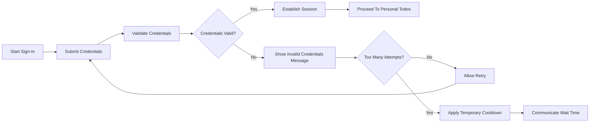
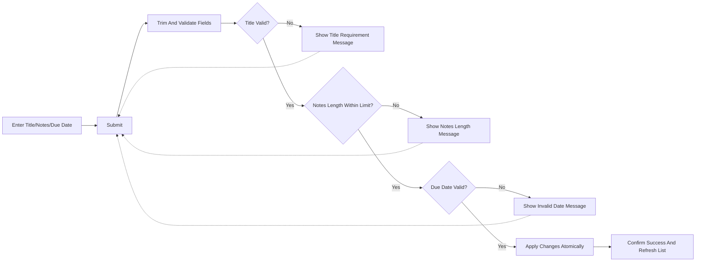
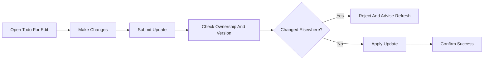
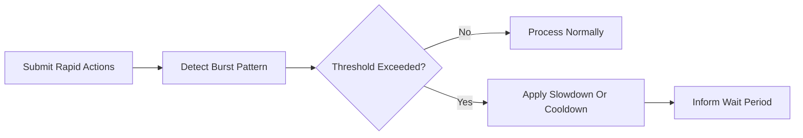
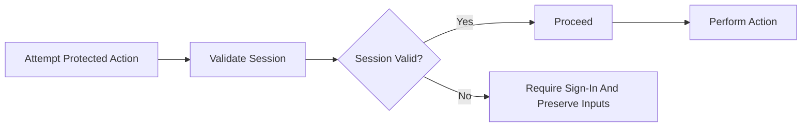

# Error Handling and Recovery Requirements for todoMvp (MVP)

## 1. Scope and Intent
Defines business-level error handling and recovery behavior for the minimal todoMvp feature set: authenticate, list own Todos, create, update (title/notes/due date/status), complete/uncomplete, and delete. Describes WHAT users experience and WHAT the service shall do; omits technical specifications such as protocols, status codes, endpoints, or database schemas.

## 2. Audience and Role Context
- Guest: Unauthenticated visitor. May not access or modify any Todo data.
- User: Authenticated individual managing only their own Todos.
- Admin: Administrator with limited oversight (aggregate insights and account lifecycle) without routine access to member Todo content in MVP.

Role expectations applied to error handling:
- Errors shall never reveal other users’ Todo content or existence.
- Admin interactions are limited to oversight; user-facing error patterns remain consistent regardless of which role triggers them.

## 3. Guiding Principles
- Consistency: Similar problems produce similar, recognizable outcomes and guidance.
- Safety and Atomicity: No partial updates; either all intended changes apply or none.
- Idempotence: Safe to retry common operations; repeating the same successful change shall confirm the final state without duplication.
- Clarity: Messages are short, plain language, with one clear next step.
- Privacy: Outcomes avoid leaking sensitive details (e.g., whether an account exists, whether a specific Todo exists when not owned).
- Timeliness: Outcomes are delivered promptly; when delay is unavoidable, visible progress or waiting indication is provided.
- Input Preservation: Where feasible, inputs are preserved so users can correct and resubmit without retyping.
- Accessibility: Outcomes are conveyed in text and are perceivable by assistive technologies; no reliance on visuals alone.

## 4. Error Taxonomy (MVP)

### 4.1 Authentication Errors
- Invalid credentials
- Excessive failed attempts (temporary slowdown/lockout)
- Session expired or missing

Expected behaviors (business-level): clear, non-technical guidance to retry or sign in again; avoid confirming account existence; apply temporary cooldowns after repeated failures.

### 4.2 Authorization and Ownership Errors
- Attempt to read, update, complete/uncomplete, or delete a Todo not owned by the user
- Guest attempts to perform any Todo action

Expected behaviors: deny the action, do not disclose whether the target Todo exists, remind user of ownership rule, suggest returning to owned list.

### 4.3 Validation Errors (Todo Fields)
- Title missing or empty after trimming
- Title length exceeds limit
- Notes length exceeds limit
- Due date not a valid calendar date

Expected behaviors: identify the field and rule in plain language; preserve valid inputs; allow quick correction.

### 4.4 Not Found or Already Removed
- Target Todo no longer exists or has already been deleted

Expected behaviors: inform that the item is unavailable and recommend refreshing the list; no reconstruction of deleted items.

### 4.5 Concurrency and Update Conflicts
- Attempt to save changes when the Todo changed or was deleted since it was viewed

Expected behaviors: decline the change; instruct to refresh to get the latest version and re-apply intended edits.

### 4.6 Rate Limiting and Abuse Signals
- Excessive actions in a short period; patterns consistent with automation or abuse

Expected behaviors: slow or temporarily block further actions; communicate a simple waiting period; maintain normal access after cooldown.

### 4.7 System Degradation and Unavailability
- Temporary inability to complete actions due to service conditions

Expected behaviors: provide a user-centered outcome; suggest retry; ensure that no partial changes are reported as successful.

## 5. Recovery and Retry Guidance

### 5.1 Authentication
- Invalid credentials: advise retry with correct credentials; do not confirm account existence.
- Temporary cooldown: communicate that too many attempts occurred and indicate when to try again.
- Session expired: preserve unsent inputs where feasible; advise signing in again to continue.

EARS:
- WHEN invalid credentials are submitted, THE service SHALL inform that sign-in failed and permit another attempt without exposing sensitive details.
- IF multiple sign-in failures occur rapidly, THEN THE service SHALL apply a temporary slowdown or lockout and indicate a simple waiting period.
- WHEN a protected action is attempted without a valid session, THE service SHALL require sign-in and, where feasible, preserve inputs for re-use after sign-in.

### 5.2 Authorization and Ownership
- Non-owner access: deny the action; avoid confirming whether the Todo exists; suggest returning to the owned list.
- Guest action: deny and guide to sign in.

EARS:
- IF a user attempts to access or modify a Todo they do not own, THEN THE service SHALL deny the action and prevent disclosure of any Todo content.
- WHEN a guest attempts a Todo action, THE service SHALL deny the action and guide the guest to sign in or register.

### 5.3 Validation
- Title issues: specify that a title is required and the allowed length.
- Notes length: specify the maximum and preserve other fields.
- Due date invalid: ask for a valid calendar date in plain language; do not require formatting codes.

EARS:
- WHEN a create or update submission lacks a valid title after trimming, THE service SHALL reject the change and specify that a non-empty title is required within the allowed length.
- IF notes exceed the maximum length, THEN THE service SHALL reject the change and preserve all other valid inputs.
- IF a due date cannot be recognized as a valid calendar date, THEN THE service SHALL reject the change and request a valid date.

### 5.4 Not Found or Already Removed
- Treat as no further action needed; recommend refresh.

EARS:
- WHEN a user targets a Todo that no longer exists, THE service SHALL inform that the item is unavailable and suggest refreshing the list.
- WHEN a delete is requested for an already removed Todo, THE service SHALL confirm that no further action is required.

### 5.5 Concurrency and Conflicts
- Detect and report conflict; advise refresh, then retry.

EARS:
- WHEN an update conflict is detected, THE service SHALL reject the change and instruct the user to refresh and re-apply intended edits.

### 5.6 Rate Limiting and Abuse
- Apply slowdown or temporary block; provide simple wait guidance; maintain access after cooldown.

EARS:
- WHERE unusually rapid repeated actions occur, THE service SHALL temporarily limit further actions and advise retry after waiting.
- WHEN cooldown is active, THE service SHALL communicate that actions are limited and when normal usage can resume.

### 5.7 System Degradation and Unavailability
- Provide an outcome quickly; keep inputs; suggest retry when appropriate.

EARS:
- IF an operation cannot complete due to temporary conditions, THEN THE service SHALL present a non-technical outcome and encourage retry later while preserving user inputs where feasible.

## 6. Messaging Principles
- Actionable: One recommended next step per outcome (e.g., retry, correct title, sign in).
- Respectful: Avoid blame; use neutral tone.
- Non-technical: No internal codes or jargon.
- Privacy-preserving: Avoid confirming existence of accounts or other users’ Todos.
- Consistent: Same issue class uses the same wording pattern across the app.

EARS:
- THE service SHALL present concise, respectful, and actionable messages for all error outcomes.
- THE service SHALL avoid exposing internal technical details in user-facing messages.

## 7. Accessibility and UX Considerations
- Text alternatives: All outcomes provided as text for assistive technologies.
- Keyboard operability: Error resolutions shall be achievable without pointer-only interactions.
- Progress feedback: When waiting is required, show non-technical waiting indication.

EARS:
- THE service SHALL provide text-based feedback for success and failure so assistive technologies can convey status changes.
- WHERE an operation exceeds typical duration, THE service SHALL display a simple waiting indication without technical jargon.

## 8. Conceptual Flows (Mermaid)

### 8.1 Authentication Failure and Recovery

### 8.2 Validation Error on Create/Update

### 8.3 Concurrency Conflict and Recovery

### 8.4 Rate Limiting

### 8.5 Session Expired Or Authorization Failure

## 9. EARS Acceptance Criteria (Consolidated)

Global
- THE service SHALL provide consistent, actionable, and non-technical error outcomes across the MVP feature set.
- THE service SHALL avoid leaking sensitive details, including existence of accounts or other users’ Todo content.
- WHILE a user interacts with core operations, THE service SHALL ensure atomic changes and idempotent retries for common operations.

Authentication
- WHEN invalid credentials are submitted, THE service SHALL allow retry without revealing whether the account exists.
- IF repeated invalid login attempts occur quickly, THEN THE service SHALL temporarily limit further attempts and communicate a waiting period.
- WHEN a protected action is attempted without a valid session, THE service SHALL require sign-in and preserve inputs where feasible.

Authorization/Ownership
- WHEN a user attempts to act on a non-owned Todo, THE service SHALL deny the action and avoid confirming whether the Todo exists.
- WHEN a guest attempts any Todo operation, THE service SHALL deny the action and offer sign-in guidance.

Validation
- WHEN title is missing or invalid after trimming, THE service SHALL reject creation or update and specify the requirement and limits.
- WHEN notes exceed the maximum length, THE service SHALL reject the change and retain other inputs.
- WHEN due date is not a valid calendar date, THE service SHALL reject the change and request a valid date.

Not Found/Removed
- WHEN a targeted Todo no longer exists, THE service SHALL inform unavailability and recommend refreshing the list.
- WHEN deletion is requested for a Todo already removed, THE service SHALL confirm no further action is required.

Conflicts
- WHEN an update conflict is detected, THE service SHALL reject the change and instruct the user to refresh and re-apply edits.

Rate Limiting
- WHERE unusually rapid requests are detected, THE service SHALL slow or temporarily block further actions and indicate a waiting period.

Degradation/Unavailability
- IF service conditions prevent completion, THEN THE service SHALL present a non-technical outcome, preserve inputs where feasible, and suggest retry later.

Accessibility
- THE service SHALL ensure all error outcomes are available as text, perceivable by assistive technologies, and resolvable without pointer-only interactions.

## 10. Traceability and Related Business References
- Role boundaries and ownership expectations: see User Roles and Permissions (Business-Level).
- Core Todo behaviors and validation: see Functional Requirements: Todo Management (MVP).
- Performance expectations and responsiveness: see Non-Functional Requirements for todoMvp (MVP).

## 11. Glossary
- Atomic Change: A change that either fully applies or fully fails, with no partial state visible.
- Cooldown: A temporary period during which actions are slowed or blocked following excessive requests.
- Idempotent: Repeating the same operation yields the same end state without adverse effects (e.g., re-marking an already completed Todo as completed).
- Ownership: The rule that each Todo belongs to exactly one authenticated user and actions are limited to that user.
- Validation: Business checks ensuring inputs meet required rules before changes are applied.
