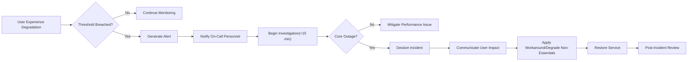

# 08-non-functional-requirements.md — todoApp

## Introduction and Scope
This document defines the non-functional requirements (NFRs) for the todoApp MVP. It establishes measurable expectations for performance, reliability, availability, security, privacy, observability, and localization/timezone handling using business language without prescribing any specific technical tools or architectures. These requirements apply to all user roles defined for the service: guestVisitor, todoUser, and systemAdmin. The requirements herein complement the functional scope and business logic described in the [Service Overview](./01-service-overview.md), [Business Requirements](./02-business-requirements.md), [User Roles and Authentication](./03-user-roles-and-authentication.md), [Business Rules and Validation](./06-business-rules-and-validation.md), [Error Handling and Recovery](./07-error-handling-and-recovery.md), and [Data Lifecycle and Privacy](./09-data-lifecycle-and-privacy.md).

All EARS keywords (WHEN, WHILE, IF, THEN, WHERE, THE, SHALL) are kept in English; all descriptive content is provided in English (en-US).

## Performance Expectations (response time and throughput in user terms)
Performance requirements are defined from the user’s perspective and measured at the boundary of the service. All percentiles refer to the distribution of successful requests during a given measurement window (e.g., rolling 1 hour) unless noted otherwise.

### Interactive Operations (single-item actions)
- Creation of a todo item
  - Requirement: 95th percentile completion within 1.0 second under normal load; 99th percentile within 2.0 seconds.
- Update of a todo item (title, description, due date, completion status)
  - Requirement: 95th percentile completion within 1.0 second; 99th percentile within 2.0 seconds.
- Deletion of a todo item
  - Requirement: 95th percentile completion within 1.0 second; 99th percentile within 2.0 seconds.
- Toggle completion (mark complete/incomplete)
  - Requirement: 95th percentile within 500 ms; 99th percentile within 1.5 seconds.

EARS (Interactive):
- WHEN a todoUser submits a new todo with valid data, THE todoApp SHALL confirm creation within 1.0 second for 95% of successful attempts and within 2.0 seconds for 99%.
- WHEN a todoUser updates an existing todo with valid data, THE todoApp SHALL confirm the update within 1.0 second for 95% and within 2.0 seconds for 99%.
- WHEN a todoUser deletes an existing todo, THE todoApp SHALL confirm deletion within 1.0 second for 95% and within 2.0 seconds for 99%.
- WHEN a todoUser toggles completion of a todo, THE todoApp SHALL confirm the change within 500 ms for 95% and within 1.5 seconds for 99%.

### Listing, Filtering, and Searching (own todos)
- List own todos (default view)
  - Dataset assumption: Up to 200 items shown without pagination for MVP.
  - Requirement: 95th percentile response within 1.0 second for lists up to 200 items; 99th percentile within 2.0 seconds.
- Filter by status (e.g., completed, not completed) and due date ranges
  - Requirement: 95th percentile within 1.0 second; 99th percentile within 2.0 seconds for result sets up to 200 items.
- Keyword search across title and description
  - Requirement: 95th percentile within 1.5 seconds; 99th percentile within 3.0 seconds for result sets up to 200 items.

EARS (Listing/Filtering/Searching):
- WHEN a todoUser requests a list of own todos up to 200 items, THE todoApp SHALL return results within 1.0 second for 95% and within 2.0 seconds for 99%.
- WHEN a todoUser applies simple filters by status or due date yielding up to 200 items, THE todoApp SHALL return results within 1.0 second for 95% and within 2.0 seconds for 99%.
- WHEN a todoUser performs keyword search across title and description with results up to 200 items, THE todoApp SHALL return results within 1.5 seconds for 95% and within 3.0 seconds for 99%.

### Account and Session Operations
- Registration (email verification may extend end-to-end duration and is excluded from response-time measures)
  - Requirement: 95th percentile server response to registration submission within 1.5 seconds; 99th percentile within 3.0 seconds.
- Login success path
  - Requirement: 95th percentile within 2.0 seconds; 99th percentile within 4.0 seconds.
- Logout
  - Requirement: 95th percentile within 500 ms; 99th percentile within 2.0 seconds.
- Password reset request submission
  - Requirement: 95th percentile within 1.5 seconds; 99th percentile within 3.0 seconds.

EARS (Account/Session):
- WHEN a guestVisitor submits a valid registration, THE todoApp SHALL respond within 1.5 seconds for 95% and within 3.0 seconds for 99%.
- WHEN a todoUser submits valid login credentials, THE todoApp SHALL confirm authentication within 2.0 seconds for 95% and within 4.0 seconds for 99%.
- WHEN a todoUser logs out, THE todoApp SHALL confirm logout within 500 ms for 95% and within 2.0 seconds for 99%.
- WHEN a guestVisitor requests a password reset with a valid account email, THE todoApp SHALL respond within 1.5 seconds for 95% and within 3.0 seconds for 99%.

### Background and Batch Behaviors
- Email-based processes (verification, password reset, notices)
  - Requirement: Emails queued within 2.0 seconds for 99% of submissions; delivery timing is dependent on email provider and not measured as service latency.

EARS (Background):
- WHEN a user-facing action triggers an email, THE todoApp SHALL queue the email within 2.0 seconds for 99% of submissions.

### Capacity and Rate Limits (business fairness)
These limits protect service quality for all users and deter abuse. Limits are evaluated per account unless otherwise specified.
- Write operations (create, update, delete, toggle): up to 60 successful write actions per minute per todoUser; bursts up to 20 in any 2 seconds are permitted.
- Read operations (list/search/filter): up to 120 successful read actions per minute per todoUser; bursts up to 40 in any 2 seconds are permitted.
- Authentication attempts: up to 10 failed login attempts within 10 minutes before additional verification is required.

EARS (Capacity/Rate):
- WHILE a todoUser remains within fair-use thresholds, THE todoApp SHALL process actions normally.
- IF a todoUser exceeds fair-use thresholds, THEN THE todoApp SHALL throttle further actions and communicate the retry window in user terms.
- IF repeated failed login attempts reach the limit, THEN THE todoApp SHALL require additional verification before further attempts.

### Performance Acceptance (EARS)
- THE todoApp SHALL meet or exceed the percentile response-time targets for all operations defined in this section.
- IF performance targets are not met during a measurement window, THEN THE todoApp SHALL record the breach for operational follow-up and display user-appropriate messaging when applicable.

## Reliability and Availability Expectations

### Availability Targets and Maintenance Windows
- Monthly availability target: 99.5% (MVP). Planned maintenance windows are excluded if scheduled with at least 72 hours notice and occur outside peak usage hours.
- Peak usage hours guideline: 07:00–23:00 in the user’s configured timezone; maintenance should prefer outside this window for the majority of affected users.

EARS (Availability):
- THE todoApp SHALL achieve at least 99.5% monthly availability excluding scheduled maintenance with the required notice.
- IF urgent maintenance is required, THEN THE todoApp SHALL notify affected users as soon as reasonably possible and minimize downtime duration.

### Data Durability, Recovery Targets, and Consistency
- Durability: No loss of confirmed todo items or profile settings under normal operations.
- Recovery Point Objective (RPO) for catastrophic events: within 24 hours for MVP.
- Recovery Time Objective (RTO) for catastrophic events: service restoration within 4 hours for core read access and 8 hours for full read/write access, where feasible for MVP.
- Consistency expectation (user-facing): After the system confirms a write action to a todoUser, the change is visible to that same user on subsequent reads without delay (read-after-write for the actor).

EARS (Durability/Recovery/Consistency):
- THE todoApp SHALL preserve all confirmed writes under normal conditions.
- IF a catastrophic event occurs, THEN THE todoApp SHALL be able to restore user data to a state no older than 24 hours prior to the event.
- IF a catastrophic event occurs, THEN THE todoApp SHALL restore core read access within 4 hours and full read/write capabilities within 8 hours.
- WHEN a write action is confirmed, THE todoApp SHALL provide read-after-write visibility to the actor.

### Degradation Behavior and Backpressure
- Graceful degradation: Non-essential features (e.g., optional search suggestions) may be temporarily disabled to preserve core todo operations.
- Backpressure: Throttling policies from the performance section take precedence during overload.
- User messaging: Clear, human-readable communication must indicate temporary limitations and expected retry guidance.

EARS (Degradation/Backpressure):
- IF system load approaches thresholds that risk violating core SLOs, THEN THE todoApp SHALL degrade non-essential features before impacting core operations.
- IF throttling is applied, THEN THE todoApp SHALL inform affected users of retry expectations without exposing internal technical details.

## Security and Privacy Expectations (business-level)

### Authentication and Access Boundaries
- Role permissions must align with the definitions in [User Roles and Authentication](./03-user-roles-and-authentication.md).
- Principle of least privilege: Access is limited to what is necessary for the action.
- Cross-user isolation: A todoUser can only access their own todos and profile data.
- Administrative access: systemAdmin actions must exclude routine access to private user content; access to private content requires explicit lawful process.

EARS (Auth/Access):
- THE todoApp SHALL enforce access controls such that a todoUser can only act on their own data.
- IF an unauthorized access is attempted, THEN THE todoApp SHALL deny the action and provide a clear, user-appropriate message.
- WHERE a systemAdmin performs administrative functions, THE todoApp SHALL ensure no routine access to private todo content without explicit lawful process.

### Data Minimization and Confidentiality
- Minimal personal data: MVP collects only what is needed to operate (e.g., email, credential, and todo content created by the user).
- Confidentiality in transit and at rest: User personal data and todo content must be protected during storage and transmission using industry-standard practices.
- Secrets and credentials: Sensitive secrets must not be exposed in any user-facing context or logs.

EARS (Minimization/Confidentiality):
- THE todoApp SHALL limit personal data collection to what is necessary for MVP functionality.
- THE todoApp SHALL protect personal data and todo content during storage and transmission using industry-standard practices.
- IF sensitive secrets or credentials would otherwise be recorded, THEN THE todoApp SHALL redact or avoid storing them.

### Session and Account Protection
- Session lifetime (MVP): Session validity up to 30 days with inactivity timeout of 14 days for convenience balanced with security.
- Concurrent sessions: Users may remain signed in on multiple devices; users can revoke sessions via account management.
- Brute-force protection: Progressive delays or additional verification after repeated failed login attempts (as defined in performance section).
- Password policy (MVP): Minimum 8 characters, maximum 64 characters; encourage passphrases.

EARS (Session/Account):
- WHILE a session remains within the validity and inactivity windows, THE todoApp SHALL honor the session without requiring re-authentication.
- WHEN a todoUser requests to revoke active sessions, THE todoApp SHALL invalidate the selected sessions promptly and confirm completion.
- IF repeated failed login attempts reach the defined threshold, THEN THE todoApp SHALL require additional verification before further attempts.
- THE todoApp SHALL require passwords to meet minimum and maximum length constraints.

### Privacy Rights and Compliance Alignment
- User rights: Access, correction, and deletion of personal data as described in the [Data Lifecycle and Privacy](./09-data-lifecycle-and-privacy.md).
- Export portability (MVP): Users may request an export of their todos and account data; fulfillment time within 7 days for MVP.
- Retention: Deleted personal data is removed from active systems promptly and from backups within a reasonable period as defined in the data lifecycle document.

EARS (Privacy):
- WHEN a todoUser requests data export, THE todoApp SHALL fulfill the request within 7 days for MVP.
- WHEN a todoUser requests deletion, THE todoApp SHALL remove personal data from active systems promptly and complete backup removal within the defined policy.

## Observability and Monitoring (business terms)

### What to Measure and Why
- Latency: Track percentile latencies for core operations (create, update, delete, toggle, list, filter, search, register, login, logout) to verify performance targets.
- Error rates: Track user-visible error ratios for each operation and overall.
- Throughput and saturation: Track counts of actions per user and overall to manage fairness and detect abuse or overload.
- Availability: Track uptime against the 99.5% monthly target.

EARS (Measurement):
- THE todoApp SHALL measure and record latency percentiles, error rates, throughput, and availability for core operations.

### Alerting Thresholds and Response Expectations
- Latency alerts: Trigger alert when 95th percentile latency exceeds target by 20% for 5 consecutive minutes.
- Error-rate alerts: Trigger alert when user-visible error rate exceeds 2% over 5 consecutive minutes.
- Availability alerts: Trigger alert for any outage affecting core operations lasting longer than 2 minutes.
- Response expectation: Operational personnel should be notified promptly so that investigation begins within 15 minutes for Sev-1 issues.

EARS (Alerting):
- IF latency targets are breached persistently, THEN THE todoApp SHALL generate an alert within 5 minutes.
- IF user-visible error rates exceed thresholds, THEN THE todoApp SHALL generate an alert within 5 minutes.
- IF a core outage persists beyond 2 minutes, THEN THE todoApp SHALL generate an immediate alert and record an incident.

### Log and Metric Retention, Redaction, and Safeguards
- Log content: Logs must not include passwords, raw authentication tokens, or full email content. Todo content appears in logs only when essential for troubleshooting, and must be minimized or redacted.
- Retention: Operational logs retained for 30 days; aggregated metrics retained for 90 days; audit-relevant security events retained for 180 days.
- Access: Log and metric access is limited to authorized personnel for operational purposes only.

EARS (Logging/Retention):
- THE todoApp SHALL redact sensitive values from logs.
- THE todoApp SHALL retain logs and metrics according to stated periods.
- WHERE access to logs and metrics is requested, THE todoApp SHALL restrict access to authorized personnel for operational purposes.

### Incident Detection and Response Overview (Mermaid)

## Localization and Timezone Considerations

### Language and Formats
- MVP language: English (en-US).
- Number, date, and time formats follow en-US conventions unless the user chooses otherwise in their profile (future scope).

EARS (Language/Formats):
- THE todoApp SHALL present all text and messages in English (en-US) for MVP.

### Timezone Handling for Due Dates and Timestamps
- Storage and display: Timestamps are stored consistently and displayed in the user-configured timezone; default to the client’s detected timezone when not configured.
- Due date semantics: A due date without time-of-day is interpreted as due by 23:59 in the user’s timezone on that date.
- DST handling: Daylight Saving Time transitions must not cause duplicate or skipped due-date evaluations for the same calendar date.

EARS (Timezone/Due Dates):
- WHEN a todoUser views times and dates, THE todoApp SHALL display them in the user’s configured timezone or a sensible default.
- WHEN a due date lacks a time-of-day, THE todoApp SHALL interpret it as due by 23:59 in the user’s timezone on that date.
- THE todoApp SHALL ensure that DST transitions do not generate duplicate or missed due-date evaluations for a given date.

## Consolidated Acceptance Criteria (EARS Summary)
- THE todoApp SHALL satisfy performance targets for interactive operations, listing/filtering/searching, and account/session actions as defined.
- THE todoApp SHALL meet 99.5% monthly availability excluding properly scheduled maintenance.
- THE todoApp SHALL preserve confirmed writes under normal conditions and meet recovery targets in catastrophic events.
- THE todoApp SHALL enforce role-based access such that users access only their data; admins do not have routine access to private user content without lawful process.
- THE todoApp SHALL minimize personal data collection and protect personal data and todos during storage and transmission using industry-standard practices.
- THE todoApp SHALL manage sessions within stated lifetimes and protect accounts against brute-force attempts with additional verification.
- THE todoApp SHALL measure, retain, and alert on operational telemetry within stated thresholds while redacting sensitive values from logs.
- THE todoApp SHALL present all text in English (en-US) and display times in the user’s timezone with clear due-date semantics.

## Out-of-Scope (Non-goals for MVP)
- Prescribing or naming specific technical tools, vendors, or architectures for achieving these requirements.
- Detailed HTTP status codes, API specifications, database schemas, or storage engine choices.
- Multi-language UI localization beyond English (en-US) in MVP.
- Advanced analytics beyond basic operational metrics required for SLO validation.

## Business-only Statement and Developer Autonomy Reminder
This document specifies business-level non-functional requirements only. It describes WHAT the system must achieve from the user and business perspective. All technical implementation decisions, including architecture, infrastructure, APIs, storage models, and tool selection, are at the discretion of the development team and must satisfy the measurable requirements stated above.