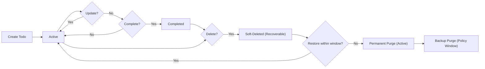
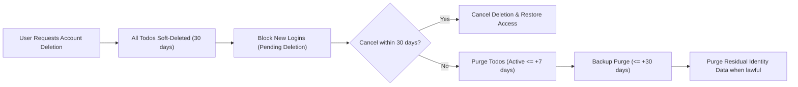

# 09 - Data Lifecycle and Privacy Requirements (todoApp MVP)

## 1. Scope and Intent
Provide unambiguous, testable business requirements for data ownership, lifecycle, retention and deletion, user data export and portability, auditability, and compliance obligations for a minimal personal Todo service. Content specifies WHAT must happen from a business perspective and excludes technical implementations such as APIs, database schemas, storage engines, or infrastructure.

## 2. Definitions and Data Categories
- Roles
  - guestVisitor: Unauthenticated visitor with no access to any Todo data; may access public pages and initiate registration/login.
  - todoUser: Authenticated user who owns and manages personal todos; full control over own data only.
  - systemAdmin: Operational governance role; manages accounts (suspend/reactivate) and service-level oversight without routine access to private Todo content.

- Core Data Categories (conceptual)
  - Todo Content Data: Title, optional description, optional due date, status, timestamps (created/updated/completed), and ownership.
  - Account Identity Data: Minimal identifiers required for account and session (e.g., email) and account state.
  - Service Metadata: Aggregated, non-identifying operational metrics; no private Todo content.
  - Audit/Activity Records: Business-level records of sensitive operations (e.g., account changes, deletions, exports, admin actions). No private Todo text values.

## 3. Data Ownership and Access Boundaries
- Ownership Principles
  - THE todoApp SHALL assign each todo to exactly one owner of role "todoUser" and SHALL not share this content by default.
  - THE todoApp SHALL treat Account Identity Data as pertaining to the user; the service acts as custodian for operation and lawful obligations only.
  - THE todoApp SHALL treat Service Metadata as non-identifying and aggregated; it SHALL not be reversible to reveal private content.
  - THE todoApp SHALL store Audit/Activity Records without private Todo text and SHALL restrict visibility to authorized personnel and the relevant user for personal history where appropriate.

- Access Boundaries by Role (business-level)

| Data Category           | Owner     | guestVisitor | todoUser (own) | todoUser (others) | systemAdmin |
|------------------------|-----------|--------------|----------------|-------------------|-------------|
| Todo Content Data      | todoUser  | ❌           | ✅              | ❌                 | ❌ (routine) |
| Account Identity Data  | todoUser  | ❌           | ✅ (own)        | ❌                 | ✅ (operational) |
| Service Metadata       | Service   | ❌           | View aggregated only | ❌           | ✅ (operational) |
| Audit/Activity Records | Service   | ❌           | ✅ (own relevant) | ❌               | ✅ (operational) |

- EARS Requirements (Ownership & Access)
  - THE todoApp SHALL restrict visibility of Todo Content Data to its owner only.
  - WHEN a guestVisitor requests any Todo Content Data, THE todoApp SHALL deny access with a clear business message.
  - WHEN a todoUser requests another user’s Todo Content Data, THE todoApp SHALL deny access and avoid revealing the resource’s existence.
  - WHERE operational tasks are performed by systemAdmin, THE todoApp SHALL avoid exposing private Todo content and SHALL limit access to aggregated or account-governance data only.

## 4. Conceptual Data Lifecycle

### 4.1 Create
- Business Behavior
  - A todoUser creates a todo with a required title and optional description and due date; ownership is set to the creator. Initial status is open (active). Creation and update timestamps are recorded.
- EARS
  - WHEN a todoUser submits a new todo with a valid title, THE todoApp SHALL create the todo associated to that user and record created/updated timestamps.
  - IF the title is empty or exceeds allowed length, THEN THE todoApp SHALL reject creation with a clear validation message.
  - THE todoApp SHALL prevent creation for any account other than the authenticated todoUser.

### 4.2 Read
- Business Behavior
  - A todoUser lists or views details of own todos only; deleted items are excluded from default lists.
- EARS
  - WHEN a todoUser requests a list of todos, THE todoApp SHALL return only that user’s todos ordered by the documented default.
  - WHEN a todoUser requests a specific todo by identifier, THE todoApp SHALL return it only if it belongs to that user and is not deleted.
  - WHEN systemAdmin performs operational tasks, THE todoApp SHALL avoid exposing any Todo Content Data.

### 4.3 Update and Completion
- Business Behavior
  - A todoUser updates title, optional description, optional due date, and completion status; updated timestamp records upon successful modification; completion sets a completion timestamp, reopening clears it.
- EARS
  - WHEN a todoUser updates an own todo with valid values, THE todoApp SHALL apply the change and set an updated timestamp.
  - WHEN a todoUser marks a todo completed, THE todoApp SHALL set a completed timestamp; WHEN reopened, THE todoApp SHALL clear it.
  - IF an update targets a todo not owned by the actor, THEN THE todoApp SHALL deny the request without exposing resource existence.

### 4.4 Delete and Recovery Window
- Business Behavior
  - Deletion places the todo into a temporary soft-deleted state during a recovery window; outside this window, the item is purged from active storage and then from backups per policy.
- EARS
  - WHEN a todoUser deletes an own todo, THE todoApp SHALL mark it as soft-deleted and exclude it from default listings.
  - WHILE within the recovery window, THE todoApp SHALL allow the owner to restore the todo to its prior state.
  - WHEN the recovery window elapses, THE todoApp SHALL permanently purge the todo from active storage and schedule purge from backups per policy.
  - IF a delete request targets a todo not owned by the actor, THEN THE todoApp SHALL deny the request and record a minimal audit entry.

### 4.5 Lifecycle Diagram (Conceptual)

## 5. Retention and Deletion Policies
- Principles
  - Data minimization: retain only what is necessary for service operation.
  - Purpose limitation: use data solely to operate personal Todo functionality and fulfill user requests.

- Timelines (Business-Level)
  - Active Todos: retained until the owner deletes them or the account is deleted.
  - Soft-Deleted Todos: recoverable for 30 days from deletion.
  - Active Purge: performed within 7 days after the 30-day recovery window ends.
  - Backup Purge: completed within 30 days after the active purge.
  - Audit/Activity Records: retained for 90 days; never include private Todo text values.
  - Aggregated Service Metadata: retained per operational needs; non-identifiable.

- Account Deletion Cascade
  - Account deletion places all associated todos into soft-delete immediately, applying the same recovery and purge timelines.
  - Minimal Account Identity Data may be retained only where legally required and for the shortest period necessary.

- EARS (Retention & Deletion)
  - WHEN a todoUser deletes a todo, THE todoApp SHALL make it recoverable for 30 days and exclude it from normal views during that period.
  - WHEN 30 days have elapsed after deletion, THE todoApp SHALL permanently purge the todo from active storage within 7 additional days.
  - WHEN a permanently purged todo exists in backups, THE todoApp SHALL ensure removal during routine backup rotation within 30 days after active purge.
  - WHEN a todoUser requests account deletion, THE todoApp SHALL place all related todos into soft-delete immediately and complete active purge according to the same timelines.
  - WHERE legal obligations require temporary retention of Account Identity Data, THE todoApp SHALL retain only minimal necessary fields for the minimal required duration and SHALL document the justification in business terms.

### Account Deletion Flow (Conceptual)

## 6. User Data Export and Portability
- Scope
  - Includes all Todo Content Data owned by the requester (including completed and soft-deleted within the recovery window) and minimal Account Identity Data.
  - Excludes other users’ data, sensitive internal identifiers not meaningful to the user, and any third-party secrets.

- Delivery and Frequency
  - Delivered via a secure, in-service download to the requesting todoUser after identity confirmation.
  - Frequency limited to once per 24-hour period per user.

- Timeliness and Format
  - Produced in a common, machine-readable format suitable for portability and accompanied by a human-readable field description.
  - Target delivery within 24 hours of request under normal conditions.

- EARS (Export)
  - WHEN a todoUser requests an export of own data, THE todoApp SHALL prepare a machine-readable package including Todo Content Data and minimal Account Identity Data.
  - IF identity confirmation fails, THEN THE todoApp SHALL cancel the export and notify the user in business terms.
  - WHILE an export is being prepared, THE todoApp SHALL protect the export from access by any other user or role.
  - WHEN the export is ready, THE todoApp SHALL make it available to the requester only for a limited download window and then expire it.
  - WHERE export volume is unusually large, THE todoApp SHALL notify the user of expected preparation time and still fulfill within the target whenever feasible.

## 7. Auditability and Traceability (Business-Level)
- Audit Scope
  - Record security-relevant events: login/logout, password resets, account suspension/reactivation, todo deletion and restoration, account deletion requests, data export requests, and any exceptional lawful access.
  - Exclude private Todo text values from audit records.

- Integrity and Access
  - Audit records must be tamper-evident and visible only to authorized operational staff.
  - Users may view personal activity history relevant to their account, excluding other users and excluding private content values.

- Retention
  - Audit records retained for 90 days unless laws require a different period; after retention, delete or anonymize.

- EARS (Audit)
  - WHEN a sensitive operation occurs, THE todoApp SHALL create an audit record capturing actor, action type, timestamp, and outcome without private Todo text.
  - IF an audit record cannot be created due to transient issues, THEN THE todoApp SHALL queue the event for later persistence and proceed only if safe; otherwise fail safely with a clear user message.
  - WHERE lawful access is performed, THE todoApp SHALL record the authority and scope, and SHALL restrict visibility of that record to authorized staff.

## 8. Compliance and Privacy Rights (Business-Level)
- Lawful Basis and Limitations
  - Process personal data solely to operate a personal Todo service and fulfill user requests.
  - Obtain consent for non-essential communications; do not sell personal data.

- User Rights (business language)
  - Access: Obtain a copy of own data.
  - Rectification: Correct inaccurate personal data and edit todos.
  - Erasure: Delete todos or request account deletion, triggering defined timelines.
  - Portability: Request export in a machine-readable format.
  - Restriction: Suspend account usage while retaining data (e.g., deactivation).
  - Objection: No processing beyond core purpose without consent; allow withdrawal at any time.

- Regional Alignment
  - Apply data minimization and purpose limitation globally; honor stricter regional rules (e.g., GDPR, CCPA, Korea PIPA) in business behavior.

- Breach Communication
  - Notify affected users promptly in clear language when a data exposure impacting users is confirmed, including protective steps and available support.

- EARS (Compliance)
  - WHEN a todoUser requests access to own data, THE todoApp SHALL provide a summary and offer export within the defined timeframe.
  - WHEN a todoUser requests erasure via account deletion, THE todoApp SHALL execute the steps and timelines defined in retention and deletion policies.
  - WHERE a region grants additional rights, THE todoApp SHALL honor them in business terms without weakening protections elsewhere.
  - IF non-essential processing is proposed, THEN THE todoApp SHALL require explicit consent and allow withdrawal at any time.

## 9. Error Handling and Edge Cases (Privacy-Centric)
- Ownership Conflicts
  - IF a request targets a todo not owned by the requester, THEN THE todoApp SHALL deny access and provide a non-technical explanation without revealing details about the target.

- Deleted or Purged Records
  - WHEN a todo is soft-deleted, THE todoApp SHALL exclude it from default listings but allow recovery within the window.
  - WHEN a todo has been permanently purged, THE todoApp SHALL indicate that the item is no longer available and cannot be recovered.

- Account States
  - WHILE an account is pending deletion, THE todoApp SHALL block new logins and disable todo modifications until deletion is canceled or completed.

- Export Unavailability
  - IF an export link expires, THEN THE todoApp SHALL require the todoUser to initiate a new export.

- Rate Limits for Exports
  - WHERE repeated exports occur within 24 hours, THE todoApp SHALL limit attempts to once per 24-hour period and communicate the next available time.

- Timezone Considerations
  - WHERE due dates are used for lifecycle evaluation or views, THE todoApp SHALL interpret them using the user’s current timezone context to avoid misleading overdue statuses.

## 10. Non-Functional Privacy-Related Expectations
- Timeliness
  - THE todoApp SHALL provide user data exports within 24 hours under normal conditions.
  - THE todoApp SHALL complete active-storage purges within 7 days after the 30-day soft-delete window ends and backup purges within 30 days thereafter.

- Transparency
  - THE todoApp SHALL present clear user-facing messages explaining outcomes of privacy actions (e.g., deletion scheduled, export ready) in en-US.

- Minimization
  - THE todoApp SHALL collect and store only fields necessary for minimal Todo functionality and lawful obligations.

## 11. Acceptance Summary (Consolidated EARS)
- THE todoApp SHALL enforce strict ownership boundaries so only the owner accesses Todo Content Data.
- WHEN a todo is deleted, THE todoApp SHALL move it to soft-delete for 30 days, then purge from active storage within 7 days and from backups within 30 days thereafter.
- WHEN a todoUser requests account deletion, THE todoApp SHALL soft-delete all associated todos immediately and apply the same purge timelines while blocking new logins during the pending period.
- WHEN a todoUser requests export, THE todoApp SHALL prepare a machine-readable package within 24 hours, make it available only to the requester for a limited window, and expire it afterward.
- WHEN sensitive operations occur, THE todoApp SHALL create audit records without private Todo text and SHALL retain them for 90 days.
- IF access attempts target other users’ data, THEN THE todoApp SHALL deny access without revealing resource existence.
- WHERE regional privacy laws provide additional rights, THE todoApp SHALL honor them in business terms.

## 12. Glossary (Business Terms)
- Todo Content Data: User-authored task items and their statuses/timestamps.
- Soft-Deleted: A temporary state where the item is hidden and recoverable during a defined window.
- Active Purge: Removal from active storage systems following the recovery window.
- Backup Purge: Removal from backup media/archives within a specified period after active purge.
- Audit Record: A business-level log of sensitive actions excluding private content values.
- Account Identity Data: Minimal personal information used to identify and operate a user account.

---
Content specifies business requirements only. Technical implementations (architecture, APIs, storage schemas, and infrastructure) remain at the discretion of the development team.