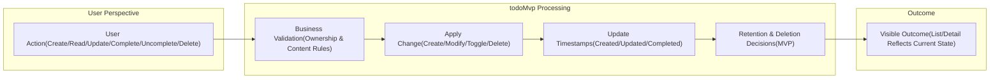
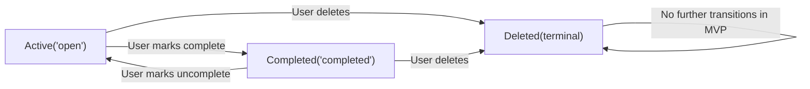
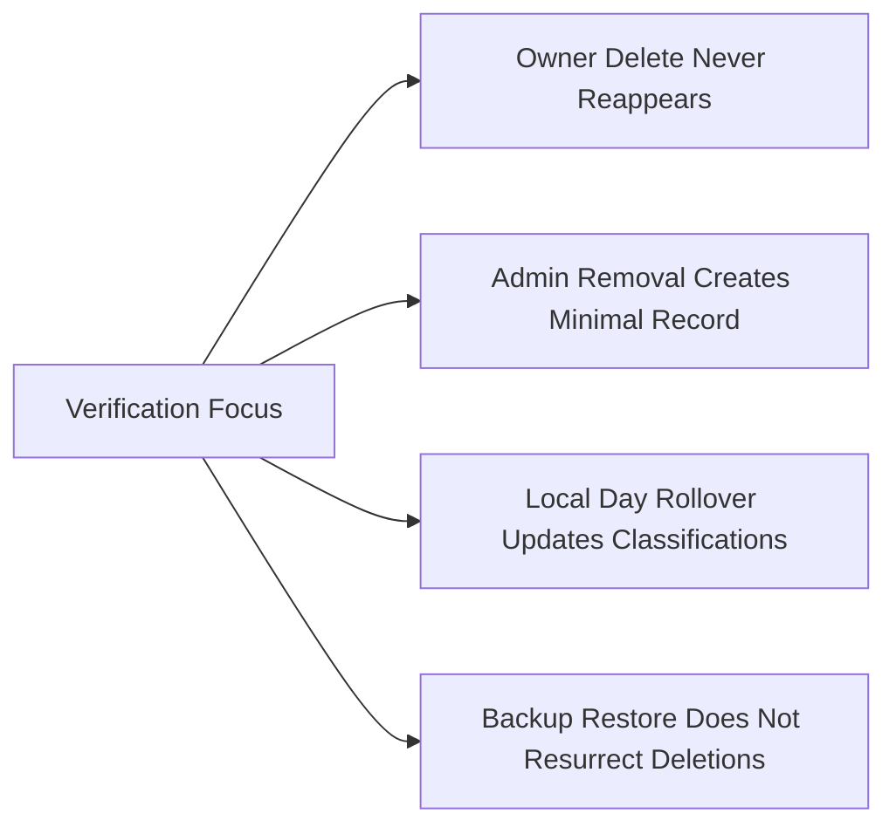

# Data Lifecycle and Retention Requirements — todoMvp (MVP)

## 1. Scope and Intent
Defines, in business terms, how Todo information progresses from creation to permanent deletion within the minimal todoMvp scope. Covers ownership, visibility, timestamps, retention, deletion, backups interaction, auditability, and time/localization behavior. Excludes all advanced features (tags, attachments, reminders, collaboration, archiving, recycle bin, version history, search, integrations). Describes WHAT must happen, not HOW to implement it.

Roles referenced:
- Guest: Unauthenticated visitor; no access to Todo data.
- User: Authenticated owner of personal Todos; full control over own items only.
- Admin: Administrator with limited oversight; permitted to remove items for compliance but not to browse or edit user content in MVP.

Time and localization:
- Dates shown to users are interpreted in the user’s local time context. Due date is day-level (no time-of-day required). Overdue/due-today classifications follow the user’s local day boundary.

## 2. Guiding Principles (MVP Minimalism)
- Minimal data model: title (required), notes (optional), due date (optional), status (open/completed), ownership, and lifecycle timestamps.
- Privacy by default: Todos are visible only to their owner; no sharing or collaboration.
- Irreversible deletion: No archive, recycle bin, or restore in MVP; deletion removes visibility permanently from user views.
- Accountability without exposure: Minimal administrative removal records exist for short-term oversight without retaining Todo content.
- Predictable time behavior: Day-level due dates, local time interpretation, midnight rollover updates for date-based classifications.

## 3. Conceptual Data Flow (MVP)

## 4. Lifecycle States and Transitions (MVP)

State meanings:
- "Active('open')": Todo exists and is not completed.
- "Completed('completed')": Todo exists and is marked as completed; owner can still edit title, notes, and due date or toggle back to Active.
- "Deleted(terminal)": Todo is permanently removed from owner-visible views and cannot be recovered in MVP.

## 5. Retention and Deletion Policies (Business-Level)
Retention baseline:
- Todos persist indefinitely until the owner deletes them or an admin removes them for compliance.
- No automatic archival or time-based purge of active/completed Todos in MVP.

Deletion behaviors:
- Owner deletion: Immediate removal from all owner-visible lists and details; no recovery path.
- Admin compliance removal: Immediate removal with a minimal administrative removal record that does not retain Todo content.

Minimal administrative removal record (business fields):
- Actor identity (business identifier), actor role, removal time, high-level reason code; no Todo title/notes content retained.
- Retention of administrative removal records: 30 days, then removal.

Backups and durability (business expectations):
- Confirmed successful operations are durably stored.
- Deleted Todos do not reappear in user-visible systems due to backup restoration. If technical restoration would otherwise re-surface a deleted Todo, the system must reconcile by re-applying the prior deletion before user visibility resumes.

## 6. Account Deletion Interactions (Business-Level)
- Owner account deletion implies deletion or irreversible anonymization of the owner’s personal data and Todos within 30 days, except where policy or law requires longer retention.
- Audit and administrative removal records related to the account may persist for their defined retention windows without retaining Todo content.

EARS for account deletion:
- WHEN an owner requests account deletion, THE todoMvp SHALL remove or irreversibly anonymize the owner’s personal data and Todos within 30 days, except where retention is legally required.
- WHERE backups exist, THE todoMvp SHALL ensure that deleted personal data is not restored to active systems after account deletion completes.

## 7. Backup and Restore Expectations (Business-Level)
- Backups exist for service resilience, not for user-initiated content recovery in MVP.
- Restores must not resurrect user-deleted Todos or accounts.
- Minimal administrative removal records are excluded from user views and are for accountability only.

EARS for backups:
- IF a restore operation would reintroduce a Todo previously deleted by its owner, THEN THE todoMvp SHALL prevent visibility of that Todo by re-applying the deletion outcome before user access resumes.
- WHEN a backup is restored after an incident, THE todoMvp SHALL preserve all confirmed changes made at least 5 minutes prior to the incident where feasible.

## 8. Export and Portability (Non-MVP)
Export is not included in MVP. A future release may provide owner-initiated export.

Forward-looking (non-MVP) EARS:
- WHERE export is enabled in a future release, THE todoMvp SHALL provide the owner with a complete export of their own Todos and basic profile, excluding admin-only metadata.

## 9. Auditability (Business-Level)
Audited events:
- Create, update (any field), complete, uncomplete, delete, and admin compliance removal.

Audit content (business level):
- Actor identity (business identifier), actor role, event time, event type, target reference; exclude Todo title/notes from logs.

Retention:
- Minimal administrative removal records: retain 30 days, then remove.
- General audit entries: retain at least 90 days for oversight, subject to policy.

Integrity and access:
- Audit entries are protected from user tampering and visible only to authorized administrators for oversight.

EARS for auditability:
- WHEN any audited event occurs, THE todoMvp SHALL record the event before acknowledging success to the actor.
- IF audit recording fails, THEN THE todoMvp SHALL fail the associated operation and present a recoverable message.
- WHERE legal or policy mandates longer retention, THE todoMvp SHALL retain relevant audit entries accordingly.

## 10. Time and Localization Behavior
- Due date is interpreted as a calendar date in the user’s local time context.
- “Due today” and “overdue” are evaluated by the local day boundary.

EARS for time behavior:
- WHEN a due date is provided without a time, THE todoMvp SHALL consider it due by the end of the local calendar day.
- WHEN the local date rolls over at midnight, THE todoMvp SHALL update “due today” and “overdue” classifications accordingly.
- IF a user changes their time zone preference, THEN THE todoMvp SHALL re-interpret date-based classifications based on the new local time context without altering stored calendar dates.

## 11. EARS Requirements — Consolidated and Testable
Ubiquitous ownership and visibility:
- THE todoMvp SHALL associate every Todo with exactly one authenticated owner.
- THE todoMvp SHALL show Todos only to their owner.

Event-driven lifecycle:
- WHEN a user creates a Todo, THE todoMvp SHALL create it in the Active state and set the created timestamp.
- WHEN a user updates a Todo they own, THE todoMvp SHALL apply changes and set the last updated timestamp.
- WHEN a user completes a Todo they own, THE todoMvp SHALL set status to Completed and record the completion timestamp.
- WHEN a user uncompletes a Todo they own, THE todoMvp SHALL set status to Active and clear the completion timestamp.
- WHEN a user deletes a Todo they own, THE todoMvp SHALL permanently remove the Todo so it no longer appears in lists or detail views.
- WHEN an admin removes a Todo for compliance, THE todoMvp SHALL permanently remove the Todo and create a minimal removal record without retaining Todo content.

Retention-specific:
- THE todoMvp SHALL retain active and completed Todos indefinitely until deleted by the owner or removed by an admin for compliance.
- THE todoMvp SHALL not perform automated archival or time-based deletion of Todos in MVP.
- THE todoMvp SHALL remove minimal administrative removal records automatically after 30 days.

Backup/restore safeguards:
- THE todoMvp SHALL ensure backup restores do not re-expose deleted Todos to users.
- WHEN backups are restored after an incident, THE todoMvp SHALL preserve confirmed changes made at least 5 minutes prior to the incident where feasible.

Privacy and admin access boundaries:
- THE todoMvp SHALL restrict administrators from browsing user Todo content in MVP; only aggregate insights and compliance removal are permitted.
- IF an administrator attempts to view or modify user Todo content beyond permitted actions, THEN THE todoMvp SHALL deny the action.

## 12. Dependencies and Related Specifications
- Vision and goals: Service overview — Service Overview and Requirements Analysis (MVP) [./01-service-overview.md]
- MVP boundaries: Scope and Out-of-Scope Definition [./02-scope-and-out-of-scope.md]
- Roles and permissions: User Roles and Permissions Requirements [./03-user-roles-and-permissions.md]
- Functional behaviors: Functional Requirements – Todo Management (MVP) [./04-functional-requirements-todo-management.md]
- Non-functional expectations: Non-Functional Requirements for todoMvp (MVP) [./09-non-functional-requirements.md]
- Error handling guidance: Error Handling and Recovery (Business-Level) [./08-error-handling-and-recovery.md]

## 13. Acceptance and Verification Criteria (Business-Level)
- WHEN creating, updating, completing/uncompleting, or deleting Todos during acceptance testing, THE todoMvp SHALL reflect outcomes immediately in owner-visible lists after success.
- WHEN a Todo is deleted by its owner, THE todoMvp SHALL ensure the item never reappears in any owner-visible context, including after backup restoration.
- WHEN an admin performs a compliance removal, THE todoMvp SHALL create a minimal removal record without storing Todo content and remove that record after 30 days.
- WHEN local date rolls over, THE todoMvp SHALL update “due today”/“overdue” classifications according to the local time context.
- WHEN account deletion is requested, THE todoMvp SHALL remove or irreversibly anonymize the owner’s personal data and Todos within 30 days (policy exceptions allowed for legal retention).

